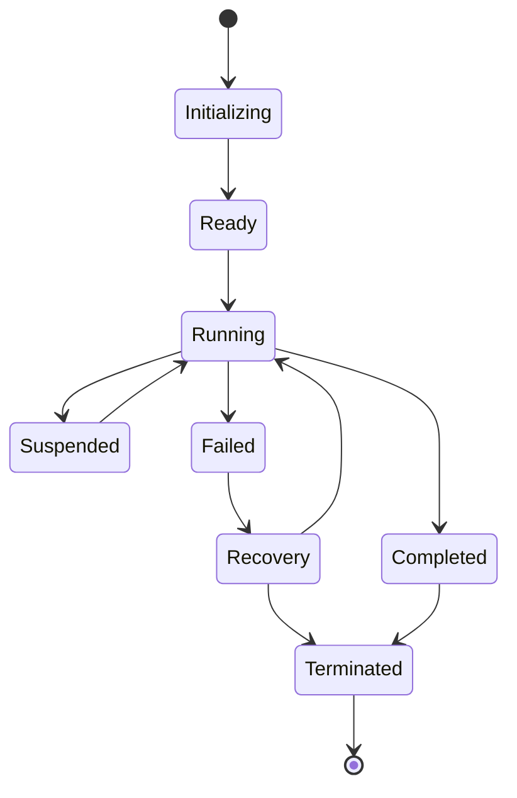

# Agent Lifecycle Management Patterns

## Overview
This document defines the comprehensive lifecycle management patterns for AI agents in our parallel processing system, including initialization, execution, monitoring, and cleanup phases.

## Agent Lifecycle States



## Core Components

### 1. Agent Factory Pattern
```typescript
interface AgentFactory {
  createAgent(config: AgentConfig): Promise<Agent>;
  destroyAgent(agentId: string): Promise<void>;
  getAgentTypes(): AgentType[];
}

class StandardAgentFactory implements AgentFactory {
  private registry: Map<string, AgentConstructor> = new Map();
  
  registerAgentType(type: string, constructor: AgentConstructor) {
    this.registry.set(type, constructor);
  }
  
  async createAgent(config: AgentConfig): Promise<Agent> {
    const Constructor = this.registry.get(config.type);
    if (!Constructor) {
      throw new Error(`Unknown agent type: ${config.type}`);
    }
    
    const agent = new Constructor(config);
    await agent.initialize();
    return agent;
  }
}
```

### 2. Agent Lifecycle Manager
```typescript
class AgentLifecycleManager {
  private agents: Map<string, Agent> = new Map();
  private stateTransitions: StateTransitionMap;
  
  async spawnAgent(config: AgentConfig): Promise<string> {
    const agent = await this.factory.createAgent(config);
    const agentId = this.generateId();
    
    // Register lifecycle hooks
    agent.onStateChange((oldState, newState) => {
      this.handleStateTransition(agentId, oldState, newState);
    });
    
    this.agents.set(agentId, agent);
    await agent.start();
    
    return agentId;
  }
  
  async suspendAgent(agentId: string): Promise<void> {
    const agent = this.getAgent(agentId);
    await agent.suspend();
  }
  
  async resumeAgent(agentId: string): Promise<void> {
    const agent = this.getAgent(agentId);
    await agent.resume();
  }
  
  async terminateAgent(agentId: string): Promise<void> {
    const agent = this.getAgent(agentId);
    await agent.terminate();
    this.agents.delete(agentId);
  }
}
```

## Lifecycle Phases

### 1. Initialization Phase
- **Resource Allocation**: Memory, CPU, storage requirements
- **Configuration Loading**: Environment variables, settings
- **Dependency Injection**: Required services and components
- **Health Checks**: System readiness validation

```typescript
class AgentInitializer {
  async initialize(config: AgentConfig): Promise<void> {
    // 1. Validate configuration
    await this.validateConfig(config);
    
    // 2. Allocate resources
    await this.allocateResources(config.resources);
    
    // 3. Initialize dependencies
    await this.initializeDependencies(config.dependencies);
    
    // 4. Setup monitoring
    await this.setupMonitoring(config.monitoring);
    
    // 5. Run health checks
    await this.runHealthChecks();
  }
}
```

### 2. Execution Phase
- **Task Processing**: Main agent functionality
- **Resource Monitoring**: Performance and usage tracking
- **Error Handling**: Graceful error recovery
- **State Persistence**: Checkpointing and recovery

### 3. Suspension/Resume Patterns
```typescript
interface SuspendableAgent {
  async suspend(): Promise<SuspensionContext>;
  async resume(context: SuspensionContext): Promise<void>;
}

class SuspensionContext {
  constructor(
    public readonly state: AgentState,
    public readonly checkpoint: Checkpoint,
    public readonly resources: ResourceSnapshot
  ) {}
}
```

### 4. Cleanup Phase
- **Resource Deallocation**: Memory, file handles, connections
- **State Persistence**: Final state saving
- **Notification**: Cleanup completion events
- **Metrics Collection**: Performance data gathering

## Resource Management

### Memory Management
```typescript
class AgentMemoryManager {
  private memoryPools: Map<string, MemoryPool> = new Map();
  
  allocateMemory(agentId: string, size: number): MemoryBlock {
    const pool = this.getOrCreatePool(agentId);
    return pool.allocate(size);
  }
  
  deallocateMemory(agentId: string, block: MemoryBlock): void {
    const pool = this.memoryPools.get(agentId);
    pool?.deallocate(block);
  }
}
```

### CPU Scheduling
```typescript
class AgentScheduler {
  private runQueue: PriorityQueue<Agent> = new PriorityQueue();
  private cpuQuota: Map<string, CpuQuota> = new Map();
  
  scheduleAgent(agent: Agent, priority: Priority): void {
    this.runQueue.enqueue(agent, priority);
  }
  
  allocateCpuTime(agentId: string, timeSlice: number): void {
    const quota = this.cpuQuota.get(agentId) || new CpuQuota();
    quota.allocate(timeSlice);
    this.cpuQuota.set(agentId, quota);
  }
}
```

## Error Recovery Strategies

### 1. Retry Patterns
```typescript
class RetryStrategy {
  constructor(
    private maxRetries: number = 3,
    private backoffMultiplier: number = 2,
    private initialDelay: number = 1000
  ) {}
  
  async executeWithRetry<T>(
    operation: () => Promise<T>,
    context: ErrorContext
  ): Promise<T> {
    let attempt = 0;
    let delay = this.initialDelay;
    
    while (attempt < this.maxRetries) {
      try {
        return await operation();
      } catch (error) {
        if (!this.isRetryableError(error, context)) {
          throw error;
        }
        
        await this.delay(delay);
        delay *= this.backoffMultiplier;
        attempt++;
      }
    }
    
    throw new MaxRetriesExceededError(this.maxRetries);
  }
}
```

### 2. Circuit Breaker Pattern
```typescript
class CircuitBreaker {
  private state: CircuitState = CircuitState.CLOSED;
  private failureCount = 0;
  private lastFailureTime: Date | null = null;
  
  async execute<T>(operation: () => Promise<T>): Promise<T> {
    if (this.state === CircuitState.OPEN) {
      if (this.shouldAttemptReset()) {
        this.state = CircuitState.HALF_OPEN;
      } else {
        throw new CircuitBreakerOpenError();
      }
    }
    
    try {
      const result = await operation();
      this.onSuccess();
      return result;
    } catch (error) {
      this.onFailure(error);
      throw error;
    }
  }
}
```

## Health Monitoring

### Health Check Framework
```typescript
interface HealthCheck {
  name: string;
  check(): Promise<HealthStatus>;
}

class AgentHealthMonitor {
  private healthChecks: HealthCheck[] = [];
  private healthStatus: Map<string, HealthStatus> = new Map();
  
  registerHealthCheck(check: HealthCheck): void {
    this.healthChecks.push(check);
  }
  
  async runHealthChecks(): Promise<OverallHealthStatus> {
    const results = await Promise.allSettled(
      this.healthChecks.map(check => 
        check.check().then(status => ({ check: check.name, status }))
      )
    );
    
    return this.aggregateHealthStatus(results);
  }
}
```

## Performance Optimization

### 1. Lazy Initialization
```typescript
class LazyAgent {
  private initialized = false;
  private initPromise: Promise<void> | null = null;
  
  private async ensureInitialized(): Promise<void> {
    if (this.initialized) return;
    
    if (!this.initPromise) {
      this.initPromise = this.performInitialization();
    }
    
    await this.initPromise;
    this.initialized = true;
  }
}
```

### 2. Resource Pooling
```typescript
class AgentPool {
  private availableAgents: Queue<Agent> = new Queue();
  private busyAgents: Set<Agent> = new Set();
  
  async acquireAgent(): Promise<Agent> {
    if (this.availableAgents.isEmpty()) {
      await this.createNewAgent();
    }
    
    const agent = this.availableAgents.dequeue();
    this.busyAgents.add(agent);
    return agent;
  }
  
  releaseAgent(agent: Agent): void {
    this.busyAgents.delete(agent);
    this.availableAgents.enqueue(agent);
  }
}
```

## Configuration Management

### Agent Configuration Schema
```yaml
agent_config:
  type: string                    # Agent type identifier
  version: string                 # Agent version
  resources:
    memory_limit: "512MB"
    cpu_limit: "1.0"
    disk_limit: "1GB"
  dependencies:
    - name: "redis"
      version: "^6.0"
    - name: "postgresql"
      version: "^13.0"
  monitoring:
    health_check_interval: "30s"
    metrics_collection: true
    log_level: "INFO"
  recovery:
    max_retries: 3
    retry_backoff: "exponential"
    circuit_breaker: true
```

## Best Practices

### 1. Graceful Shutdown
- Implement signal handlers for SIGTERM/SIGINT
- Complete current operations before shutdown
- Save state and cleanup resources
- Notify dependent services

### 2. State Management
- Use immutable state patterns
- Implement state validation
- Provide state migration capabilities
- Enable state rollback functionality

### 3. Resource Efficiency
- Implement resource quotas and limits
- Use resource pooling for expensive operations
- Monitor and alert on resource usage
- Implement garbage collection strategies

### 4. Error Handling
- Use structured error types
- Implement comprehensive error logging
- Provide error recovery mechanisms
- Enable error aggregation and analysis

## Integration Points

### Container Orchestration
```yaml
# Kubernetes Deployment Example
apiVersion: apps/v1
kind: Deployment
metadata:
  name: ai-agent
spec:
  replicas: 3
  template:
    spec:
      containers:
      - name: agent
        image: ai-agent:latest
        resources:
          requests:
            memory: "256Mi"
            cpu: "250m"
          limits:
            memory: "512Mi"
            cpu: "500m"
        livenessProbe:
          httpGet:
            path: /health
            port: 8080
          initialDelaySeconds: 30
          periodSeconds: 10
        readinessProbe:
          httpGet:
            path: /ready
            port: 8080
          initialDelaySeconds: 5
          periodSeconds: 5
```

### Service Mesh Integration
- Implement service discovery
- Configure load balancing
- Enable traffic management
- Setup security policies