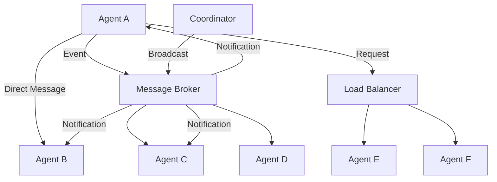

# Inter-Agent Communication Protocols

## Overview
This document defines the communication protocols and patterns used for inter-agent coordination, collaboration, and data exchange in the parallel AI system.

## Communication Architecture



## Core Protocol Stack

### 1. Transport Layer
```typescript
interface Transport {
  send(destination: AgentId, message: Message): Promise<void>;
  receive(): AsyncIterator<Message>;
  connect(endpoint: Endpoint): Promise<Connection>;
  disconnect(): Promise<void>;
}

class WebSocketTransport implements Transport {
  private connections: Map<AgentId, WebSocket> = new Map();
  private messageQueue: Queue<Message> = new Queue();
  
  async send(destination: AgentId, message: Message): Promise<void> {
    const connection = await this.getConnection(destination);
    const serialized = this.serializer.serialize(message);
    connection.send(serialized);
  }
  
  async *receive(): AsyncIterator<Message> {
    while (true) {
      const message = await this.messageQueue.dequeue();
      yield message;
    }
  }
}
```

### 2. Message Format
```typescript
interface Message {
  id: string;
  timestamp: Date;
  source: AgentId;
  destination: AgentId | AgentId[];
  type: MessageType;
  payload: any;
  headers: Record<string, string>;
  priority: Priority;
  ttl?: number;
  replyTo?: string;
  correlationId?: string;
}

enum MessageType {
  REQUEST = 'REQUEST',
  RESPONSE = 'RESPONSE',
  EVENT = 'EVENT',
  COMMAND = 'COMMAND',
  NOTIFICATION = 'NOTIFICATION',
  HEARTBEAT = 'HEARTBEAT'
}
```

### 3. Protocol Stack Implementation
```typescript
class ProtocolStack {
  private layers: ProtocolLayer[] = [];
  
  constructor() {
    // Stack from bottom to top
    this.layers = [
      new TransportLayer(),
      new SerializationLayer(),
      new CompressionLayer(),
      new EncryptionLayer(),
      new RoutingLayer(),
      new ReliabilityLayer(),
      new ApplicationLayer()
    ];
  }
  
  async send(message: Message): Promise<void> {
    let processedMessage = message;
    
    // Process through layers top-down
    for (let i = this.layers.length - 1; i >= 0; i--) {
      processedMessage = await this.layers[i].processOutbound(processedMessage);
    }
  }
  
  async receive(rawData: Buffer): Promise<Message> {
    let data = rawData;
    
    // Process through layers bottom-up
    for (const layer of this.layers) {
      data = await layer.processInbound(data);
    }
    
    return data as Message;
  }
}
```

## Communication Patterns

### 1. Request-Response Pattern
```typescript
class RequestResponseClient {
  private pendingRequests: Map<string, PendingRequest> = new Map();
  
  async sendRequest<T>(
    destination: AgentId,
    payload: any,
    timeout: number = 30000
  ): Promise<T> {
    const requestId = this.generateId();
    const message: Message = {
      id: requestId,
      timestamp: new Date(),
      source: this.agentId,
      destination,
      type: MessageType.REQUEST,
      payload,
      headers: {},
      priority: Priority.NORMAL,
      replyTo: this.agentId
    };
    
    return new Promise<T>((resolve, reject) => {
      const timer = setTimeout(() => {
        this.pendingRequests.delete(requestId);
        reject(new TimeoutError(`Request ${requestId} timed out`));
      }, timeout);
      
      this.pendingRequests.set(requestId, {
        resolve,
        reject,
        timer
      });
      
      this.transport.send(destination, message);
    });
  }
  
  handleResponse(message: Message): void {
    const pending = this.pendingRequests.get(message.correlationId);
    if (pending) {
      clearTimeout(pending.timer);
      this.pendingRequests.delete(message.correlationId);
      pending.resolve(message.payload);
    }
  }
}
```

### 2. Publish-Subscribe Pattern
```typescript
class EventBus {
  private subscribers: Map<string, Set<EventHandler>> = new Map();
  private messageRouter: MessageRouter;
  
  subscribe(eventType: string, handler: EventHandler): Subscription {
    if (!this.subscribers.has(eventType)) {
      this.subscribers.set(eventType, new Set());
    }
    
    this.subscribers.get(eventType)!.add(handler);
    
    return {
      unsubscribe: () => {
        this.subscribers.get(eventType)?.delete(handler);
      }
    };
  }
  
  async publish(eventType: string, data: any, options?: PublishOptions): Promise<void> {
    const event: Event = {
      id: this.generateId(),
      type: eventType,
      data,
      timestamp: new Date(),
      source: this.agentId,
      options: options || {}
    };
    
    // Local subscribers
    const localHandlers = this.subscribers.get(eventType) || new Set();
    await Promise.all([...localHandlers].map(handler => handler(event)));
    
    // Remote subscribers
    await this.messageRouter.broadcast(eventType, event);
  }
}
```

### 3. Command Pattern
```typescript
interface Command {
  id: string;
  type: string;
  target: AgentId;
  payload: any;
  timeout?: number;
  retryPolicy?: RetryPolicy;
}

class CommandDispatcher {
  private commandHandlers: Map<string, CommandHandler> = new Map();
  
  registerHandler(commandType: string, handler: CommandHandler): void {
    this.commandHandlers.set(commandType, handler);
  }
  
  async executeCommand(command: Command): Promise<CommandResult> {
    const handler = this.commandHandlers.get(command.type);
    if (!handler) {
      throw new UnknownCommandError(command.type);
    }
    
    const context = new CommandContext(command, this.agentId);
    return await handler.execute(context);
  }
  
  async sendCommand(command: Command): Promise<CommandResult> {
    const message: Message = {
      id: command.id,
      timestamp: new Date(),
      source: this.agentId,
      destination: command.target,
      type: MessageType.COMMAND,
      payload: command,
      headers: {},
      priority: Priority.HIGH
    };
    
    return await this.requestResponseClient.sendRequest(
      command.target,
      message,
      command.timeout
    );
  }
}
```

## Advanced Communication Features

### 1. Message Ordering and Sequencing
```typescript
class SequentialMessageProcessor {
  private sequenceNumbers: Map<AgentId, number> = new Map();
  private pendingMessages: Map<AgentId, PriorityQueue<Message>> = new Map();
  
  async processMessage(message: Message): Promise<void> {
    const expectedSeq = this.getNextSequenceNumber(message.source);
    const messageSeq = message.headers['sequence-number'];
    
    if (messageSeq === expectedSeq.toString()) {
      // Process immediately
      await this.handleMessage(message);
      this.incrementSequenceNumber(message.source);
      
      // Check for buffered messages
      await this.processBufferedMessages(message.source);
    } else {
      // Buffer out-of-order message
      this.bufferMessage(message);
    }
  }
}
```

### 2. Flow Control and Backpressure
```typescript
class FlowController {
  private windowSize: number = 100;
  private inflightMessages: number = 0;
  private sendWindow: SlidingWindow;
  
  async canSend(): Promise<boolean> {
    return this.inflightMessages < this.windowSize;
  }
  
  async waitForCapacity(): Promise<void> {
    while (!await this.canSend()) {
      await this.delay(10); // Wait 10ms before checking again
    }
  }
  
  async sendWithFlowControl(message: Message): Promise<void> {
    await this.waitForCapacity();
    this.inflightMessages++;
    
    try {
      await this.transport.send(message.destination, message);
    } finally {
      this.inflightMessages--;
    }
  }
}
```

### 3. Message Delivery Guarantees
```typescript
enum DeliveryGuarantee {
  AT_MOST_ONCE = 'AT_MOST_ONCE',    // Fire and forget
  AT_LEAST_ONCE = 'AT_LEAST_ONCE',  // Retry until acknowledged
  EXACTLY_ONCE = 'EXACTLY_ONCE'     // Idempotent delivery
}

class ReliableMessageDelivery {
  private pendingAcks: Map<string, PendingAck> = new Map();
  private deliveredMessages: Set<string> = new Set();
  
  async sendReliable(
    message: Message,
    guarantee: DeliveryGuarantee
  ): Promise<void> {
    switch (guarantee) {
      case DeliveryGuarantee.AT_MOST_ONCE:
        await this.sendOnce(message);
        break;
        
      case DeliveryGuarantee.AT_LEAST_ONCE:
        await this.sendWithRetry(message);
        break;
        
      case DeliveryGuarantee.EXACTLY_ONCE:
        await this.sendExactlyOnce(message);
        break;
    }
  }
  
  private async sendWithRetry(message: Message): Promise<void> {
    let attempt = 0;
    const maxRetries = 3;
    
    while (attempt < maxRetries) {
      try {
        await this.transport.send(message.destination, message);
        await this.waitForAck(message.id, 5000);
        return;
      } catch (error) {
        if (error instanceof TimeoutError && attempt < maxRetries - 1) {
          attempt++;
          await this.delay(Math.pow(2, attempt) * 1000);
          continue;
        }
        throw error;
      }
    }
  }
}
```

## Security Protocols

### 1. Message Authentication
```typescript
class MessageAuthenticator {
  private keyManager: KeyManager;
  
  async signMessage(message: Message, privateKey: PrivateKey): Promise<Message> {
    const payload = JSON.stringify(message.payload);
    const signature = await this.keyManager.sign(payload, privateKey);
    
    return {
      ...message,
      headers: {
        ...message.headers,
        signature,
        'signature-algorithm': 'RS256'
      }
    };
  }
  
  async verifyMessage(message: Message, publicKey: PublicKey): Promise<boolean> {
    const signature = message.headers.signature;
    if (!signature) return false;
    
    const payload = JSON.stringify(message.payload);
    return await this.keyManager.verify(payload, signature, publicKey);
  }
}
```

### 2. End-to-End Encryption
```typescript
class MessageEncryption {
  private encryptionManager: EncryptionManager;
  
  async encryptMessage(message: Message, recipientKey: PublicKey): Promise<Message> {
    const encryptedPayload = await this.encryptionManager.encrypt(
      JSON.stringify(message.payload),
      recipientKey
    );
    
    return {
      ...message,
      payload: encryptedPayload,
      headers: {
        ...message.headers,
        'content-encryption': 'AES-256-GCM',
        encrypted: 'true'
      }
    };
  }
  
  async decryptMessage(message: Message, privateKey: PrivateKey): Promise<Message> {
    if (message.headers.encrypted !== 'true') {
      return message;
    }
    
    const decryptedPayload = await this.encryptionManager.decrypt(
      message.payload,
      privateKey
    );
    
    return {
      ...message,
      payload: JSON.parse(decryptedPayload),
      headers: {
        ...message.headers,
        encrypted: 'false'
      }
    };
  }
}
```

## Performance Optimization

### 1. Message Batching
```typescript
class MessageBatcher {
  private batches: Map<AgentId, Message[]> = new Map();
  private batchTimers: Map<AgentId, NodeJS.Timeout> = new Map();
  private batchSize: number = 100;
  private batchTimeout: number = 10; // ms
  
  async sendMessage(destination: AgentId, message: Message): Promise<void> {
    if (!this.batches.has(destination)) {
      this.batches.set(destination, []);
      this.scheduleBatchSend(destination);
    }
    
    const batch = this.batches.get(destination)!;
    batch.push(message);
    
    if (batch.length >= this.batchSize) {
      await this.flushBatch(destination);
    }
  }
  
  private scheduleBatchSend(destination: AgentId): void {
    const timer = setTimeout(async () => {
      await this.flushBatch(destination);
    }, this.batchTimeout);
    
    this.batchTimers.set(destination, timer);
  }
  
  private async flushBatch(destination: AgentId): Promise<void> {
    const batch = this.batches.get(destination);
    if (!batch || batch.length === 0) return;
    
    // Clear timer and batch
    const timer = this.batchTimers.get(destination);
    if (timer) clearTimeout(timer);
    
    this.batches.delete(destination);
    this.batchTimers.delete(destination);
    
    // Send batch
    const batchMessage: Message = {
      id: this.generateId(),
      timestamp: new Date(),
      source: this.agentId,
      destination,
      type: MessageType.BATCH,
      payload: batch,
      headers: { 'batch-size': batch.length.toString() },
      priority: Priority.NORMAL
    };
    
    await this.transport.send(destination, batchMessage);
  }
}
```

### 2. Connection Pooling
```typescript
class ConnectionPool {
  private pools: Map<AgentId, Connection[]> = new Map();
  private activeConnections: Map<AgentId, Connection[]> = new Map();
  private maxPoolSize: number = 10;
  private minPoolSize: number = 2;
  
  async getConnection(destination: AgentId): Promise<Connection> {
    let pool = this.pools.get(destination);
    if (!pool) {
      pool = [];
      this.pools.set(destination, pool);
    }
    
    // Try to get existing connection
    if (pool.length > 0) {
      return pool.pop()!;
    }
    
    // Create new connection if under limit
    const activeCount = this.activeConnections.get(destination)?.length || 0;
    if (activeCount < this.maxPoolSize) {
      return await this.createConnection(destination);
    }
    
    // Wait for available connection
    return await this.waitForConnection(destination);
  }
  
  releaseConnection(destination: AgentId, connection: Connection): void {
    const pool = this.pools.get(destination) || [];
    if (pool.length < this.maxPoolSize) {
      pool.push(connection);
    } else {
      connection.close();
    }
  }
}
```

## Monitoring and Observability

### 1. Message Tracing
```typescript
class MessageTracer {
  private tracer: Tracer;
  
  traceMessage(message: Message, operation: string): Span {
    const span = this.tracer.startSpan(`message.${operation}`, {
      attributes: {
        'message.id': message.id,
        'message.type': message.type,
        'message.source': message.source,
        'message.destination': Array.isArray(message.destination) 
          ? message.destination.join(',') 
          : message.destination,
        'message.size': JSON.stringify(message).length
      }
    });
    
    return span;
  }
  
  async traceMessageExecution<T>(
    message: Message,
    operation: string,
    fn: () => Promise<T>
  ): Promise<T> {
    const span = this.traceMessage(message, operation);
    
    try {
      const result = await fn();
      span.setStatus({ code: SpanStatusCode.OK });
      return result;
    } catch (error) {
      span.setStatus({
        code: SpanStatusCode.ERROR,
        message: error.message
      });
      throw error;
    } finally {
      span.end();
    }
  }
}
```

### 2. Performance Metrics
```typescript
class CommunicationMetrics {
  private messageCounter: Counter;
  private messageLatency: Histogram;
  private connectionGauge: Gauge;
  
  constructor() {
    this.messageCounter = new Counter({
      name: 'messages_total',
      help: 'Total number of messages sent/received',
      labelNames: ['direction', 'type', 'status']
    });
    
    this.messageLatency = new Histogram({
      name: 'message_latency_seconds',
      help: 'Message processing latency',
      labelNames: ['operation', 'type']
    });
    
    this.connectionGauge = new Gauge({
      name: 'active_connections',
      help: 'Number of active connections',
      labelNames: ['destination']
    });
  }
  
  recordMessageSent(message: Message): void {
    this.messageCounter.inc({
      direction: 'outbound',
      type: message.type,
      status: 'sent'
    });
  }
  
  recordMessageLatency(operation: string, type: string, latency: number): void {
    this.messageLatency.observe({ operation, type }, latency);
  }
}
```

## Error Handling and Recovery

### 1. Circuit Breaker for Communication
```typescript
class CommunicationCircuitBreaker {
  private breakers: Map<AgentId, CircuitBreaker> = new Map();
  
  async sendWithCircuitBreaker(destination: AgentId, message: Message): Promise<void> {
    let breaker = this.breakers.get(destination);
    if (!breaker) {
      breaker = new CircuitBreaker({
        failureThreshold: 5,
        recoveryTimeout: 30000,
        monitoringPeriod: 10000
      });
      this.breakers.set(destination, breaker);
    }
    
    return await breaker.execute(async () => {
      return await this.transport.send(destination, message);
    });
  }
}
```

### 2. Dead Letter Queue
```typescript
class DeadLetterQueue {
  private deadLetters: Map<string, DeadLetter> = new Map();
  private maxRetries: number = 3;
  
  async handleFailedMessage(message: Message, error: Error): Promise<void> {
    const deadLetter = this.deadLetters.get(message.id);
    
    if (!deadLetter) {
      this.deadLetters.set(message.id, {
        message,
        error,
        attempts: 1,
        firstFailure: new Date(),
        lastAttempt: new Date()
      });
    } else {
      deadLetter.attempts++;
      deadLetter.lastAttempt = new Date();
      deadLetter.error = error;
    }
    
    // Schedule retry if under limit
    if ((deadLetter?.attempts || 1) < this.maxRetries) {
      await this.scheduleRetry(message, deadLetter?.attempts || 1);
    } else {
      await this.sendToDeadLetterStore(message, error);
    }
  }
}
```

## Configuration and Deployment

### Communication Configuration
```yaml
communication:
  transports:
    - type: websocket
      port: 8080
      ssl: true
      compression: true
    - type: tcp
      port: 8081
      keepalive: true
    - type: udp
      port: 8082
      multicast: false
      
  protocols:
    message_format: json
    compression: gzip
    encryption: aes-256-gcm
    authentication: jwt
    
  reliability:
    delivery_guarantee: at-least-once
    retry_policy:
      max_retries: 3
      backoff: exponential
      initial_delay: 1000
      max_delay: 30000
      
  flow_control:
    window_size: 100
    batch_size: 50
    batch_timeout: 10ms
    
  security:
    encryption_enabled: true
    authentication_required: true
    authorization_enabled: true
    
  monitoring:
    tracing_enabled: true
    metrics_collection: true
    dead_letter_queue: true
```

## Best Practices

### 1. Protocol Design
- Use versioned message schemas
- Implement backward compatibility
- Design for idempotency
- Handle partial failures gracefully

### 2. Performance Optimization
- Use appropriate batching strategies
- Implement connection pooling
- Monitor and tune buffer sizes
- Use compression for large payloads

### 3. Security
- Always authenticate message sources
- Encrypt sensitive data
- Implement rate limiting
- Use secure transport protocols

### 4. Monitoring
- Trace all message flows
- Monitor communication patterns
- Alert on anomalies
- Track performance metrics