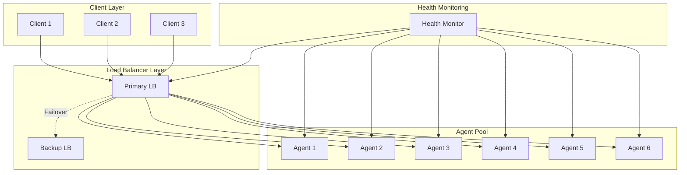

# Load Balancing and Failover Strategies

## Overview
This document defines comprehensive load balancing algorithms, failover mechanisms, and high availability strategies for the parallel AI system, ensuring optimal resource utilization and system resilience.

## Load Balancing Architecture



## Core Load Balancing Components

### 1. Load Balancer Interface
```typescript
interface LoadBalancer {
  selectAgent(request: Request, availableAgents: Agent[]): Agent | null;
  updateAgentMetrics(agentId: string, metrics: AgentMetrics): void;
  removeAgent(agentId: string): void;
  addAgent(agent: Agent): void;
  getHealthStatus(): HealthStatus;
}

abstract class BaseLoadBalancer implements LoadBalancer {
  protected agents: Map<string, Agent> = new Map();
  protected agentMetrics: Map<string, AgentMetrics> = new Map();
  protected healthMonitor: HealthMonitor;
  
  constructor(healthMonitor: HealthMonitor) {
    this.healthMonitor = healthMonitor;
  }
  
  abstract selectAgent(request: Request, availableAgents: Agent[]): Agent | null;
  
  updateAgentMetrics(agentId: string, metrics: AgentMetrics): void {
    this.agentMetrics.set(agentId, {
      ...this.agentMetrics.get(agentId),
      ...metrics,
      lastUpdated: new Date()
    });
  }
  
  addAgent(agent: Agent): void {
    this.agents.set(agent.id, agent);
    this.agentMetrics.set(agent.id, new AgentMetrics());
  }
  
  removeAgent(agentId: string): void {
    this.agents.delete(agentId);
    this.agentMetrics.delete(agentId);
  }
  
  protected getHealthyAgents(): Agent[] {
    return Array.from(this.agents.values()).filter(agent => 
      this.healthMonitor.isHealthy(agent.id)
    );
  }
}
```

### 2. Agent Metrics
```typescript
class AgentMetrics {
  public cpuUsage: number = 0;
  public memoryUsage: number = 0;
  public activeConnections: number = 0;
  public requestCount: number = 0;
  public averageResponseTime: number = 0;
  public errorRate: number = 0;
  public lastRequestTime: Date = new Date();
  public lastUpdated: Date = new Date();
  
  // Weighted load calculation
  public getLoadScore(weights: LoadWeights = DEFAULT_WEIGHTS): number {
    return (
      this.cpuUsage * weights.cpu +
      this.memoryUsage * weights.memory +
      this.activeConnections * weights.connections +
      this.averageResponseTime * weights.responseTime +
      this.errorRate * weights.errorRate
    );
  }
  
  // Health score (0-100, higher is healthier)
  public getHealthScore(): number {
    const cpuScore = Math.max(0, 100 - this.cpuUsage);
    const memoryScore = Math.max(0, 100 - this.memoryUsage);
    const errorScore = Math.max(0, 100 - this.errorRate);
    const responseScore = Math.max(0, 100 - Math.min(this.averageResponseTime / 10, 100));
    
    return (cpuScore + memoryScore + errorScore + responseScore) / 4;
  }
}

interface LoadWeights {
  cpu: number;
  memory: number;
  connections: number;
  responseTime: number;
  errorRate: number;
}

const DEFAULT_WEIGHTS: LoadWeights = {
  cpu: 0.3,
  memory: 0.2,
  connections: 0.2,
  responseTime: 0.2,
  errorRate: 0.1
};
```

## Load Balancing Algorithms

### 1. Round Robin Load Balancer
```typescript
class RoundRobinLoadBalancer extends BaseLoadBalancer {
  private currentIndex: number = 0;
  
  selectAgent(request: Request, availableAgents: Agent[]): Agent | null {
    const healthyAgents = this.getHealthyAgents().filter(agent =>
      availableAgents.some(a => a.id === agent.id)
    );
    
    if (healthyAgents.length === 0) return null;
    
    const selectedAgent = healthyAgents[this.currentIndex % healthyAgents.length];
    this.currentIndex = (this.currentIndex + 1) % healthyAgents.length;
    
    return selectedAgent;
  }
}
```

### 2. Weighted Round Robin Load Balancer
```typescript
class WeightedRoundRobinLoadBalancer extends BaseLoadBalancer {
  private currentWeights: Map<string, number> = new Map();
  
  selectAgent(request: Request, availableAgents: Agent[]): Agent | null {
    const healthyAgents = this.getHealthyAgents().filter(agent =>
      availableAgents.some(a => a.id === agent.id)
    );
    
    if (healthyAgents.length === 0) return null;
    
    let selectedAgent: Agent | null = null;
    let maxCurrentWeight = -1;
    let totalWeight = 0;
    
    for (const agent of healthyAgents) {
      const weight = this.getAgentWeight(agent);
      totalWeight += weight;
      
      const currentWeight = (this.currentWeights.get(agent.id) || 0) + weight;
      this.currentWeights.set(agent.id, currentWeight);
      
      if (currentWeight > maxCurrentWeight) {
        maxCurrentWeight = currentWeight;
        selectedAgent = agent;
      }
    }
    
    if (selectedAgent) {
      this.currentWeights.set(
        selectedAgent.id,
        (this.currentWeights.get(selectedAgent.id) || 0) - totalWeight
      );
    }
    
    return selectedAgent;
  }
  
  private getAgentWeight(agent: Agent): number {
    const metrics = this.agentMetrics.get(agent.id);
    if (!metrics) return 1;
    
    // Higher health score = higher weight
    const healthScore = metrics.getHealthScore();
    return Math.max(1, Math.floor(healthScore / 10));
  }
}
```

### 3. Least Connections Load Balancer
```typescript
class LeastConnectionsLoadBalancer extends BaseLoadBalancer {
  selectAgent(request: Request, availableAgents: Agent[]): Agent | null {
    const healthyAgents = this.getHealthyAgents().filter(agent =>
      availableAgents.some(a => a.id === agent.id)
    );
    
    if (healthyAgents.length === 0) return null;
    
    return healthyAgents.reduce((leastLoaded, current) => {
      const currentConnections = this.agentMetrics.get(current.id)?.activeConnections || 0;
      const leastConnections = this.agentMetrics.get(leastLoaded.id)?.activeConnections || 0;
      
      return currentConnections < leastConnections ? current : leastLoaded;
    });
  }
}
```

### 4. Least Response Time Load Balancer
```typescript
class LeastResponseTimeLoadBalancer extends BaseLoadBalancer {
  selectAgent(request: Request, availableAgents: Agent[]): Agent | null {
    const healthyAgents = this.getHealthyAgents().filter(agent =>
      availableAgents.some(a => a.id === agent.id)
    );
    
    if (healthyAgents.length === 0) return null;
    
    return healthyAgents.reduce((fastest, current) => {
      const currentMetrics = this.agentMetrics.get(current.id);
      const fastestMetrics = this.agentMetrics.get(fastest.id);
      
      if (!currentMetrics) return fastest;
      if (!fastestMetrics) return current;
      
      // Combine response time with active connections for better decision
      const currentScore = currentMetrics.averageResponseTime + 
                          (currentMetrics.activeConnections * 10);
      const fastestScore = fastestMetrics.averageResponseTime + 
                          (fastestMetrics.activeConnections * 10);
      
      return currentScore < fastestScore ? current : fastest;
    });
  }
}
```

### 5. Resource-Based Load Balancer
```typescript
class ResourceBasedLoadBalancer extends BaseLoadBalancer {
  constructor(
    healthMonitor: HealthMonitor,
    private weights: LoadWeights = DEFAULT_WEIGHTS
  ) {
    super(healthMonitor);
  }
  
  selectAgent(request: Request, availableAgents: Agent[]): Agent | null {
    const healthyAgents = this.getHealthyAgents().filter(agent =>
      availableAgents.some(a => a.id === agent.id)
    );
    
    if (healthyAgents.length === 0) return null;
    
    // Select agent with lowest load score
    return healthyAgents.reduce((leastLoaded, current) => {
      const currentMetrics = this.agentMetrics.get(current.id);
      const leastLoadedMetrics = this.agentMetrics.get(leastLoaded.id);
      
      if (!currentMetrics) return leastLoaded;
      if (!leastLoadedMetrics) return current;
      
      const currentLoad = currentMetrics.getLoadScore(this.weights);
      const leastLoad = leastLoadedMetrics.getLoadScore(this.weights);
      
      return currentLoad < leastLoad ? current : leastLoaded;
    });
  }
}
```

### 6. Consistent Hashing Load Balancer
```typescript
class ConsistentHashingLoadBalancer extends BaseLoadBalancer {
  private hashRing: ConsistentHashRing;
  private virtualNodes: number;
  
  constructor(healthMonitor: HealthMonitor, virtualNodes: number = 150) {
    super(healthMonitor);
    this.virtualNodes = virtualNodes;
    this.hashRing = new ConsistentHashRing();
  }
  
  selectAgent(request: Request, availableAgents: Agent[]): Agent | null {
    const healthyAgents = this.getHealthyAgents().filter(agent =>
      availableAgents.some(a => a.id === agent.id)
    );
    
    if (healthyAgents.length === 0) return null;
    
    // Update hash ring with current healthy agents
    this.updateHashRing(healthyAgents);
    
    // Get request key (could be user ID, session ID, etc.)
    const requestKey = this.getRequestKey(request);
    const agentId = this.hashRing.get(requestKey);
    
    return healthyAgents.find(agent => agent.id === agentId) || null;
  }
  
  private updateHashRing(agents: Agent[]): void {
    this.hashRing.clear();
    
    for (const agent of agents) {
      for (let i = 0; i < this.virtualNodes; i++) {
        const virtualNodeKey = `${agent.id}:${i}`;
        this.hashRing.add(virtualNodeKey, agent.id);
      }
    }
  }
  
  private getRequestKey(request: Request): string {
    // Use different keys based on request type
    return request.sessionId || request.userId || request.clientId || 'default';
  }
  
  addAgent(agent: Agent): void {
    super.addAgent(agent);
    // Add to hash ring
    for (let i = 0; i < this.virtualNodes; i++) {
      const virtualNodeKey = `${agent.id}:${i}`;
      this.hashRing.add(virtualNodeKey, agent.id);
    }
  }
  
  removeAgent(agentId: string): void {
    super.removeAgent(agentId);
    // Remove from hash ring
    for (let i = 0; i < this.virtualNodes; i++) {
      const virtualNodeKey = `${agentId}:${i}`;
      this.hashRing.remove(virtualNodeKey);
    }
  }
}
```

## Advanced Load Balancing Strategies

### 1. Adaptive Load Balancer
```typescript
class AdaptiveLoadBalancer extends BaseLoadBalancer {
  private strategies: Map<string, LoadBalancer> = new Map();
  private currentStrategy: string = 'resource-based';
  private performanceHistory: PerformanceHistory = new PerformanceHistory();
  private adaptationInterval: number = 30000; // 30 seconds
  
  constructor(healthMonitor: HealthMonitor) {
    super(healthMonitor);
    
    // Initialize strategies
    this.strategies.set('round-robin', new RoundRobinLoadBalancer(healthMonitor));
    this.strategies.set('least-connections', new LeastConnectionsLoadBalancer(healthMonitor));
    this.strategies.set('least-response-time', new LeastResponseTimeLoadBalancer(healthMonitor));
    this.strategies.set('resource-based', new ResourceBasedLoadBalancer(healthMonitor));
    
    // Start adaptation loop
    this.startAdaptation();
  }
  
  selectAgent(request: Request, availableAgents: Agent[]): Agent | null {
    const strategy = this.strategies.get(this.currentStrategy);
    if (!strategy) return null;
    
    const startTime = Date.now();
    const selectedAgent = strategy.selectAgent(request, availableAgents);
    const selectionTime = Date.now() - startTime;
    
    // Record performance
    this.performanceHistory.record(this.currentStrategy, {
      selectionTime,
      agentSelected: selectedAgent?.id || null,
      timestamp: new Date()
    });
    
    return selectedAgent;
  }
  
  private startAdaptation(): void {
    setInterval(() => {
      this.adaptStrategy();
    }, this.adaptationInterval);
  }
  
  private adaptStrategy(): void {
    const performance = this.performanceHistory.getPerformanceMetrics();
    const bestStrategy = this.findBestStrategy(performance);
    
    if (bestStrategy !== this.currentStrategy) {
      console.log(`Adapting load balancing strategy from ${this.currentStrategy} to ${bestStrategy}`);
      this.currentStrategy = bestStrategy;
    }
  }
  
  private findBestStrategy(performance: Map<string, StrategyPerformance>): string {
    let bestStrategy = this.currentStrategy;
    let bestScore = 0;
    
    for (const [strategy, metrics] of performance) {
      const score = this.calculateStrategyScore(metrics);
      if (score > bestScore) {
        bestScore = score;
        bestStrategy = strategy;
      }
    }
    
    return bestStrategy;
  }
  
  private calculateStrategyScore(metrics: StrategyPerformance): number {
    // Higher is better
    const responseTimeScore = Math.max(0, 100 - metrics.averageResponseTime);
    const errorRateScore = Math.max(0, 100 - metrics.errorRate);
    const throughputScore = Math.min(100, metrics.throughput / 10);
    
    return (responseTimeScore + errorRateScore + throughputScore) / 3;
  }
}
```

### 2. Priority-Based Load Balancer
```typescript
class PriorityBasedLoadBalancer extends BaseLoadBalancer {
  private priorityQueues: Map<Priority, Agent[]> = new Map();
  
  constructor(healthMonitor: HealthMonitor) {
    super(healthMonitor);
    
    // Initialize priority queues
    for (const priority of Object.values(Priority)) {
      this.priorityQueues.set(priority, []);
    }
  }
  
  selectAgent(request: Request, availableAgents: Agent[]): Agent | null {
    const requestPriority = request.priority || Priority.NORMAL;
    const healthyAgents = this.getHealthyAgents().filter(agent =>
      availableAgents.some(a => a.id === agent.id)
    );
    
    if (healthyAgents.length === 0) return null;
    
    // Try to find agent based on priority
    for (const priority of this.getPriorityOrder(requestPriority)) {
      const priorityAgents = this.getPriorityAgents(priority, healthyAgents);
      if (priorityAgents.length > 0) {
        return this.selectFromPriorityGroup(priorityAgents);
      }
    }
    
    return null;
  }
  
  private getPriorityOrder(requestPriority: Priority): Priority[] {
    const order = [Priority.HIGH, Priority.NORMAL, Priority.LOW];
    
    // Reorder based on request priority
    const index = order.indexOf(requestPriority);
    if (index > 0) {
      return [...order.slice(index), ...order.slice(0, index)];
    }
    
    return order;
  }
  
  private getPriorityAgents(priority: Priority, availableAgents: Agent[]): Agent[] {
    return availableAgents.filter(agent => {
      const metrics = this.agentMetrics.get(agent.id);
      return this.getAgentPriority(agent, metrics) === priority;
    });
  }
  
  private getAgentPriority(agent: Agent, metrics?: AgentMetrics): Priority {
    if (!metrics) return Priority.LOW;
    
    const healthScore = metrics.getHealthScore();
    const loadScore = metrics.getLoadScore();
    
    // High-performing agents get high priority
    if (healthScore > 80 && loadScore < 30) return Priority.HIGH;
    if (healthScore > 60 && loadScore < 60) return Priority.NORMAL;
    return Priority.LOW;
  }
  
  private selectFromPriorityGroup(agents: Agent[]): Agent {
    // Use least connections within priority group
    return agents.reduce((leastLoaded, current) => {
      const currentConnections = this.agentMetrics.get(current.id)?.activeConnections || 0;
      const leastConnections = this.agentMetrics.get(leastLoaded.id)?.activeConnections || 0;
      
      return currentConnections < leastConnections ? current : leastLoaded;
    });
  }
}
```

## Failover Strategies

### 1. Active-Passive Failover
```typescript
class ActivePassiveFailover {
  private activeAgents: Set<string> = new Set();
  private passiveAgents: Set<string> = new Set();
  private healthMonitor: HealthMonitor;
  private failoverThreshold: number = 3; // failures before failover
  private failureCount: Map<string, number> = new Map();
  
  constructor(healthMonitor: HealthMonitor) {
    this.healthMonitor = healthMonitor;
    this.healthMonitor.onHealthChange((agentId, isHealthy) => {
      this.handleHealthChange(agentId, isHealthy);
    });
  }
  
  private async handleHealthChange(agentId: string, isHealthy: boolean): Promise<void> {
    if (!isHealthy) {
      await this.handleAgentFailure(agentId);
    } else {
      await this.handleAgentRecovery(agentId);
    }
  }
  
  private async handleAgentFailure(agentId: string): Promise<void> {
    const currentFailures = (this.failureCount.get(agentId) || 0) + 1;
    this.failureCount.set(agentId, currentFailures);
    
    if (currentFailures >= this.failoverThreshold) {
      await this.performFailover(agentId);
    }
  }
  
  private async performFailover(failedAgentId: string): Promise<void> {
    if (!this.activeAgents.has(failedAgentId)) return;
    
    // Move failed agent to passive
    this.activeAgents.delete(failedAgentId);
    this.passiveAgents.add(failedAgentId);
    
    // Find replacement from passive agents
    const replacement = this.findHealthyPassiveAgent();
    if (replacement) {
      this.passiveAgents.delete(replacement);
      this.activeAgents.add(replacement);
      
      console.log(`Failover: ${failedAgentId} -> ${replacement}`);
      await this.notifyFailover(failedAgentId, replacement);
    }
  }
  
  private async handleAgentRecovery(agentId: string): Promise<void> {
    this.failureCount.delete(agentId);
    
    // If agent was in passive state and we need more active agents
    if (this.passiveAgents.has(agentId) && this.shouldPromoteToActive()) {
      this.passiveAgents.delete(agentId);
      this.activeAgents.add(agentId);
      
      console.log(`Recovery: ${agentId} promoted to active`);
    }
  }
  
  private findHealthyPassiveAgent(): string | null {
    for (const agentId of this.passiveAgents) {
      if (this.healthMonitor.isHealthy(agentId)) {
        return agentId;
      }
    }
    return null;
  }
  
  private shouldPromoteToActive(): boolean {
    return this.activeAgents.size < this.getDesiredActiveCount();
  }
  
  private getDesiredActiveCount(): number {
    return Math.ceil((this.activeAgents.size + this.passiveAgents.size) * 0.7);
  }
  
  private async notifyFailover(failedAgent: string, replacementAgent: string): Promise<void> {
    // Notify monitoring systems, update load balancers, etc.
    await this.eventBus.publish({
      type: 'agent.failover',
      data: {
        failedAgent,
        replacementAgent,
        timestamp: new Date()
      }
    });
  }
}
```

### 2. Circuit Breaker Pattern
```typescript
class AgentCircuitBreaker {
  private breakers: Map<string, CircuitBreakerState> = new Map();
  private config: CircuitBreakerConfig;
  
  constructor(config: CircuitBreakerConfig) {
    this.config = {
      failureThreshold: 5,
      recoveryTimeout: 30000,
      halfOpenMaxCalls: 3,
      ...config
    };
  }
  
  async executeWithCircuitBreaker<T>(
    agentId: string,
    operation: () => Promise<T>
  ): Promise<T> {
    const breaker = this.getOrCreateBreaker(agentId);
    
    if (breaker.state === CircuitState.OPEN) {
      if (this.shouldAttemptReset(breaker)) {
        breaker.state = CircuitState.HALF_OPEN;
        breaker.halfOpenCalls = 0;
      } else {
        throw new CircuitBreakerOpenError(`Circuit breaker open for agent ${agentId}`);
      }
    }
    
    if (breaker.state === CircuitState.HALF_OPEN) {
      if (breaker.halfOpenCalls >= this.config.halfOpenMaxCalls) {
        throw new CircuitBreakerOpenError(`Circuit breaker half-open limit exceeded for agent ${agentId}`);
      }
      breaker.halfOpenCalls++;
    }
    
    try {
      const result = await operation();
      this.onSuccess(breaker);
      return result;
    } catch (error) {
      this.onFailure(breaker);
      throw error;
    }
  }
  
  private getOrCreateBreaker(agentId: string): CircuitBreakerState {
    if (!this.breakers.has(agentId)) {
      this.breakers.set(agentId, {
        state: CircuitState.CLOSED,
        failureCount: 0,
        lastFailureTime: null,
        halfOpenCalls: 0
      });
    }
    return this.breakers.get(agentId)!;
  }
  
  private shouldAttemptReset(breaker: CircuitBreakerState): boolean {
    return breaker.lastFailureTime !== null &&
           Date.now() - breaker.lastFailureTime.getTime() > this.config.recoveryTimeout;
  }
  
  private onSuccess(breaker: CircuitBreakerState): void {
    breaker.failureCount = 0;
    breaker.lastFailureTime = null;
    if (breaker.state === CircuitState.HALF_OPEN) {
      breaker.state = CircuitState.CLOSED;
    }
  }
  
  private onFailure(breaker: CircuitBreakerState): void {
    breaker.failureCount++;
    breaker.lastFailureTime = new Date();
    
    if (breaker.failureCount >= this.config.failureThreshold) {
      breaker.state = CircuitState.OPEN;
    }
  }
}
```

### 3. Bulkhead Pattern
```typescript
class BulkheadIsolation {
  private pools: Map<string, ResourcePool> = new Map();
  private config: BulkheadConfig;
  
  constructor(config: BulkheadConfig) {
    this.config = config;
    this.initializePools();
  }
  
  private initializePools(): void {
    for (const [poolName, poolConfig] of Object.entries(this.config.pools)) {
      this.pools.set(poolName, new ResourcePool({
        name: poolName,
        maxSize: poolConfig.maxSize,
        minSize: poolConfig.minSize,
        timeout: poolConfig.timeout
      }));
    }
  }
  
  async executeInPool<T>(
    poolName: string,
    operation: (resource: PooledResource) => Promise<T>
  ): Promise<T> {
    const pool = this.pools.get(poolName);
    if (!pool) {
      throw new Error(`Pool ${poolName} not found`);
    }
    
    let resource: PooledResource | null = null;
    try {
      resource = await pool.acquire();
      return await operation(resource);
    } finally {
      if (resource) {
        await pool.release(resource);
      }
    }
  }
  
  getPoolStatus(poolName: string): PoolStatus | null {
    const pool = this.pools.get(poolName);
    return pool ? pool.getStatus() : null;
  }
  
  getAllPoolStatus(): Map<string, PoolStatus> {
    const status = new Map<string, PoolStatus>();
    for (const [name, pool] of this.pools) {
      status.set(name, pool.getStatus());
    }
    return status;
  }
}

class ResourcePool {
  private availableResources: Queue<PooledResource> = new Queue();
  private busyResources: Set<PooledResource> = new Set();
  private waitingQueue: Queue<PoolAcquisitionRequest> = new Queue();
  private config: PoolConfig;
  
  constructor(config: PoolConfig) {
    this.config = config;
    this.initializePool();
  }
  
  private async initializePool(): Promise<void> {
    for (let i = 0; i < this.config.minSize; i++) {
      const resource = await this.createResource();
      this.availableResources.enqueue(resource);
    }
  }
  
  async acquire(): Promise<PooledResource> {
    // Try to get available resource
    if (!this.availableResources.isEmpty()) {
      const resource = this.availableResources.dequeue()!;
      this.busyResources.add(resource);
      return resource;
    }
    
    // Create new resource if under limit
    if (this.getTotalSize() < this.config.maxSize) {
      const resource = await this.createResource();
      this.busyResources.add(resource);
      return resource;
    }
    
    // Wait for available resource
    return await this.waitForResource();
  }
  
  async release(resource: PooledResource): Promise<void> {
    this.busyResources.delete(resource);
    
    // Process waiting queue first
    if (!this.waitingQueue.isEmpty()) {
      const waitingRequest = this.waitingQueue.dequeue()!;
      this.busyResources.add(resource);
      waitingRequest.resolve(resource);
      return;
    }
    
    // Return to available pool or destroy if over min size
    if (this.availableResources.size() >= this.config.minSize) {
      await this.destroyResource(resource);
    } else {
      this.availableResources.enqueue(resource);
    }
  }
  
  private async waitForResource(): Promise<PooledResource> {
    return new Promise<PooledResource>((resolve, reject) => {
      const timeout = setTimeout(() => {
        reject(new PoolTimeoutError('Resource acquisition timeout'));
      }, this.config.timeout);
      
      this.waitingQueue.enqueue({
        resolve: (resource) => {
          clearTimeout(timeout);
          resolve(resource);
        },
        reject: (error) => {
          clearTimeout(timeout);
          reject(error);
        }
      });
    });
  }
  
  getStatus(): PoolStatus {
    return {
      name: this.config.name,
      totalSize: this.getTotalSize(),
      availableSize: this.availableResources.size(),
      busySize: this.busyResources.size,
      waitingCount: this.waitingQueue.size(),
      minSize: this.config.minSize,
      maxSize: this.config.maxSize
    };
  }
  
  private getTotalSize(): number {
    return this.availableResources.size() + this.busyResources.size;
  }
}
```

## High Availability Patterns

### 1. Multi-Region Failover
```typescript
class MultiRegionFailover {
  private regions: Map<string, RegionStatus> = new Map();
  private primaryRegion: string;
  private failoverThreshold: number = 0.7; // 70% health threshold
  
  constructor(
    primaryRegion: string,
    regions: string[]
  ) {
    this.primaryRegion = primaryRegion;
    
    for (const region of regions) {
      this.regions.set(region, {
        name: region,
        isPrimary: region === primaryRegion,
        healthScore: 1.0,
        lastHealthCheck: new Date(),
        agents: new Set<string>()
      });
    }
  }
  
  async updateRegionHealth(region: string, healthScore: number): Promise<void> {
    const regionStatus = this.regions.get(region);
    if (!regionStatus) return;
    
    regionStatus.healthScore = healthScore;
    regionStatus.lastHealthCheck = new Date();
    
    // Check if failover is needed
    if (region === this.primaryRegion && healthScore < this.failoverThreshold) {
      await this.performRegionFailover();
    }
  }
  
  private async performRegionFailover(): Promise<void> {
    const healthySecondary = this.findBestSecondaryRegion();
    if (!healthySecondary) {
      console.error('No healthy secondary region available for failover');
      return;
    }
    
    const oldPrimary = this.primaryRegion;
    this.primaryRegion = healthySecondary;
    
    // Update region statuses
    const oldPrimaryStatus = this.regions.get(oldPrimary)!;
    const newPrimaryStatus = this.regions.get(healthySecondary)!;
    
    oldPrimaryStatus.isPrimary = false;
    newPrimaryStatus.isPrimary = true;
    
    console.log(`Region failover: ${oldPrimary} -> ${healthySecondary}`);
    
    // Notify systems of failover
    await this.notifyRegionFailover(oldPrimary, healthySecondary);
  }
  
  private findBestSecondaryRegion(): string | null {
    let bestRegion: string | null = null;
    let bestScore = 0;
    
    for (const [region, status] of this.regions) {
      if (region !== this.primaryRegion && 
          status.healthScore > bestScore && 
          status.healthScore >= this.failoverThreshold) {
        bestScore = status.healthScore;
        bestRegion = region;
      }
    }
    
    return bestRegion;
  }
  
  getCurrentPrimary(): string {
    return this.primaryRegion;
  }
  
  getRegionStatus(): Map<string, RegionStatus> {
    return new Map(this.regions);
  }
}
```

### 2. Auto-Scaling Manager
```typescript
class AutoScalingManager {
  private scaleUpThreshold: number = 0.8;
  private scaleDownThreshold: number = 0.3;
  private minAgents: number = 2;
  private maxAgents: number = 20;
  private cooldownPeriod: number = 300000; // 5 minutes
  private lastScaleAction: Date | null = null;
  
  constructor(
    private agentManager: AgentManager,
    private loadBalancer: LoadBalancer,
    private metrics: MetricsCollector
  ) {}
  
  async evaluateScaling(): Promise<void> {
    if (this.isInCooldownPeriod()) {
      return;
    }
    
    const currentMetrics = await this.metrics.getCurrentSystemMetrics();
    const currentAgentCount = this.agentManager.getActiveAgentCount();
    
    if (this.shouldScaleUp(currentMetrics, currentAgentCount)) {
      await this.scaleUp();
    } else if (this.shouldScaleDown(currentMetrics, currentAgentCount)) {
      await this.scaleDown();
    }
  }
  
  private shouldScaleUp(metrics: SystemMetrics, currentCount: number): boolean {
    return (
      currentCount < this.maxAgents &&
      (metrics.averageCpuUsage > this.scaleUpThreshold ||
       metrics.averageMemoryUsage > this.scaleUpThreshold ||
       metrics.averageResponseTime > 1000) // 1 second threshold
    );
  }
  
  private shouldScaleDown(metrics: SystemMetrics, currentCount: number): boolean {
    return (
      currentCount > this.minAgents &&
      metrics.averageCpuUsage < this.scaleDownThreshold &&
      metrics.averageMemoryUsage < this.scaleDownThreshold &&
      metrics.averageResponseTime < 200 // 200ms threshold
    );
  }
  
  private async scaleUp(): Promise<void> {
    const scaleUpCount = this.calculateScaleUpCount();
    console.log(`Scaling up by ${scaleUpCount} agents`);
    
    const promises: Promise<Agent>[] = [];
    for (let i = 0; i < scaleUpCount; i++) {
      promises.push(this.agentManager.createAgent({
        type: 'general',
        priority: Priority.NORMAL
      }));
    }
    
    const newAgents = await Promise.all(promises);
    
    // Add to load balancer
    for (const agent of newAgents) {
      this.loadBalancer.addAgent(agent);
    }
    
    this.lastScaleAction = new Date();
  }
  
  private async scaleDown(): Promise<void> {
    const scaleDownCount = this.calculateScaleDownCount();
    console.log(`Scaling down by ${scaleDownCount} agents`);
    
    const agentsToRemove = this.selectAgentsForRemoval(scaleDownCount);
    
    for (const agent of agentsToRemove) {
      // Gracefully drain connections
      await this.drainAgent(agent);
      
      // Remove from load balancer and shutdown
      this.loadBalancer.removeAgent(agent.id);
      await this.agentManager.terminateAgent(agent.id);
    }
    
    this.lastScaleAction = new Date();
  }
  
  private calculateScaleUpCount(): number {
    const currentCount = this.agentManager.getActiveAgentCount();
    const desiredIncrease = Math.ceil(currentCount * 0.5); // 50% increase
    return Math.min(desiredIncrease, this.maxAgents - currentCount);
  }
  
  private calculateScaleDownCount(): number {
    const currentCount = this.agentManager.getActiveAgentCount();
    const desiredDecrease = Math.ceil(currentCount * 0.3); // 30% decrease
    return Math.min(desiredDecrease, currentCount - this.minAgents);
  }
  
  private selectAgentsForRemoval(count: number): Agent[] {
    const agents = this.agentManager.getActiveAgents();
    
    // Sort by load (remove least loaded agents first)
    return agents
      .sort((a, b) => {
        const aMetrics = this.loadBalancer.getAgentMetrics(a.id);
        const bMetrics = this.loadBalancer.getAgentMetrics(b.id);
        return aMetrics.getLoadScore() - bMetrics.getLoadScore();
      })
      .slice(0, count);
  }
  
  private async drainAgent(agent: Agent): Promise<void> {
    // Mark agent as draining
    agent.state = AgentState.DRAINING;
    
    // Wait for connections to drain (with timeout)
    const maxDrainTime = 30000; // 30 seconds
    const startTime = Date.now();
    
    while (agent.activeConnections > 0 && Date.now() - startTime < maxDrainTime) {
      await new Promise(resolve => setTimeout(resolve, 1000));
    }
  }
  
  private isInCooldownPeriod(): boolean {
    return this.lastScaleAction !== null &&
           Date.now() - this.lastScaleAction.getTime() < this.cooldownPeriod;
  }
}
```

## Monitoring and Observability

### 1. Load Balancing Metrics
```typescript
class LoadBalancingMetrics {
  private requestCounter: Counter;
  private responseTimeHistogram: Histogram;
  private agentLoadGauge: Gauge;
  private failoverCounter: Counter;
  
  constructor() {
    this.requestCounter = new Counter({
      name: 'load_balancer_requests_total',
      help: 'Total number of requests processed by load balancer',
      labelNames: ['strategy', 'agent_id', 'status']
    });
    
    this.responseTimeHistogram = new Histogram({
      name: 'load_balancer_response_time_seconds',
      help: 'Response time for load balancing decisions',
      labelNames: ['strategy']
    });
    
    this.agentLoadGauge = new Gauge({
      name: 'agent_load_score',
      help: 'Current load score for each agent',
      labelNames: ['agent_id', 'agent_type']
    });
    
    this.failoverCounter = new Counter({
      name: 'failover_events_total',
      help: 'Total number of failover events',
      labelNames: ['type', 'from_agent', 'to_agent']
    });
  }
  
  recordRequest(strategy: string, agentId: string | null, status: string): void {
    this.requestCounter.inc({
      strategy,
      agent_id: agentId || 'none',
      status
    });
  }
  
  recordResponseTime(strategy: string, responseTime: number): void {
    this.responseTimeHistogram.observe({ strategy }, responseTime);
  }
  
  updateAgentLoad(agentId: string, agentType: string, loadScore: number): void {
    this.agentLoadGauge.set({
      agent_id: agentId,
      agent_type: agentType
    }, loadScore);
  }
  
  recordFailover(type: string, fromAgent: string, toAgent: string): void {
    this.failoverCounter.inc({
      type,
      from_agent: fromAgent,
      to_agent: toAgent
    });
  }
}
```

### 2. Health Monitoring
```typescript
class HealthMonitor {
  private healthChecks: Map<string, HealthCheck> = new Map();
  private healthStatus: Map<string, boolean> = new Map();
  private healthChangeListeners: ((agentId: string, isHealthy: boolean) => void)[] = [];
  
  registerHealthCheck(agentId: string, healthCheck: HealthCheck): void {
    this.healthChecks.set(agentId, healthCheck);
    this.startMonitoring(agentId);
  }
  
  unregisterHealthCheck(agentId: string): void {
    this.healthChecks.delete(agentId);
    this.healthStatus.delete(agentId);
  }
  
  isHealthy(agentId: string): boolean {
    return this.healthStatus.get(agentId) || false;
  }
  
  onHealthChange(listener: (agentId: string, isHealthy: boolean) => void): void {
    this.healthChangeListeners.push(listener);
  }
  
  private startMonitoring(agentId: string): void {
    const performHealthCheck = async () => {
      const healthCheck = this.healthChecks.get(agentId);
      if (!healthCheck) return;
      
      try {
        const result = await healthCheck.check();
        const wasHealthy = this.healthStatus.get(agentId) || false;
        const isHealthy = result.status === 'healthy';
        
        this.healthStatus.set(agentId, isHealthy);
        
        if (wasHealthy !== isHealthy) {
          this.notifyHealthChange(agentId, isHealthy);
        }
      } catch (error) {
        const wasHealthy = this.healthStatus.get(agentId) || false;
        this.healthStatus.set(agentId, false);
        
        if (wasHealthy) {
          this.notifyHealthChange(agentId, false);
        }
      }
    };
    
    // Initial check
    performHealthCheck();
    
    // Schedule periodic checks
    setInterval(performHealthCheck, 30000); // 30 seconds
  }
  
  private notifyHealthChange(agentId: string, isHealthy: boolean): void {
    for (const listener of this.healthChangeListeners) {
      try {
        listener(agentId, isHealthy);
      } catch (error) {
        console.error('Error in health change listener:', error);
      }
    }
  }
}
```

## Configuration

### Load Balancing Configuration
```yaml
load_balancing:
  strategy: adaptive  # round-robin, weighted-round-robin, least-connections, resource-based, adaptive
  
  health_monitoring:
    check_interval: 30s
    failure_threshold: 3
    recovery_threshold: 2
    timeout: 5s
  
  failover:
    type: active-passive  # active-passive, active-active
    threshold: 3
    cooldown: 60s
    
  circuit_breaker:
    failure_threshold: 5
    recovery_timeout: 30s
    half_open_max_calls: 3
    
  auto_scaling:
    enabled: true
    scale_up_threshold: 0.8
    scale_down_threshold: 0.3
    min_agents: 2
    max_agents: 20
    cooldown_period: 300s
    
  bulkhead:
    pools:
      high_priority:
        max_size: 10
        min_size: 2
        timeout: 5s
      normal_priority:
        max_size: 20
        min_size: 5
        timeout: 10s
      low_priority:
        max_size: 30
        min_size: 3
        timeout: 30s
        
  metrics:
    collection_enabled: true
    export_interval: 15s
    retention_period: 7d
```

## Best Practices

### 1. Load Balancing Strategy Selection
- Use round-robin for homogeneous agents
- Use resource-based for heterogeneous agents
- Use consistent hashing for session affinity
- Use adaptive strategies for dynamic environments

### 2. Failover Design
- Implement multiple layers of failover
- Test failover scenarios regularly
- Monitor failover frequency and duration
- Design for graceful degradation

### 3. Performance Optimization
- Monitor and tune health check intervals
- Implement proper connection pooling
- Use circuit breakers to prevent cascading failures
- Design for horizontal scaling

### 4. Monitoring and Alerting
- Monitor key metrics continuously
- Set up alerting for critical thresholds
- Implement distributed tracing
- Create dashboards for operational visibility