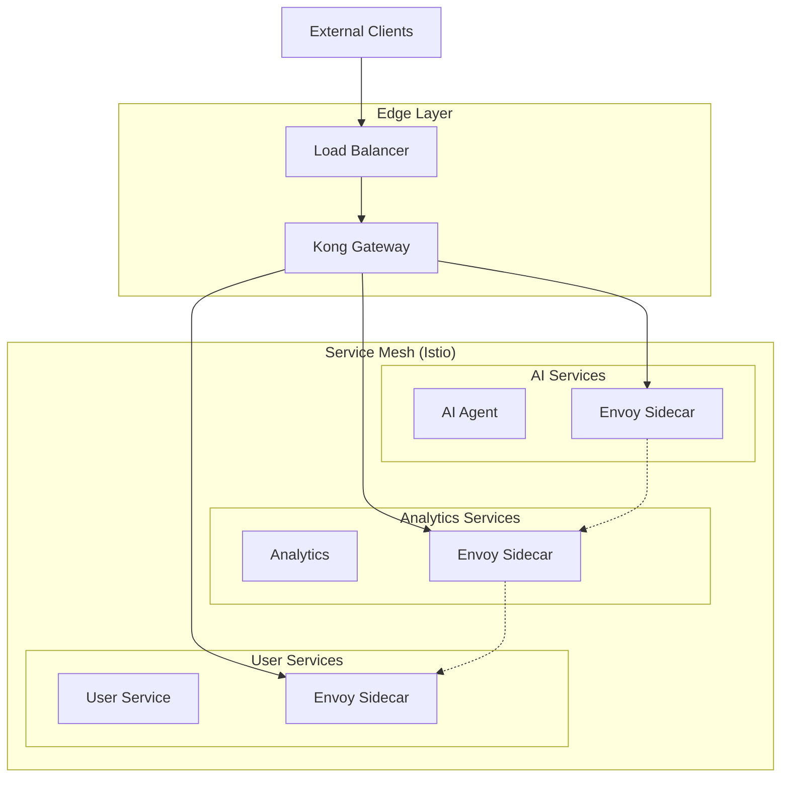

# ADR-002: Service Mesh Integration with API Gateway

## Status
Accepted

## Context
Our API Gateway needs to integrate seamlessly with the service mesh to provide end-to-end security, observability, and traffic management. We need to define how Kong Gateway will work with Istio/Envoy service mesh.

## Decision
We will implement a **hybrid architecture** where Kong Gateway serves as the **ingress gateway** at the edge, and **Istio** manages **east-west traffic** between services within the cluster.

## Architecture Pattern



## Rationale

### Benefits of Hybrid Approach:

1. **Best of Both Worlds**:
   - Kong's superior ingress capabilities
   - Istio's advanced service-to-service features

2. **Clear Separation of Concerns**:
   - North-South traffic: Kong Gateway
   - East-West traffic: Istio Service Mesh

3. **Performance Optimization**:
   - Single proxy hop for ingress
   - Optimized internal service communication

4. **Flexibility**:
   - Can evolve each component independently
   - Easier debugging and troubleshooting

### Alternative Approaches Considered:

**Istio Gateway Only**:
- ❌ Limited plugin ecosystem
- ❌ Complex configuration for simple use cases
- ✅ Unified architecture
- ❌ Higher resource overhead

**Kong Gateway Only**:
- ✅ Simpler architecture
- ❌ Limited service mesh capabilities
- ❌ No automatic mTLS for internal services
- ❌ Less observability for east-west traffic

**Ambassador + Linkerd**:
- ✅ Kubernetes-native
- ❌ Smaller ecosystem
- ❌ Less enterprise features
- ✅ Lower resource usage

## Implementation Details

### 1. Kong Configuration for Service Mesh

```yaml
# Kong service pointing to Istio ingress
apiVersion: configuration.konghq.com/v1
kind: KongService
metadata:
  name: ai-agent-service
spec:
  host: ai-agent-service.parallel-ai.svc.cluster.local
  port: 8080
  protocol: http
  path: /
  retries: 3
  connect_timeout: 30000
  write_timeout: 30000
  read_timeout: 30000
---
apiVersion: configuration.konghq.com/v1
kind: KongRoute
metadata:
  name: ai-agent-route
spec:
  service:
    name: ai-agent-service
  paths:
  - /api/v1/ai
  methods:
  - GET
  - POST
  strip_path: false
```

### 2. Istio Configuration for Internal Services

```yaml
# Enable automatic sidecar injection
apiVersion: v1
kind: Namespace
metadata:
  name: parallel-ai
  labels:
    istio-injection: enabled
---
# Virtual Service for internal routing
apiVersion: networking.istio.io/v1beta1
kind: VirtualService
metadata:
  name: ai-agent-internal
  namespace: parallel-ai
spec:
  hosts:
  - ai-agent-service
  http:
  - match:
    - headers:
        x-user-tier:
          exact: premium
    route:
    - destination:
        host: ai-agent-service
        subset: premium
  - route:
    - destination:
        host: ai-agent-service
        subset: standard
```

### 3. Service-to-Service Authentication

```yaml
# Peer Authentication for mTLS
apiVersion: security.istio.io/v1beta1
kind: PeerAuthentication
metadata:
  name: default
  namespace: parallel-ai
spec:
  mtls:
    mode: STRICT
---
# Authorization Policy
apiVersion: security.istio.io/v1beta1
kind: AuthorizationPolicy
metadata:
  name: ai-agent-authz
  namespace: parallel-ai
spec:
  selector:
    matchLabels:
      app: ai-agent
  rules:
  - from:
    - source:
        principals:
        - "cluster.local/ns/kong/sa/kong"
        - "cluster.local/ns/parallel-ai/sa/analytics-service"
```

### 4. Observability Integration

```yaml
# Telemetry configuration
apiVersion: telemetry.istio.io/v1alpha1
kind: Telemetry
metadata:
  name: kong-integration
  namespace: parallel-ai
spec:
  metrics:
  - providers:
    - name: prometheus
  tracing:
  - providers:
    - name: jaeger
  accessLogging:
  - providers:
    - name: otel
  - customTags:
      kong_request_id:
        header:
          name: x-kong-request-id
      upstream_service:
        header:
          name: x-forwarded-service
```

## Security Integration

### 1. Certificate Management

```yaml
# Shared root CA between Kong and Istio
apiVersion: v1
kind: Secret
metadata:
  name: shared-root-ca
  namespace: istio-system
type: Opaque
data:
  root-cert.pem: LS0tLS1...
  cert-chain.pem: LS0tLS1...
---
# Kong certificate configuration
apiVersion: v1
kind: Secret
metadata:
  name: kong-tls
  namespace: kong
type: kubernetes.io/tls
data:
  tls.crt: LS0tLS1...
  tls.key: LS0tLS1...
```

### 2. JWT Token Propagation

```yaml
# Kong JWT plugin
apiVersion: configuration.konghq.com/v1
kind: KongPlugin
metadata:
  name: jwt-auth
config:
  uri_param_names:
  - jwt
  header_names:
  - authorization
  claims_to_verify:
  - exp
  - aud
  key_claim_name: iss
  secret_is_base64: false
protocol: http
plugin: jwt
---
# Request transformer to add headers for Istio
apiVersion: configuration.konghq.com/v1
kind: KongPlugin
metadata:
  name: request-transformer
config:
  add:
    headers:
    - "x-user-id: $(headers.x-user-id)"
    - "x-user-tier: $(headers.x-user-tier)"
    - "x-request-source: kong-gateway"
protocol: http
plugin: request-transformer
```

## Performance Considerations

### 1. Latency Optimization

```yaml
performance_optimization:
  kong_configuration:
    - nginx_http_keepalive_requests: 1000
    - nginx_upstream_keepalive: 320
    - nginx_upstream_keepalive_requests: 1000
    - log_level: notice  # Reduce logging overhead
  
  istio_configuration:
    - pilot.env.PILOT_ENABLE_WORKLOAD_ENTRY_CROSS_CLUSTER: false
    - pilot.env.PILOT_ENABLE_CROSS_CLUSTER_WORKLOAD_ENTRY: false
    - proxy.resources.requests.cpu: "100m"
    - proxy.resources.requests.memory: "128Mi"
```

### 2. Connection Pooling

```yaml
# Destination rule for connection pooling
apiVersion: networking.istio.io/v1beta1
kind: DestinationRule
metadata:
  name: connection-pool-settings
spec:
  host: "*.parallel-ai.svc.cluster.local"
  trafficPolicy:
    connectionPool:
      tcp:
        maxConnections: 100
        connectTimeout: 30s
        keepAlive:
          time: 7200s
          interval: 75s
      http:
        http1MaxPendingRequests: 50
        http2MaxRequests: 100
        maxRequestsPerConnection: 10
        maxRetries: 3
        connectTimeout: 30s
        h2UpgradePolicy: UPGRADE
```

## Monitoring and Observability

### 1. Metrics Collection

```yaml
metrics_integration:
  kong_metrics:
    - kong_http_requests_total{source="external"}
    - kong_latency_bucket{source="external"}
    - kong_bandwidth_bytes{source="external"}
  
  istio_metrics:
    - istio_requests_total{source="internal"}
    - istio_request_duration_milliseconds{source="internal"}
    - istio_request_bytes{source="internal"}
  
  combined_dashboards:
    - end_to_end_request_flow
    - service_dependency_graph
    - performance_bottleneck_analysis
```

### 2. Distributed Tracing

```yaml
tracing_integration:
  trace_header_propagation:
    - x-request-id
    - x-b3-traceid
    - x-b3-spanid
    - x-b3-parentspanid
    - x-b3-sampled
    - x-b3-flags
    - x-ot-span-context
  
  jaeger_configuration:
    collector_endpoint: http://jaeger-collector.istio-system:14268/api/traces
    sampling_rate: 0.1
    max_tag_value_length: 256
```

## Operational Procedures

### 1. Deployment Strategy

```bash
# Phase 1: Install Istio
istioctl install --set values.pilot.resources.requests.memory=512Mi

# Phase 2: Deploy Kong
helm install kong kong/kong -n kong --create-namespace \
  --set ingressController.enabled=true \
  --set postgresql.enabled=true

# Phase 3: Configure integration
kubectl apply -f kong-istio-integration.yaml

# Phase 4: Enable monitoring
kubectl apply -f observability-config.yaml
```

### 2. Health Checks

```yaml
health_checks:
  kong_health:
    endpoint: http://kong-admin:8001/health
    interval: 30s
    timeout: 5s
  
  istio_health:
    endpoint: http://istiod.istio-system:15014/ready
    interval: 30s
    timeout: 5s
  
  integration_health:
    - verify_mtls_connectivity
    - check_certificate_validity
    - validate_traffic_policies
```

## Consequences

### Positive:
- Best-in-class capabilities for both ingress and service mesh
- Clear architectural boundaries and responsibilities
- Excellent observability across the entire request path
- Flexible scaling and configuration options
- Strong security with end-to-end encryption

### Negative:
- Increased architectural complexity
- Two systems to operate and maintain
- Potential performance overhead with multiple proxies
- Learning curve for operational teams

### Risks and Mitigations:

1. **Configuration Drift**:
   - **Risk**: Inconsistent configuration between Kong and Istio
   - **Mitigation**: Infrastructure as Code (IaC) and automated validation

2. **Performance Overhead**:
   - **Risk**: Multiple proxy hops increase latency
   - **Mitigation**: Careful performance testing and optimization

3. **Debugging Complexity**:
   - **Risk**: Issues may span both systems
   - **Mitigation**: Comprehensive distributed tracing and logging

## Success Criteria

- **Performance**: End-to-end P95 latency < 100ms
- **Security**: 100% mTLS coverage for internal services
- **Observability**: Complete request tracing from client to service
- **Reliability**: 99.95% availability for the integrated solution
- **Scalability**: Support for 50,000+ concurrent users

## Review Schedule

This decision will be reviewed quarterly and may be updated based on:
- Operational experience and lessons learned
- Performance metrics and scaling requirements
- New features in Kong and Istio
- Changes in the broader service mesh ecosystem

---

**Date**: 2024-01-21  
**Author**: System Architect  
**Reviewers**: Engineering Team, DevOps Team, Security Team, Platform Team