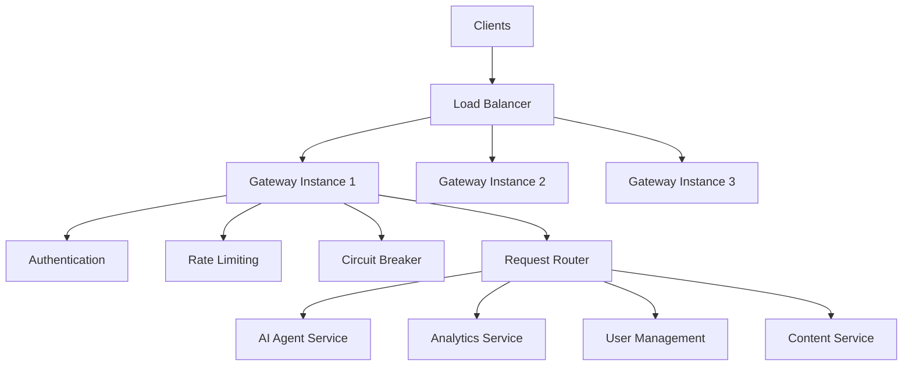

# API Gateway Core Design

## Overview

The API Gateway serves as the single entry point for all client requests in the parallel AI system, providing centralized routing, authentication, rate limiting, and observability for microservices.

## Architecture Components

### 1. Gateway Layer



### 2. Core Components

#### Request Processing Pipeline

1. **TLS Termination**
   - SSL/TLS certificate management
   - HTTP/2 and HTTP/3 support
   - Certificate rotation automation

2. **Authentication & Authorization**
   - JWT token validation
   - OAuth 2.0/OpenID Connect integration
   - API key management
   - Role-based access control (RBAC)

3. **Rate Limiting**
   - Token bucket algorithm
   - Sliding window counters
   - Per-client and global limits
   - Adaptive rate limiting

4. **Request Routing**
   - Path-based routing
   - Header-based routing
   - Weighted routing for A/B testing
   - Canary deployments

5. **Circuit Breaker**
   - Hystrix pattern implementation
   - Fallback responses
   - Health monitoring
   - Auto-recovery mechanisms

## Technology Stack

### Primary Gateway: Kong

```yaml
# Gateway Configuration
gateway:
  type: kong
  version: "3.5+"
  deployment: kubernetes
  replicas: 3
  resources:
    cpu: "2000m"
    memory: "4Gi"
  plugins:
    - authentication
    - rate-limiting
    - cors
    - request-transformer
    - response-transformer
    - prometheus
    - zipkin
```

### Alternative: Envoy Proxy

```yaml
# Envoy Configuration
envoy:
  version: "1.28+"
  features:
    - http2: enabled
    - grpc_web: enabled
    - wasm_filters: enabled
    - access_log: json_format
  xds_cluster:
    - pilot (Istio)
    - control-plane
```

## Deployment Architecture

### High Availability Setup

```yaml
apiVersion: apps/v1
kind: Deployment
metadata:
  name: api-gateway
spec:
  replicas: 3
  strategy:
    type: RollingUpdate
    rollingUpdate:
      maxSurge: 1
      maxUnavailable: 0
  template:
    spec:
      affinity:
        podAntiAffinity:
          preferredDuringSchedulingIgnoredDuringExecution:
          - weight: 100
            podAffinityTerm:
              labelSelector:
                matchExpressions:
                - key: app
                  operator: In
                  values: ["api-gateway"]
              topologyKey: kubernetes.io/hostname
      containers:
      - name: kong
        image: kong:3.5-alpine
        resources:
          requests:
            cpu: 1000m
            memory: 2Gi
          limits:
            cpu: 2000m
            memory: 4Gi
        env:
        - name: KONG_DATABASE
          value: postgres
        - name: KONG_PG_HOST
          value: postgres-service
        readinessProbe:
          httpGet:
            path: /health
            port: 8001
          initialDelaySeconds: 30
          periodSeconds: 10
        livenessProbe:
          httpGet:
            path: /health
            port: 8001
          initialDelaySeconds: 60
          periodSeconds: 30
```

## Performance Specifications

### Throughput Targets

- **Request Rate**: 10,000 RPS per gateway instance
- **Latency P95**: < 50ms (excluding backend processing)
- **Latency P99**: < 100ms
- **Availability**: 99.95% uptime

### Resource Requirements

```yaml
production_sizing:
  cpu:
    requests: 1000m
    limits: 2000m
  memory:
    requests: 2Gi
    limits: 4Gi
  storage:
    logs: 10Gi
    cache: 5Gi
    
horizontal_scaling:
  min_replicas: 3
  max_replicas: 20
  target_cpu: 70%
  target_memory: 80%
```

## Security Considerations

### 1. Defense in Depth

- **WAF Integration**: Web Application Firewall rules
- **DDoS Protection**: Rate limiting and traffic shaping
- **Input Validation**: Request payload validation
- **Output Sanitization**: Response filtering

### 2. Certificate Management

```yaml
certificate_management:
  provider: cert-manager
  issuer: letsencrypt
  auto_renewal: true
  key_algorithm: ECDSA P-256
  min_tls_version: "1.2"
  cipher_suites:
    - TLS_ECDHE_ECDSA_WITH_AES_256_GCM_SHA384
    - TLS_ECDHE_RSA_WITH_AES_256_GCM_SHA384
    - TLS_ECDHE_ECDSA_WITH_CHACHA20_POLY1305
```

### 3. API Security

- **API Key Rotation**: Automated key lifecycle management
- **Token Validation**: JWT signature verification
- **Scope Enforcement**: Fine-grained permission checks
- **Audit Logging**: Comprehensive request/response logging

## Monitoring and Observability

### Metrics Collection

```yaml
prometheus_metrics:
  - kong_http_requests_total
  - kong_latency_bucket
  - kong_bandwidth_bytes
  - kong_nginx_connections
  - kong_upstream_health_status
  
custom_metrics:
  - ai_agent_requests_per_user
  - authentication_failure_rate
  - rate_limit_exceeded_total
  - circuit_breaker_state
```

### Distributed Tracing

```yaml
jaeger_config:
  collector:
    endpoint: http://jaeger-collector:14268/api/traces
  sampler:
    type: probabilistic
    param: 0.1
  tags:
    service.name: api-gateway
    service.version: "${VERSION}"
```

## Configuration Management

### Environment-Specific Configuration

```yaml
# Development
development:
  rate_limiting:
    enabled: false
  authentication:
    bypass_local: true
  logging:
    level: debug
    
# Staging
staging:
  rate_limiting:
    requests_per_second: 100
  authentication:
    strict_validation: true
  circuit_breaker:
    failure_threshold: 10
    
# Production
production:
  rate_limiting:
    requests_per_second: 1000
  authentication:
    strict_validation: true
    token_refresh: true
  circuit_breaker:
    failure_threshold: 5
    timeout: 30s
```

## Integration Patterns

### Service Discovery

```yaml
service_discovery:
  kubernetes:
    enabled: true
    namespace_selector: app=ai-services
  consul:
    enabled: false
    endpoint: consul.service.consul:8500
  dns:
    enabled: true
    resolver: kube-dns
```

### Health Checks

```yaml
health_checks:
  upstream_services:
    path: /health
    interval: 30s
    timeout: 5s
    healthy_threshold: 2
    unhealthy_threshold: 3
  gateway_health:
    path: /gateway/health
    checks:
      - database_connectivity
      - cache_availability
      - downstream_services
```

## Disaster Recovery

### Backup Strategy

- **Configuration Backup**: Daily automated backups
- **Certificate Backup**: Encrypted storage with rotation
- **Logs Backup**: 30-day retention with archival
- **Metrics Backup**: Long-term storage for analytics

### Failover Procedures

1. **Primary Region Failure**: Automatic DNS failover to secondary region
2. **Gateway Instance Failure**: Load balancer removes failed instances
3. **Database Failure**: Switch to read replica with eventual consistency
4. **Cache Failure**: Direct backend requests with circuit breaker protection

See [authentication-flow.md](authentication-flow.md) for detailed authentication architecture and [routing-patterns.md](routing-patterns.md) for advanced routing strategies.