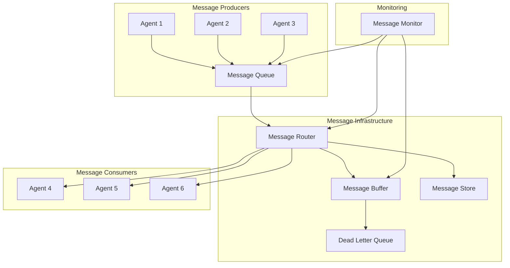

# Message Passing Protocols

## Overview
This document defines the message passing protocols for inter-agent communication in the parallel AI system, including synchronous and asynchronous messaging patterns, message routing, and delivery guarantees.

## Message Passing Architecture



## Core Message Components

### 1. Message Structure
```typescript
interface Message {
  // Core identification
  id: string;
  timestamp: Date;
  version: string;
  
  // Routing information
  source: AgentId;
  destination: AgentId | AgentId[] | RoutingPattern;
  replyTo?: AgentId;
  
  // Message classification
  type: MessageType;
  category: MessageCategory;
  priority: Priority;
  
  // Content
  payload: any;
  headers: MessageHeaders;
  
  // Delivery and processing
  ttl?: number;                    // Time to live
  deliveryMode: DeliveryMode;
  processingMode: ProcessingMode;
  
  // Correlation and tracing
  correlationId?: string;
  causationId?: string;
  traceId?: string;
  
  // Metadata
  metadata: MessageMetadata;
}

enum MessageType {
  COMMAND = 'COMMAND',
  EVENT = 'EVENT',
  QUERY = 'QUERY',
  RESPONSE = 'RESPONSE',
  NOTIFICATION = 'NOTIFICATION',
  HEARTBEAT = 'HEARTBEAT',
  ERROR = 'ERROR'
}

enum MessageCategory {
  SYSTEM = 'SYSTEM',
  BUSINESS = 'BUSINESS',
  OPERATIONAL = 'OPERATIONAL',
  DIAGNOSTIC = 'DIAGNOSTIC'
}

enum DeliveryMode {
  FIRE_AND_FORGET = 'FIRE_AND_FORGET',
  AT_LEAST_ONCE = 'AT_LEAST_ONCE',
  AT_MOST_ONCE = 'AT_MOST_ONCE',
  EXACTLY_ONCE = 'EXACTLY_ONCE'
}

enum ProcessingMode {
  SYNC = 'SYNC',
  ASYNC = 'ASYNC',
  BATCH = 'BATCH'
}
```

### 2. Message Channel
```typescript
abstract class MessageChannel {
  protected name: string;
  protected serializer: MessageSerializer;
  protected middleware: ChannelMiddleware[] = [];
  
  constructor(name: string) {
    this.name = name;
    this.serializer = new JsonMessageSerializer();
  }
  
  abstract send(message: Message): Promise<void>;
  abstract receive(): AsyncIterableIterator<Message>;
  abstract close(): Promise<void>;
  
  addMiddleware(middleware: ChannelMiddleware): void {
    this.middleware.push(middleware);
  }
  
  protected async applyMiddleware(
    message: Message, 
    direction: 'inbound' | 'outbound'
  ): Promise<Message> {
    let processedMessage = message;
    
    const middlewares = direction === 'inbound' 
      ? this.middleware.slice().reverse()
      : this.middleware;
    
    for (const mw of middlewares) {
      processedMessage = await mw.process(processedMessage, direction);
    }
    
    return processedMessage;
  }
}

// Point-to-point channel implementation
class PointToPointChannel extends MessageChannel {
  private queue: Queue<Message> = new Queue();
  private subscribers: Set<MessageHandler> = new Set();
  
  async send(message: Message): Promise<void> {
    const processedMessage = await this.applyMiddleware(message, 'outbound');
    this.queue.enqueue(processedMessage);
    
    // Notify one subscriber (round-robin)
    const handler = this.getNextHandler();
    if (handler) {
      await handler.handle(processedMessage);
    }
  }
  
  async *receive(): AsyncIterableIterator<Message> {
    while (true) {
      const message = await this.queue.dequeue();
      const processedMessage = await this.applyMiddleware(message, 'inbound');
      yield processedMessage;
    }
  }
  
  subscribe(handler: MessageHandler): Subscription {
    this.subscribers.add(handler);
    return {
      unsubscribe: () => this.subscribers.delete(handler)
    };
  }
  
  private getNextHandler(): MessageHandler | null {
    if (this.subscribers.size === 0) return null;
    
    const handlers = Array.from(this.subscribers);
    return handlers[Math.floor(Math.random() * handlers.length)];
  }
}
```

### 3. Message Router
```typescript
class MessageRouter {
  private routes: Map<string, RouteHandler[]> = new Map();
  private defaultRoute: RouteHandler | null = null;
  private filters: MessageFilter[] = [];
  
  addRoute(pattern: string, handler: RouteHandler): void {
    if (!this.routes.has(pattern)) {
      this.routes.set(pattern, []);
    }
    this.routes.get(pattern)!.push(handler);
  }
  
  setDefaultRoute(handler: RouteHandler): void {
    this.defaultRoute = handler;
  }
  
  addFilter(filter: MessageFilter): void {
    this.filters.push(filter);
  }
  
  async route(message: Message): Promise<void> {
    // Apply filters first
    if (!this.shouldRoute(message)) {
      return;
    }
    
    const matchingRoutes = this.findMatchingRoutes(message);
    
    if (matchingRoutes.length === 0 && this.defaultRoute) {
      await this.defaultRoute.handle(message);
      return;
    }
    
    // Route to all matching handlers
    const routingPromises = matchingRoutes.map(handler => 
      this.handleWithRetry(handler, message)
    );
    
    await Promise.allSettled(routingPromises);
  }
  
  private shouldRoute(message: Message): boolean {
    return this.filters.every(filter => filter.accept(message));
  }
  
  private findMatchingRoutes(message: Message): RouteHandler[] {
    const handlers: RouteHandler[] = [];
    
    for (const [pattern, routeHandlers] of this.routes) {
      if (this.matchesPattern(message, pattern)) {
        handlers.push(...routeHandlers);
      }
    }
    
    return handlers;
  }
  
  private matchesPattern(message: Message, pattern: string): boolean {
    // Support different routing patterns
    if (pattern === '*') return true;
    if (pattern.startsWith('type:')) {
      return message.type === pattern.substring(5);
    }
    if (pattern.startsWith('category:')) {
      return message.category === pattern.substring(9);
    }
    if (pattern.startsWith('source:')) {
      return message.source === pattern.substring(7);
    }
    if (pattern.startsWith('destination:')) {
      return message.destination === pattern.substring(12);
    }
    
    // Default: exact match on message type
    return message.type === pattern;
  }
  
  private async handleWithRetry(
    handler: RouteHandler, 
    message: Message, 
    maxRetries: number = 3
  ): Promise<void> {
    let attempt = 0;
    while (attempt < maxRetries) {
      try {
        await handler.handle(message);
        return;
      } catch (error) {
        attempt++;
        if (attempt === maxRetries) {
          console.error(`Failed to route message ${message.id} after ${maxRetries} attempts:`, error);
          throw error;
        }
        await this.delay(Math.pow(2, attempt) * 1000);
      }
    }
  }
}
```

## Message Passing Patterns

### 1. Request-Reply Pattern
```typescript
class RequestReplyMessaging {
  private pendingRequests: Map<string, PendingRequest> = new Map();
  private messageChannel: MessageChannel;
  private timeout: number = 30000;
  
  constructor(messageChannel: MessageChannel) {
    this.messageChannel = messageChannel;
    this.startResponseListener();
  }
  
  async sendRequest<T>(
    destination: AgentId,
    request: any,
    options: RequestOptions = {}
  ): Promise<T> {
    const requestId = this.generateRequestId();
    const message: Message = {
      id: requestId,
      timestamp: new Date(),
      version: '1.0',
      source: this.agentId,
      destination,
      replyTo: this.agentId,
      type: MessageType.QUERY,
      category: MessageCategory.BUSINESS,
      priority: options.priority || Priority.NORMAL,
      payload: request,
      headers: {},
      deliveryMode: DeliveryMode.AT_LEAST_ONCE,
      processingMode: ProcessingMode.SYNC,
      correlationId: requestId,
      ttl: options.timeout || this.timeout,
      metadata: {
        requestType: 'query',
        expectedResponseType: 'response'
      }
    };
    
    return new Promise<T>((resolve, reject) => {
      const timer = setTimeout(() => {
        this.pendingRequests.delete(requestId);
        reject(new TimeoutError(`Request ${requestId} timed out`));
      }, options.timeout || this.timeout);
      
      this.pendingRequests.set(requestId, {
        resolve,
        reject,
        timer,
        startTime: Date.now()
      });
      
      this.messageChannel.send(message).catch(error => {
        this.pendingRequests.delete(requestId);
        clearTimeout(timer);
        reject(error);
      });
    });
  }
  
  handleRequest(
    pattern: string,
    handler: (request: any, context: RequestContext) => Promise<any>
  ): void {
    this.messageRouter.addRoute(pattern, {
      handle: async (message: Message) => {
        if (message.type !== MessageType.QUERY) return;
        
        try {
          const context = new RequestContext(message);
          const response = await handler(message.payload, context);
          
          await this.sendResponse(message, response);
        } catch (error) {
          await this.sendErrorResponse(message, error);
        }
      }
    });
  }
  
  private async sendResponse(originalMessage: Message, responseData: any): Promise<void> {
    if (!originalMessage.replyTo) return;
    
    const responseMessage: Message = {
      id: this.generateMessageId(),
      timestamp: new Date(),
      version: '1.0',
      source: this.agentId,
      destination: originalMessage.replyTo,
      type: MessageType.RESPONSE,
      category: MessageCategory.BUSINESS,
      priority: originalMessage.priority,
      payload: responseData,
      headers: {},
      deliveryMode: DeliveryMode.AT_LEAST_ONCE,
      processingMode: ProcessingMode.SYNC,
      correlationId: originalMessage.correlationId,
      metadata: {
        responseType: 'success',
        originalMessageId: originalMessage.id
      }
    };
    
    await this.messageChannel.send(responseMessage);
  }
  
  private startResponseListener(): void {
    (async () => {
      for await (const message of this.messageChannel.receive()) {
        if (message.type === MessageType.RESPONSE && message.correlationId) {
          this.handleResponse(message);
        }
      }
    })();
  }
  
  private handleResponse(message: Message): void {
    const pending = this.pendingRequests.get(message.correlationId!);
    if (pending) {
      clearTimeout(pending.timer);
      this.pendingRequests.delete(message.correlationId!);
      
      if (message.payload instanceof Error || message.headers['error'] === 'true') {
        pending.reject(message.payload);
      } else {
        pending.resolve(message.payload);
      }
    }
  }
}
```

### 2. Publish-Subscribe Pattern
```typescript
class PublishSubscribeMessaging {
  private topics: Map<string, Set<TopicSubscriber>> = new Map();
  private messageChannel: MessageChannel;
  
  constructor(messageChannel: MessageChannel) {
    this.messageChannel = messageChannel;
    this.startMessageListener();
  }
  
  async publish(topic: string, data: any, options: PublishOptions = {}): Promise<void> {
    const message: Message = {
      id: this.generateMessageId(),
      timestamp: new Date(),
      version: '1.0',
      source: this.agentId,
      destination: topic,
      type: MessageType.EVENT,
      category: options.category || MessageCategory.BUSINESS,
      priority: options.priority || Priority.NORMAL,
      payload: data,
      headers: {
        topic,
        ...options.headers
      },
      deliveryMode: options.deliveryMode || DeliveryMode.AT_LEAST_ONCE,
      processingMode: ProcessingMode.ASYNC,
      metadata: {
        publishTime: new Date().toISOString(),
        topicType: 'event',
        ...options.metadata
      }
    };
    
    await this.messageChannel.send(message);
  }
  
  subscribe(
    topic: string,
    handler: (data: any, context: SubscriptionContext) => Promise<void>,
    options: SubscriptionOptions = {}
  ): Subscription {
    if (!this.topics.has(topic)) {
      this.topics.set(topic, new Set());
    }
    
    const subscriber: TopicSubscriber = {
      id: this.generateSubscriberId(),
      handler,
      filter: options.filter,
      batchSize: options.batchSize || 1,
      batchTimeout: options.batchTimeout || 1000
    };
    
    this.topics.get(topic)!.add(subscriber);
    
    return {
      unsubscribe: () => {
        this.topics.get(topic)?.delete(subscriber);
      }
    };
  }
  
  private startMessageListener(): void {
    (async () => {
      for await (const message of this.messageChannel.receive()) {
        if (message.type === MessageType.EVENT) {
          await this.handleEvent(message);
        }
      }
    })();
  }
  
  private async handleEvent(message: Message): Promise<void> {
    const topic = message.headers.topic || message.destination;
    const subscribers = this.topics.get(topic as string) || new Set();
    
    const handlerPromises = Array.from(subscribers).map(subscriber =>
      this.executeSubscriberHandler(subscriber, message)
    );
    
    await Promise.allSettled(handlerPromises);
  }
  
  private async executeSubscriberHandler(
    subscriber: TopicSubscriber,
    message: Message
  ): Promise<void> {
    try {
      // Apply filter if present
      if (subscriber.filter && !subscriber.filter(message.payload)) {
        return;
      }
      
      const context = new SubscriptionContext(message);
      
      // Handle batching if configured
      if (subscriber.batchSize > 1) {
        await this.handleBatchedMessage(subscriber, message, context);
      } else {
        await subscriber.handler(message.payload, context);
      }
    } catch (error) {
      console.error(`Error in subscriber handler for message ${message.id}:`, error);
      await this.handleSubscriberError(subscriber, message, error);
    }
  }
}
```

### 3. Command Pattern
```typescript
class CommandMessaging {
  private commandHandlers: Map<string, CommandHandler> = new Map();
  private messageChannel: MessageChannel;
  private commandQueue: PriorityQueue<CommandMessage> = new PriorityQueue();
  
  constructor(messageChannel: MessageChannel) {
    this.messageChannel = messageChannel;
    this.startCommandProcessor();
  }
  
  async sendCommand(
    destination: AgentId,
    commandType: string,
    payload: any,
    options: CommandOptions = {}
  ): Promise<CommandResult> {
    const commandId = this.generateCommandId();
    const message: Message = {
      id: commandId,
      timestamp: new Date(),
      version: '1.0',
      source: this.agentId,
      destination,
      type: MessageType.COMMAND,
      category: MessageCategory.BUSINESS,
      priority: options.priority || Priority.NORMAL,
      payload: {
        commandType,
        commandId,
        data: payload,
        options
      },
      headers: {
        commandType,
        expectsResult: options.expectsResult !== false
      },
      deliveryMode: DeliveryMode.EXACTLY_ONCE,
      processingMode: ProcessingMode.ASYNC,
      correlationId: commandId,
      ttl: options.timeout || 60000,
      metadata: {
        commandCategory: options.category || 'business',
        retryable: options.retryable !== false
      }
    };
    
    if (options.expectsResult !== false) {
      return await this.sendCommandWithResult(message, options.timeout || 60000);
    } else {
      await this.messageChannel.send(message);
      return { success: true, commandId };
    }
  }
  
  registerCommandHandler(
    commandType: string,
    handler: (payload: any, context: CommandContext) => Promise<any>
  ): void {
    this.commandHandlers.set(commandType, {
      type: commandType,
      handler,
      execute: async (message: Message) => {
        const context = new CommandContext(message);
        const result = await handler(message.payload.data, context);
        return result;
      }
    });
  }
  
  private async sendCommandWithResult(
    message: Message,
    timeout: number
  ): Promise<CommandResult> {
    const requestReply = new RequestReplyMessaging(this.messageChannel);
    
    try {
      const result = await requestReply.sendRequest(
        message.destination as AgentId,
        message.payload,
        { timeout }
      );
      
      return {
        success: true,
        commandId: message.id,
        result
      };
    } catch (error) {
      return {
        success: false,
        commandId: message.id,
        error: error.message
      };
    }
  }
  
  private startCommandProcessor(): void {
    (async () => {
      for await (const message of this.messageChannel.receive()) {
        if (message.type === MessageType.COMMAND) {
          await this.processCommand(message);
        }
      }
    })();
  }
  
  private async processCommand(message: Message): Promise<void> {
    const commandType = message.payload.commandType;
    const handler = this.commandHandlers.get(commandType);
    
    if (!handler) {
      await this.sendCommandError(
        message,
        new Error(`No handler registered for command type: ${commandType}`)
      );
      return;
    }
    
    try {
      const result = await handler.execute(message);
      
      if (message.headers.expectsResult === 'true') {
        await this.sendCommandResult(message, result);
      }
    } catch (error) {
      await this.sendCommandError(message, error);
    }
  }
}
```

## Advanced Message Features

### 1. Message Batching
```typescript
class MessageBatcher {
  private batches: Map<string, MessageBatch> = new Map();
  private batchConfig: BatchConfig;
  
  constructor(config: BatchConfig) {
    this.batchConfig = {
      maxBatchSize: 100,
      maxBatchAge: 1000, // ms
      maxMemorySize: 1024 * 1024, // 1MB
      ...config
    };
  }
  
  async addMessage(batchKey: string, message: Message): Promise<void> {
    let batch = this.batches.get(batchKey);
    
    if (!batch) {
      batch = this.createBatch(batchKey);
      this.batches.set(batchKey, batch);
    }
    
    batch.messages.push(message);
    batch.currentSize += this.getMessageSize(message);
    
    // Check if batch is ready for processing
    if (this.shouldProcessBatch(batch)) {
      await this.processBatch(batchKey, batch);
    }
  }
  
  private createBatch(batchKey: string): MessageBatch {
    const batch: MessageBatch = {
      key: batchKey,
      messages: [],
      createdAt: Date.now(),
      currentSize: 0
    };
    
    // Schedule batch timeout
    setTimeout(() => {
      this.processTimedOutBatch(batchKey);
    }, this.batchConfig.maxBatchAge);
    
    return batch;
  }
  
  private shouldProcessBatch(batch: MessageBatch): boolean {
    return (
      batch.messages.length >= this.batchConfig.maxBatchSize ||
      batch.currentSize >= this.batchConfig.maxMemorySize ||
      Date.now() - batch.createdAt >= this.batchConfig.maxBatchAge
    );
  }
  
  private async processBatch(batchKey: string, batch: MessageBatch): Promise<void> {
    this.batches.delete(batchKey);
    
    const batchMessage: Message = {
      id: this.generateBatchId(),
      timestamp: new Date(),
      version: '1.0',
      source: this.agentId,
      destination: this.deriveBatchDestination(batch),
      type: MessageType.EVENT,
      category: MessageCategory.SYSTEM,
      priority: Priority.NORMAL,
      payload: {
        batchKey,
        messages: batch.messages,
        batchSize: batch.messages.length,
        totalSize: batch.currentSize
      },
      headers: {
        'batch': 'true',
        'batch-size': batch.messages.length.toString(),
        'batch-key': batchKey
      },
      deliveryMode: DeliveryMode.AT_LEAST_ONCE,
      processingMode: ProcessingMode.BATCH,
      metadata: {
        batchCreatedAt: new Date(batch.createdAt).toISOString(),
        batchProcessedAt: new Date().toISOString()
      }
    };
    
    await this.sendBatchMessage(batchMessage);
  }
}
```

### 2. Message Ordering and Sequencing
```typescript
class MessageSequencer {
  private sequenceNumbers: Map<string, number> = new Map();
  private outOfOrderBuffer: Map<string, Message[]> = new Map();
  private expectedSequence: Map<string, number> = new Map();
  
  async sendSequencedMessage(
    partitionKey: string,
    message: Message
  ): Promise<void> {
    const sequenceNumber = this.getNextSequenceNumber(partitionKey);
    
    const sequencedMessage = {
      ...message,
      headers: {
        ...message.headers,
        'sequence-number': sequenceNumber.toString(),
        'partition-key': partitionKey
      }
    };
    
    await this.messageChannel.send(sequencedMessage);
  }
  
  async processSequencedMessage(message: Message): Promise<boolean> {
    const partitionKey = message.headers['partition-key'];
    const sequenceNumber = parseInt(message.headers['sequence-number'] || '0');
    
    if (!partitionKey) {
      // Non-sequenced message, process immediately
      return true;
    }
    
    const expectedSeq = this.expectedSequence.get(partitionKey) || 1;
    
    if (sequenceNumber === expectedSeq) {
      // Process message and check buffer for next messages
      this.expectedSequence.set(partitionKey, expectedSeq + 1);
      await this.processBufferedMessages(partitionKey);
      return true;
    } else if (sequenceNumber > expectedSeq) {
      // Buffer out-of-order message
      this.bufferOutOfOrderMessage(partitionKey, message);
      return false;
    } else {
      // Duplicate or old message, discard
      console.warn(`Discarding old message: seq=${sequenceNumber}, expected=${expectedSeq}`);
      return false;
    }
  }
  
  private bufferOutOfOrderMessage(partitionKey: string, message: Message): void {
    if (!this.outOfOrderBuffer.has(partitionKey)) {
      this.outOfOrderBuffer.set(partitionKey, []);
    }
    
    const buffer = this.outOfOrderBuffer.get(partitionKey)!;
    buffer.push(message);
    
    // Sort by sequence number
    buffer.sort((a, b) => {
      const seqA = parseInt(a.headers['sequence-number'] || '0');
      const seqB = parseInt(b.headers['sequence-number'] || '0');
      return seqA - seqB;
    });
  }
  
  private async processBufferedMessages(partitionKey: string): Promise<void> {
    const buffer = this.outOfOrderBuffer.get(partitionKey) || [];
    const expectedSeq = this.expectedSequence.get(partitionKey) || 1;
    
    let processed = 0;
    for (const message of buffer) {
      const messageSeq = parseInt(message.headers['sequence-number'] || '0');
      if (messageSeq === expectedSeq + processed) {
        await this.processMessage(message);
        processed++;
      } else {
        break; // Gap in sequence, stop processing
      }
    }
    
    if (processed > 0) {
      this.expectedSequence.set(partitionKey, expectedSeq + processed);
      buffer.splice(0, processed);
      
      // Recursively process if more messages are available
      if (buffer.length > 0) {
        await this.processBufferedMessages(partitionKey);
      }
    }
  }
}
```

### 3. Message Deduplication
```typescript
class MessageDeduplicator {
  private messageHashes: Set<string> = new Set();
  private processedMessages: LRUCache<string, boolean>;
  private duplicateStore: Map<string, DuplicateInfo> = new Map();
  
  constructor(maxCacheSize: number = 10000) {
    this.processedMessages = new LRUCache<string, boolean>(maxCacheSize);
  }
  
  async processMessage(message: Message): Promise<ProcessingResult> {
    const messageHash = this.calculateMessageHash(message);
    
    if (this.isDuplicate(message, messageHash)) {
      return this.handleDuplicate(message, messageHash);
    }
    
    // Mark message as processed
    this.markAsProcessed(message, messageHash);
    
    try {
      await this.processUniqueMessage(message);
      return { processed: true, duplicate: false };
    } catch (error) {
      // Remove from processed set if processing failed
      this.removeFromProcessed(messageHash);
      throw error;
    }
  }
  
  private calculateMessageHash(message: Message): string {
    // Use message ID if available and reliable
    if (message.id && this.isReliableId(message.id)) {
      return message.id;
    }
    
    // Calculate content-based hash for idempotency
    const contentForHashing = {
      source: message.source,
      destination: message.destination,
      type: message.type,
      payload: message.payload,
      correlationId: message.correlationId
    };
    
    return this.hashObject(contentForHashing);
  }
  
  private isDuplicate(message: Message, hash: string): boolean {
    // Check in-memory cache first
    if (this.processedMessages.has(hash)) {
      return true;
    }
    
    // Check message hash set
    if (this.messageHashes.has(hash)) {
      return true;
    }
    
    // Check idempotency based on business logic
    return this.isBusinessLogicDuplicate(message);
  }
  
  private handleDuplicate(message: Message, hash: string): ProcessingResult {
    const duplicateInfo = this.duplicateStore.get(hash) || {
      firstSeen: new Date(),
      count: 0,
      lastSeen: new Date()
    };
    
    duplicateInfo.count++;
    duplicateInfo.lastSeen = new Date();
    this.duplicateStore.set(hash, duplicateInfo);
    
    console.log(`Duplicate message detected: ${message.id}, count: ${duplicateInfo.count}`);
    
    return {
      processed: false,
      duplicate: true,
      duplicateInfo
    };
  }
  
  private markAsProcessed(message: Message, hash: string): void {
    this.processedMessages.set(hash, true);
    this.messageHashes.add(hash);
  }
  
  private isBusinessLogicDuplicate(message: Message): boolean {
    // Implement business-specific duplicate detection
    // For example, check if a command with same parameters was already executed
    
    if (message.type === MessageType.COMMAND) {
      const commandType = message.payload?.commandType;
      const commandData = message.payload?.data;
      
      // Check if this exact command was already processed
      return this.hasCommandBeenProcessed(commandType, commandData);
    }
    
    return false;
  }
  
  private hasCommandBeenProcessed(commandType: string, commandData: any): boolean {
    // Implementation depends on business logic
    // Could check database, cache, or other persistence mechanisms
    return false;
  }
}
```

## Quality of Service Features

### 1. Message Prioritization
```typescript
class PriorityMessageProcessor {
  private priorityQueues: Map<Priority, Queue<Message>> = new Map();
  private processingWeights: Map<Priority, number> = new Map();
  private currentWeight: Map<Priority, number> = new Map();
  
  constructor() {
    // Initialize queues and weights
    const priorities = [Priority.CRITICAL, Priority.HIGH, Priority.NORMAL, Priority.LOW];
    const weights = [10, 5, 2, 1]; // Higher priority gets more processing time
    
    priorities.forEach((priority, index) => {
      this.priorityQueues.set(priority, new Queue<Message>());
      this.processingWeights.set(priority, weights[index]);
      this.currentWeight.set(priority, 0);
    });
  }
  
  enqueue(message: Message): void {
    const priority = message.priority || Priority.NORMAL;
    const queue = this.priorityQueues.get(priority);
    
    if (queue) {
      queue.enqueue(message);
    }
  }
  
  async processMessages(): Promise<void> {
    while (true) {
      const message = this.getNextMessage();
      if (!message) {
        await this.delay(10); // Wait for messages
        continue;
      }
      
      try {
        await this.processMessage(message);
      } catch (error) {
        console.error(`Error processing message ${message.id}:`, error);
        await this.handleProcessingError(message, error);
      }
    }
  }
  
  private getNextMessage(): Message | null {
    // Weighted round-robin selection
    let selectedQueue: Queue<Message> | null = null;
    let maxWeight = -1;
    let selectedPriority: Priority | null = null;
    
    for (const [priority, queue] of this.priorityQueues) {
      if (queue.isEmpty()) continue;
      
      const weight = this.processingWeights.get(priority)!;
      const currentWeight = (this.currentWeight.get(priority)! + weight);
      
      this.currentWeight.set(priority, currentWeight);
      
      if (currentWeight > maxWeight) {
        maxWeight = currentWeight;
        selectedQueue = queue;
        selectedPriority = priority;
      }
    }
    
    if (selectedQueue && selectedPriority) {
      // Reduce weight after selection
      const totalWeight = Array.from(this.processingWeights.values())
        .reduce((sum, weight) => sum + weight, 0);
      
      this.currentWeight.set(
        selectedPriority,
        (this.currentWeight.get(selectedPriority)! - totalWeight)
      );
      
      return selectedQueue.dequeue()!;
    }
    
    return null;
  }
}
```

### 2. Message Persistence and Durability
```typescript
class DurableMessageStore {
  private storage: MessageStorage;
  private inMemoryBuffer: Map<string, Message> = new Map();
  private persistencePolicy: PersistencePolicy;
  private backgroundWriter: BackgroundWriter;
  
  constructor(
    storage: MessageStorage,
    policy: PersistencePolicy = PersistencePolicy.ASYNC
  ) {
    this.storage = storage;
    this.persistencePolicy = policy;
    this.backgroundWriter = new BackgroundWriter(storage);
  }
  
  async store(message: Message): Promise<void> {
    // Always buffer in memory first
    this.inMemoryBuffer.set(message.id, message);
    
    switch (this.persistencePolicy) {
      case PersistencePolicy.SYNC:
        await this.storage.save(message);
        break;
        
      case PersistencePolicy.ASYNC:
        this.backgroundWriter.schedule(message);
        break;
        
      case PersistencePolicy.BATCH:
        this.backgroundWriter.addToBatch(message);
        break;
        
      case PersistencePolicy.MEMORY_ONLY:
        // Already in memory buffer
        break;
    }
  }
  
  async retrieve(messageId: string): Promise<Message | null> {
    // Check memory buffer first
    const bufferedMessage = this.inMemoryBuffer.get(messageId);
    if (bufferedMessage) {
      return bufferedMessage;
    }
    
    // Fallback to persistent storage
    return await this.storage.load(messageId);
  }
  
  async delete(messageId: string): Promise<void> {
    this.inMemoryBuffer.delete(messageId);
    
    if (this.persistencePolicy !== PersistencePolicy.MEMORY_ONLY) {
      await this.storage.delete(messageId);
    }
  }
  
  async getMessagesByPattern(
    pattern: MessagePattern,
    limit: number = 100
  ): Promise<Message[]> {
    const results: Message[] = [];
    
    // Search in memory buffer
    for (const [id, message] of this.inMemoryBuffer) {
      if (this.matchesPattern(message, pattern) && results.length < limit) {
        results.push(message);
      }
    }
    
    // Search in persistent storage if needed
    if (results.length < limit) {
      const persistentResults = await this.storage.findByPattern(
        pattern,
        limit - results.length
      );
      results.push(...persistentResults);
    }
    
    return results;
  }
}

class BackgroundWriter {
  private writeQueue: Queue<Message> = new Queue();
  private batchQueue: Message[] = [];
  private batchSize: number = 100;
  private batchTimeout: number = 5000; // 5 seconds
  private isWriting: boolean = false;
  
  constructor(private storage: MessageStorage) {
    this.startBackgroundProcessing();
    this.startBatchProcessing();
  }
  
  schedule(message: Message): void {
    this.writeQueue.enqueue(message);
  }
  
  addToBatch(message: Message): void {
    this.batchQueue.push(message);
    
    if (this.batchQueue.length >= this.batchSize) {
      this.processBatch();
    }
  }
  
  private startBackgroundProcessing(): void {
    setInterval(async () => {
      if (!this.isWriting && !this.writeQueue.isEmpty()) {
        this.isWriting = true;
        try {
          while (!this.writeQueue.isEmpty()) {
            const message = this.writeQueue.dequeue()!;
            await this.storage.save(message);
          }
        } catch (error) {
          console.error('Background write error:', error);
        } finally {
          this.isWriting = false;
        }
      }
    }, 100); // Check every 100ms
  }
  
  private startBatchProcessing(): void {
    setInterval(() => {
      if (this.batchQueue.length > 0) {
        this.processBatch();
      }
    }, this.batchTimeout);
  }
  
  private async processBatch(): Promise<void> {
    if (this.batchQueue.length === 0) return;
    
    const batch = this.batchQueue.splice(0);
    
    try {
      await this.storage.saveBatch(batch);
    } catch (error) {
      console.error('Batch write error:', error);
      // Re-queue failed messages
      this.batchQueue.unshift(...batch);
    }
  }
}
```

## Performance Optimization

### 1. Message Compression
```typescript
class MessageCompressor {
  private compressors: Map<CompressionType, Compressor> = new Map();
  private compressionThreshold: number = 1024; // bytes
  
  constructor() {
    this.compressors.set(CompressionType.GZIP, new GzipCompressor());
    this.compressors.set(CompressionType.DEFLATE, new DeflateCompressor());
    this.compressors.set(CompressionType.LZ4, new Lz4Compressor());
  }
  
  async compress(message: Message): Promise<Message> {
    const messageSize = this.getMessageSize(message);
    
    if (messageSize < this.compressionThreshold) {
      return message; // Skip compression for small messages
    }
    
    const compressionType = this.selectCompressionType(message);
    const compressor = this.compressors.get(compressionType);
    
    if (!compressor) {
      return message;
    }
    
    const serializedPayload = JSON.stringify(message.payload);
    const compressedPayload = await compressor.compress(serializedPayload);
    
    return {
      ...message,
      payload: compressedPayload,
      headers: {
        ...message.headers,
        'compression': compressionType,
        'original-size': messageSize.toString(),
        'compressed-size': compressedPayload.length.toString()
      }
    };
  }
  
  async decompress(message: Message): Promise<Message> {
    const compressionType = message.headers['compression'] as CompressionType;
    
    if (!compressionType) {
      return message; // Not compressed
    }
    
    const compressor = this.compressors.get(compressionType);
    if (!compressor) {
      throw new Error(`Unsupported compression type: ${compressionType}`);
    }
    
    const decompressedPayload = await compressor.decompress(message.payload);
    const originalPayload = JSON.parse(decompressedPayload);
    
    return {
      ...message,
      payload: originalPayload,
      headers: {
        ...message.headers,
        'compression': undefined,
        'original-size': undefined,
        'compressed-size': undefined
      }
    };
  }
  
  private selectCompressionType(message: Message): CompressionType {
    // Select compression based on message characteristics
    const messageSize = this.getMessageSize(message);
    
    if (messageSize > 10 * 1024 * 1024) { // > 10MB
      return CompressionType.LZ4; // Fast compression for large messages
    } else if (messageSize > 1024 * 1024) { // > 1MB
      return CompressionType.DEFLATE; // Good compression ratio
    } else {
      return CompressionType.GZIP; // Standard compression
    }
  }
}
```

### 2. Connection Pooling and Multiplexing
```typescript
class ConnectionPool {
  private connections: Map<string, Connection[]> = new Map();
  private activeConnections: Map<string, Connection[]> = new Map();
  private connectionConfig: ConnectionPoolConfig;
  
  constructor(config: ConnectionPoolConfig) {
    this.connectionConfig = {
      minConnections: 2,
      maxConnections: 10,
      connectionTimeout: 30000,
      idleTimeout: 60000,
      ...config
    };
  }
  
  async getConnection(endpoint: string): Promise<PooledConnection> {
    let pool = this.connections.get(endpoint);
    
    if (!pool) {
      pool = [];
      this.connections.set(endpoint, pool);
      await this.initializePool(endpoint);
    }
    
    // Try to get an idle connection
    if (pool.length > 0) {
      const connection = pool.pop()!;
      this.moveToActive(endpoint, connection);
      return new PooledConnection(connection, () => this.releaseConnection(endpoint, connection));
    }
    
    // Create new connection if under limit
    const activeConnections = this.activeConnections.get(endpoint) || [];
    if (activeConnections.length < this.connectionConfig.maxConnections) {
      const connection = await this.createConnection(endpoint);
      this.moveToActive(endpoint, connection);
      return new PooledConnection(connection, () => this.releaseConnection(endpoint, connection));
    }
    
    // Wait for available connection
    return await this.waitForConnection(endpoint);
  }
  
  private async initializePool(endpoint: string): Promise<void> {
    const pool = this.connections.get(endpoint)!;
    
    for (let i = 0; i < this.connectionConfig.minConnections; i++) {
      try {
        const connection = await this.createConnection(endpoint);
        pool.push(connection);
      } catch (error) {
        console.error(`Failed to initialize connection to ${endpoint}:`, error);
      }
    }
  }
  
  private async createConnection(endpoint: string): Promise<Connection> {
    const connection = new Connection(endpoint, {
      timeout: this.connectionConfig.connectionTimeout,
      keepAlive: true,
      multiplexing: true
    });
    
    await connection.connect();
    
    // Setup idle timeout
    connection.onIdle(() => {
      setTimeout(() => {
        if (connection.isIdle()) {
          this.closeIdleConnection(endpoint, connection);
        }
      }, this.connectionConfig.idleTimeout);
    });
    
    return connection;
  }
  
  private releaseConnection(endpoint: string, connection: Connection): void {
    this.moveToPool(endpoint, connection);
  }
  
  private moveToActive(endpoint: string, connection: Connection): void {
    if (!this.activeConnections.has(endpoint)) {
      this.activeConnections.set(endpoint, []);
    }
    this.activeConnections.get(endpoint)!.push(connection);
  }
  
  private moveToPool(endpoint: string, connection: Connection): void {
    // Remove from active
    const activeConnections = this.activeConnections.get(endpoint) || [];
    const index = activeConnections.indexOf(connection);
    if (index > -1) {
      activeConnections.splice(index, 1);
    }
    
    // Add to pool if healthy and under max
    const pool = this.connections.get(endpoint) || [];
    if (connection.isHealthy() && pool.length < this.connectionConfig.maxConnections) {
      pool.push(connection);
    } else {
      connection.close();
    }
  }
}

class MessageMultiplexer {
  private channels: Map<string, MultiplexedChannel> = new Map();
  private connection: Connection;
  
  constructor(connection: Connection) {
    this.connection = connection;
    this.startMessageDemultiplexing();
  }
  
  createChannel(channelId: string): MultiplexedChannel {
    if (this.channels.has(channelId)) {
      throw new Error(`Channel ${channelId} already exists`);
    }
    
    const channel = new MultiplexedChannel(channelId, this.connection);
    this.channels.set(channelId, channel);
    
    return channel;
  }
  
  async send(channelId: string, message: Message): Promise<void> {
    const multiplexedMessage = {
      ...message,
      headers: {
        ...message.headers,
        'channel-id': channelId
      }
    };
    
    await this.connection.send(multiplexedMessage);
  }
  
  private startMessageDemultiplexing(): void {
    this.connection.onMessage((message: Message) => {
      const channelId = message.headers['channel-id'];
      
      if (channelId && this.channels.has(channelId)) {
        const channel = this.channels.get(channelId)!;
        channel.receive(message);
      }
    });
  }
}
```

## Monitoring and Diagnostics

### 1. Message Flow Tracing
```typescript
class MessageTracer {
  private tracer: Tracer;
  private spans: Map<string, Span> = new Map();
  
  constructor(tracer: Tracer) {
    this.tracer = tracer;
  }
  
  traceMessageSend(message: Message): Span {
    const span = this.tracer.startSpan(`message.send.${message.type}`, {
      attributes: {
        'message.id': message.id,
        'message.type': message.type,
        'message.source': message.source,
        'message.destination': Array.isArray(message.destination) 
          ? message.destination.join(',') 
          : message.destination,
        'message.size': JSON.stringify(message).length,
        'message.priority': message.priority
      }
    });
    
    // Inject trace context into message
    message.headers['trace-id'] = span.spanContext().traceId;
    message.headers['span-id'] = span.spanContext().spanId;
    
    this.spans.set(message.id, span);
    return span;
  }
  
  traceMessageReceive(message: Message): Span {
    const parentSpanContext = this.extractSpanContext(message);
    
    const span = this.tracer.startSpan(`message.receive.${message.type}`, {
      parent: parentSpanContext,
      attributes: {
        'message.id': message.id,
        'message.type': message.type,
        'message.received_at': new Date().toISOString()
      }
    });
    
    return span;
  }
  
  traceMessageProcess<T>(
    message: Message,
    operation: string,
    fn: () => Promise<T>
  ): Promise<T> {
    const span = this.traceMessageReceive(message);
    span.updateName(`message.process.${operation}`);
    
    return span.wrap(async () => {
      try {
        const result = await fn();
        span.setStatus({ code: SpanStatusCode.OK });
        return result;
      } catch (error) {
        span.setStatus({
          code: SpanStatusCode.ERROR,
          message: error.message
        });
        span.recordException(error);
        throw error;
      }
    })();
  }
  
  private extractSpanContext(message: Message): SpanContext | undefined {
    const traceId = message.headers['trace-id'];
    const spanId = message.headers['span-id'];
    
    if (traceId && spanId) {
      return {
        traceId,
        spanId,
        traceFlags: TraceFlags.SAMPLED
      };
    }
    
    return undefined;
  }
}
```

## Configuration

### Message Passing Configuration
```yaml
message_passing:
  transport:
    type: redis  # redis, rabbitmq, kafka, memory
    connection_string: "redis://localhost:6379"
    pool_size: 10
    timeout: 30s
    
  channels:
    default:
      type: point-to-point
      persistence: async
      compression: auto
      batch_size: 100
      
  routing:
    default_route: null
    route_timeout: 5s
    retry_policy:
      max_retries: 3
      backoff: exponential
      
  quality_of_service:
    delivery_mode: at-least-once
    message_ttl: 300s
    dead_letter_queue: enabled
    priority_levels: 4
    
  performance:
    compression_threshold: 1KB
    batch_timeout: 1s
    connection_pool_size: 10
    multiplexing: enabled
    
  monitoring:
    tracing: enabled
    metrics: enabled
    message_logging: enabled
    
  persistence:
    policy: async  # sync, async, batch, memory-only
    storage_type: redis
    retention_period: 7d
```

## Best Practices

### 1. Message Design
- Keep messages immutable
- Use clear, descriptive message types
- Include all necessary context
- Design for idempotency
- Version message schemas

### 2. Error Handling
- Implement retry mechanisms
- Use dead letter queues
- Handle partial failures
- Provide meaningful error messages
- Log all error conditions

### 3. Performance
- Use appropriate batching
- Implement message compression
- Pool connections efficiently
- Monitor message flow
- Optimize serialization

### 4. Reliability
- Design for at-least-once delivery
- Implement deduplication
- Use message sequencing when needed
- Monitor delivery guarantees
- Plan for failover scenarios