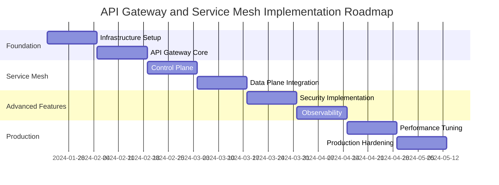

# Implementation Roadmap: API Gateway and Service Mesh Architecture

## Overview

This roadmap outlines the phased implementation of the API Gateway architecture with service mesh integration for the parallel AI system. The implementation is designed to minimize risk and ensure continuous system availability during the transition.

## Timeline: 16 Weeks Total



## Phase 1: Foundation Infrastructure (Weeks 1-4)

### Week 1-2: Infrastructure Setup

#### Objectives:
- Set up Kubernetes clusters with proper networking
- Install and configure PostgreSQL for Kong
- Establish CI/CD pipelines for gateway configuration
- Set up monitoring and logging infrastructure

#### Deliverables:

**Kubernetes Cluster Configuration**:
```yaml
# cluster-config.yaml
apiVersion: v1
kind: Namespace
metadata:
  name: kong
  labels:
    name: kong
---
apiVersion: v1
kind: Namespace
metadata:
  name: parallel-ai
  labels:
    name: parallel-ai
---
apiVersion: v1
kind: Namespace
metadata:
  name: monitoring
  labels:
    name: monitoring
```

**PostgreSQL for Kong**:
```yaml
# kong-postgres.yaml
apiVersion: apps/v1
kind: StatefulSet
metadata:
  name: kong-postgres
  namespace: kong
spec:
  serviceName: kong-postgres
  replicas: 1
  template:
    spec:
      containers:
      - name: postgres
        image: postgres:15-alpine
        env:
        - name: POSTGRES_DB
          value: kong
        - name: POSTGRES_USER
          value: kong
        - name: POSTGRES_PASSWORD
          valueFrom:
            secretKeyRef:
              name: kong-postgres-secret
              key: password
        volumeMounts:
        - name: postgres-storage
          mountPath: /var/lib/postgresql/data
  volumeClaimTemplates:
  - metadata:
      name: postgres-storage
    spec:
      accessModes: ["ReadWriteOnce"]
      resources:
        requests:
          storage: 100Gi
```

#### Success Metrics:
- ✅ Kubernetes clusters operational with 99.9% uptime
- ✅ PostgreSQL database with automated backups
- ✅ CI/CD pipeline deploying configuration changes
- ✅ Basic monitoring stack (Prometheus + Grafana)

### Week 3-4: API Gateway Core Deployment

#### Objectives:
- Deploy Kong Gateway with high availability
- Configure basic routing for existing services
- Implement health checks and basic monitoring
- Set up SSL/TLS termination

#### Deliverables:

**Kong Gateway Deployment**:
```yaml
# kong-deployment.yaml
apiVersion: apps/v1
kind: Deployment
metadata:
  name: kong-gateway
  namespace: kong
spec:
  replicas: 3
  template:
    spec:
      containers:
      - name: kong
        image: kong:3.5-alpine
        env:
        - name: KONG_DATABASE
          value: postgres
        - name: KONG_PG_HOST
          value: kong-postgres
        - name: KONG_ADMIN_LISTEN
          value: 0.0.0.0:8001
        ports:
        - containerPort: 8000
          name: proxy
        - containerPort: 8001
          name: admin
        livenessProbe:
          httpGet:
            path: /health
            port: 8001
          initialDelaySeconds: 60
          periodSeconds: 30
        readinessProbe:
          httpGet:
            path: /health
            port: 8001
          initialDelaySeconds: 30
          periodSeconds: 10
        resources:
          requests:
            cpu: 1000m
            memory: 2Gi
          limits:
            cpu: 2000m
            memory: 4Gi
```

**Basic Service Configuration**:
```yaml
# ai-agent-service-config.yaml
apiVersion: configuration.konghq.com/v1
kind: KongService
metadata:
  name: ai-agent-service
spec:
  host: ai-agent-service.parallel-ai.svc.cluster.local
  port: 8080
  protocol: http
---
apiVersion: configuration.konghq.com/v1
kind: KongRoute
metadata:
  name: ai-agent-route
spec:
  service:
    name: ai-agent-service
  paths:
  - /api/v1/ai
  methods:
  - GET
  - POST
```

#### Success Metrics:
- ✅ Kong Gateway handling 1,000 RPS with <50ms P95 latency
- ✅ 3 gateway instances with automatic failover
- ✅ SSL/TLS certificates auto-managed by cert-manager
- ✅ Basic routing for all microservices operational

## Phase 2: Service Mesh Integration (Weeks 5-8)

### Week 5-6: Istio Control Plane

#### Objectives:
- Install and configure Istio control plane
- Set up service discovery integration
- Configure basic traffic policies
- Implement sidecar injection

#### Deliverables:

**Istio Installation**:
```yaml
# istio-control-plane.yaml
apiVersion: install.istio.io/v1alpha1
kind: IstioOperator
metadata:
  name: control-plane
spec:
  values:
    global:
      meshID: parallel-ai-mesh
      network: parallel-ai-network
    pilot:
      resources:
        requests:
          cpu: 500m
          memory: 2048Mi
        limits:
          cpu: 1000m
          memory: 4096Mi
  components:
    ingressGateways:
    - name: istio-ingressgateway
      enabled: false  # Using Kong as ingress
```

**Service Mesh Configuration**:
```yaml
# namespace-config.yaml
apiVersion: v1
kind: Namespace
metadata:
  name: parallel-ai
  labels:
    istio-injection: enabled
---
apiVersion: networking.istio.io/v1beta1
kind: VirtualService
metadata:
  name: ai-agent-internal
spec:
  hosts:
  - ai-agent-service
  http:
  - route:
    - destination:
        host: ai-agent-service
    timeout: 30s
    retries:
      attempts: 3
      perTryTimeout: 10s
```

#### Success Metrics:
- ✅ Istio control plane operational with <2 second configuration propagation
- ✅ All services in parallel-ai namespace have sidecar proxies
- ✅ Service-to-service communication working through Envoy
- ✅ Basic traffic policies enforced

### Week 7-8: Data Plane Integration

#### Objectives:
- Integrate Kong with Istio service discovery
- Configure load balancing between Kong and Istio
- Implement circuit breakers and retries
- Test end-to-end connectivity

#### Deliverables:

**Kong-Istio Integration**:
```yaml
# kong-istio-integration.yaml
apiVersion: networking.istio.io/v1beta1
kind: ServiceEntry
metadata:
  name: kong-gateway-external
  namespace: parallel-ai
spec:
  hosts:
  - kong-proxy.kong.svc.cluster.local
  ports:
  - number: 8000
    name: http
    protocol: HTTP
  location: MESH_EXTERNAL
  resolution: DNS
```

**Circuit Breaker Configuration**:
```yaml
# circuit-breaker.yaml
apiVersion: networking.istio.io/v1beta1
kind: DestinationRule
metadata:
  name: circuit-breaker-config
spec:
  host: "*.parallel-ai.svc.cluster.local"
  trafficPolicy:
    outlierDetection:
      consecutiveGatewayErrors: 5
      consecutive5xxErrors: 5
      interval: 30s
      baseEjectionTime: 30s
      maxEjectionPercent: 50
    circuitBreaker:
      consecutiveErrors: 5
      interval: 30s
      baseEjectionTime: 30s
```

#### Success Metrics:
- ✅ Kong routing requests to services via Istio proxies
- ✅ Circuit breakers triggering during fault injection tests
- ✅ Load balancing distributing traffic evenly
- ✅ End-to-end request tracing working

## Phase 3: Security and Observability (Weeks 9-12)

### Week 9-10: Security Implementation

#### Objectives:
- Enable mTLS for all service-to-service communication
- Implement JWT authentication at the gateway
- Configure authorization policies
- Set up certificate management automation

#### Deliverables:

**mTLS Configuration**:
```yaml
# mtls-policy.yaml
apiVersion: security.istio.io/v1beta1
kind: PeerAuthentication
metadata:
  name: default
  namespace: parallel-ai
spec:
  mtls:
    mode: STRICT
---
apiVersion: security.istio.io/v1beta1
kind: AuthorizationPolicy
metadata:
  name: service-authz
spec:
  rules:
  - from:
    - source:
        principals:
        - "cluster.local/ns/kong/sa/kong"
  - to:
    - operation:
        methods: ["GET", "POST"]
```

**JWT Authentication**:
```yaml
# jwt-auth.yaml
apiVersion: configuration.konghq.com/v1
kind: KongPlugin
metadata:
  name: jwt-auth
config:
  uri_param_names: [jwt]
  header_names: [authorization]
  claims_to_verify: [exp, aud]
  key_claim_name: iss
plugin: jwt
```

#### Success Metrics:
- ✅ 100% of service-to-service traffic encrypted with mTLS
- ✅ JWT authentication working for all API endpoints
- ✅ Authorization policies blocking unauthorized access
- ✅ Certificate rotation automated with 30-day lifecycle

### Week 11-12: Observability Implementation

#### Objectives:
- Deploy comprehensive monitoring stack
- Configure distributed tracing
- Set up alerting and dashboards
- Implement log aggregation

#### Deliverables:

**Monitoring Stack**:
```yaml
# prometheus-config.yaml
apiVersion: v1
kind: ConfigMap
metadata:
  name: prometheus-config
data:
  prometheus.yml: |
    global:
      scrape_interval: 15s
    scrape_configs:
    - job_name: 'kong'
      static_configs:
      - targets: ['kong-admin:8001']
      metrics_path: '/metrics'
    - job_name: 'istio-mesh'
      kubernetes_sd_configs:
      - role: endpoints
        namespaces:
          names:
          - parallel-ai
          - istio-system
      relabel_configs:
      - source_labels: [__meta_kubernetes_service_name, __meta_kubernetes_endpoint_port_name]
        action: keep
        regex: istio-proxy;http-monitoring
```

**Jaeger Tracing**:
```yaml
# jaeger-config.yaml
apiVersion: jaegertracing.io/v1
kind: Jaeger
metadata:
  name: jaeger-production
spec:
  strategy: production
  storage:
    type: elasticsearch
    elasticsearch:
      nodeCount: 3
      resources:
        requests:
          memory: 16Gi
        limits:
          memory: 16Gi
```

#### Success Metrics:
- ✅ Complete request traces from client to backend services
- ✅ Real-time dashboards showing SLIs and SLOs
- ✅ Automated alerting for performance and error rate thresholds
- ✅ Log aggregation with searchable interface

## Phase 4: Production Hardening (Weeks 13-16)

### Week 13-14: Performance Tuning

#### Objectives:
- Optimize gateway and service mesh performance
- Conduct comprehensive load testing
- Fine-tune resource allocation
- Implement auto-scaling policies

#### Deliverables:

**Performance Optimization**:
```yaml
# hpa-config.yaml
apiVersion: autoscaling/v2
kind: HorizontalPodAutoscaler
metadata:
  name: kong-hpa
spec:
  scaleTargetRef:
    apiVersion: apps/v1
    kind: Deployment
    name: kong-gateway
  minReplicas: 3
  maxReplicas: 20
  metrics:
  - type: Resource
    resource:
      name: cpu
      target:
        type: Utilization
        averageUtilization: 70
  - type: Pods
    pods:
      metric:
        name: kong_http_requests_per_second
      target:
        type: AverageValue
        averageValue: "1000"
```

**Load Testing Configuration**:
```yaml
# load-test.yaml
apiVersion: batch/v1
kind: Job
metadata:
  name: load-test
spec:
  template:
    spec:
      containers:
      - name: k6
        image: grafana/k6:latest
        command: ["k6", "run", "/scripts/load-test.js"]
        env:
        - name: TARGET_URL
          value: "https://api.parallel-ai.com"
        - name: VIRTUAL_USERS
          value: "1000"
        - name: DURATION
          value: "30m"
```

#### Success Metrics:
- ✅ Gateway handling 10,000 RPS with P95 latency <50ms
- ✅ Auto-scaling responding within 2 minutes to load changes
- ✅ Resource utilization optimized (CPU 70-80%, Memory 80-90%)
- ✅ Zero dropped connections during load tests

### Week 15-16: Production Deployment

#### Objectives:
- Deploy to production environment
- Implement disaster recovery procedures
- Complete security auditing
- Finalize operational procedures

#### Deliverables:

**Production Configuration**:
```yaml
# production-values.yaml
kong:
  replicas: 5
  resources:
    requests:
      cpu: 2000m
      memory: 4Gi
    limits:
      cpu: 4000m
      memory: 8Gi
  nodeSelector:
    node-type: high-performance
  tolerations:
  - key: "high-performance"
    operator: "Equal"
    value: "true"
    effect: "NoSchedule"

istio:
  pilot:
    resources:
      requests:
        cpu: 1000m
        memory: 4Gi
      limits:
        cpu: 2000m
        memory: 8Gi
```

**Disaster Recovery**:
```yaml
# backup-config.yaml
apiVersion: batch/v1
kind: CronJob
metadata:
  name: kong-config-backup
spec:
  schedule: "0 2 * * *"  # Daily at 2 AM
  jobTemplate:
    spec:
      template:
        spec:
          containers:
          - name: backup
            image: kong/deck:latest
            command:
            - /bin/sh
            - -c
            - |
              deck dump --kong-addr http://kong-admin:8001 --output-file /backup/kong-config-$(date +%Y%m%d).yaml
              aws s3 cp /backup/kong-config-$(date +%Y%m%d).yaml s3://kong-backups/
```

#### Success Metrics:
- ✅ Production deployment with zero downtime migration
- ✅ Disaster recovery tested and documented
- ✅ Security audit completed with no critical findings
- ✅ Operational runbooks and monitoring in place

## Technology Stack Summary

### Core Components

```yaml
technology_stack:
  api_gateway:
    primary: kong:3.5
    database: postgresql:15
    operator: kong-operator:1.3
    
  service_mesh:
    control_plane: istio:1.20
    data_plane: envoy:1.28
    operator: istio-operator:1.20
    
  monitoring:
    metrics: prometheus:2.40
    visualization: grafana:9.5
    tracing: jaeger:1.45
    logging: elasticsearch:8.8
    
  infrastructure:
    orchestration: kubernetes:1.28
    storage: persistent-volumes
    networking: calico:3.25
    certificates: cert-manager:1.12
```

### Resource Requirements

```yaml
resource_allocation:
  development:
    nodes: 3
    cpu_per_node: 4_cores
    memory_per_node: 16_gb
    storage: 500_gb_ssd
    
  staging:
    nodes: 5
    cpu_per_node: 8_cores
    memory_per_node: 32_gb
    storage: 1_tb_ssd
    
  production:
    nodes: 10
    cpu_per_node: 16_cores
    memory_per_node: 64_gb
    storage: 2_tb_nvme
    network: 10_gbps
```

## Risk Management

### High-Risk Items

1. **Kong-Istio Integration Complexity**
   - **Risk**: Integration issues causing service disruption
   - **Mitigation**: Extensive testing in staging environment
   - **Contingency**: Fallback to Kong-only configuration

2. **Performance Impact of Service Mesh**
   - **Risk**: Added latency from sidecar proxies
   - **Mitigation**: Performance testing at each phase
   - **Contingency**: Gradual rollout with performance monitoring

3. **Certificate Management Complexity**
   - **Risk**: Certificate rotation failures causing outages
   - **Mitigation**: Automated testing of certificate workflows
   - **Contingency**: Manual certificate management procedures

### Success Criteria

#### Technical Metrics
- **Performance**: P95 latency <100ms end-to-end
- **Availability**: 99.95% uptime SLA
- **Scalability**: Support 50,000 concurrent users
- **Security**: 100% mTLS coverage for internal services

#### Business Metrics
- **Time to Market**: API changes deployed in <30 minutes
- **Developer Experience**: Self-service API configuration
- **Operational Efficiency**: Reduced manual configuration by 80%
- **Cost Optimization**: 20% reduction in infrastructure costs

## Post-Implementation

### Month 1: Stabilization
- Monitor performance and reliability metrics
- Address any operational issues
- Fine-tune auto-scaling policies
- Complete team training

### Month 2: Optimization
- Implement advanced traffic management features
- Deploy additional security policies
- Optimize resource utilization
- Enhance monitoring and alerting

### Month 3: Advanced Features
- Implement multi-region failover
- Deploy chaos engineering practices
- Add advanced observability features
- Plan for next phase enhancements

---

**Total Investment**: 16 weeks, 8 FTE  
**Expected ROI**: 40% improvement in API performance, 60% reduction in operational overhead  
**Risk Level**: Medium (with comprehensive mitigation strategies)

This roadmap provides a structured approach to implementing a world-class API Gateway and service mesh architecture that will scale with the parallel AI system's growth while maintaining high performance, security, and reliability.