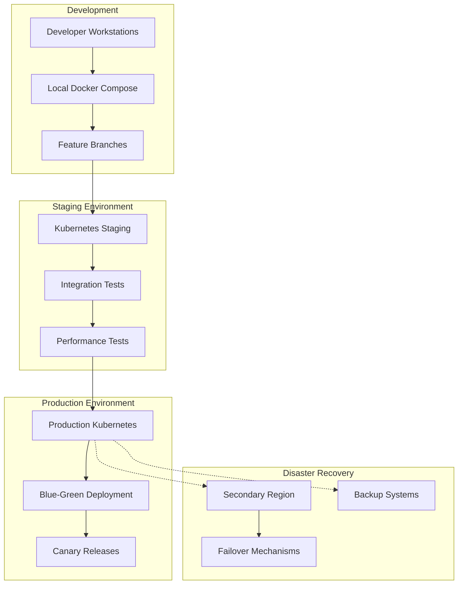

# Deployment Strategy and Migration Planning

## Overview

This document outlines the comprehensive deployment strategy for the multimodal education system, including environment management, migration approaches, zero-downtime deployment patterns, and disaster recovery procedures.

## Deployment Architecture

### Multi-Environment Strategy



### Environment Specifications

#### Development Environment
```yaml
Development_Environment:
  Purpose: Local development and testing
  Infrastructure: Docker Compose + Kind
  Scaling: Single instance per service
  Data: Synthetic/anonymized test data
  
  Configuration:
    compute:
      cpu: 4 cores per developer
      memory: 16GB per developer
      storage: 100GB SSD
    
    services:
      database: PostgreSQL (single instance)
      cache: Redis (single instance)
      message_queue: RabbitMQ (single instance)
      monitoring: Minimal (logs only)
    
    networking:
      service_mesh: Disabled
      load_balancer: nginx (local)
      ssl: Self-signed certificates
    
    data_management:
      persistence: Local volumes
      backup: None (disposable)
      migration: Automated seeding
```

#### Staging Environment
```yaml
Staging_Environment:
  Purpose: Integration testing and pre-production validation
  Infrastructure: Kubernetes cluster (smaller scale)
  Scaling: Production-like but reduced capacity
  Data: Anonymized production data subset
  
  Configuration:
    compute:
      nodes: 3 (1 master, 2 workers)
      cpu: 8 cores per node
      memory: 32GB per node
      storage: 500GB per node
    
    services:
      database: PostgreSQL cluster (1 primary, 1 replica)
      cache: Redis cluster (3 nodes)
      message_queue: Kafka (3 brokers)
      monitoring: Full stack (Prometheus, Grafana, Jaeger)
    
    networking:
      service_mesh: Istio enabled
      load_balancer: Cloud load balancer
      ssl: Let's Encrypt certificates
    
    data_management:
      persistence: Cloud storage
      backup: Daily snapshots
      migration: Automated from production
```

#### Production Environment
```yaml
Production_Environment:
  Purpose: Live system serving real users
  Infrastructure: Multi-zone Kubernetes cluster
  Scaling: Auto-scaling based on demand
  Data: Live production data with full compliance
  
  Configuration:
    compute:
      nodes: 12+ (3 masters, 9+ workers)
      cpu: 16 cores per node
      memory: 64GB per node
      storage: 1TB NVMe per node
    
    services:
      database: PostgreSQL cluster (1 primary, 2 replicas)
      cache: Redis cluster (6 nodes)
      message_queue: Kafka (5 brokers)
      monitoring: Full observability stack
    
    networking:
      service_mesh: Istio with security policies
      load_balancer: Multi-region load balancer
      ssl: Commercial certificates
    
    data_management:
      persistence: Replicated cloud storage
      backup: Continuous backup with PITR
      migration: Zero-downtime migration tools
```

## Deployment Patterns

### 1. Blue-Green Deployment

**Implementation Strategy:**
```yaml
Blue_Green_Deployment:
  Pattern: Complete environment switch
  Use_Cases:
    - Major version releases
    - Database schema changes
    - Infrastructure updates
    - High-risk deployments
  
  Process:
    preparation:
      - Deploy to green environment
      - Run health checks
      - Validate data integrity
      - Perform smoke tests
    
    switchover:
      - Update load balancer routing
      - Monitor key metrics
      - Validate user journeys
      - Confirm system stability
    
    validation:
      - Full regression testing
      - Performance validation
      - Security verification
      - Business logic testing
    
    cleanup:
      - Keep blue environment for 24h
      - Archive blue environment
      - Update documentation
      - Post-deployment review
```

**Kubernetes Implementation:**
```yaml
# Blue deployment
apiVersion: apps/v1
kind: Deployment
metadata:
  name: content-service-blue
  labels:
    app: content-service
    version: blue
spec:
  replicas: 3
  selector:
    matchLabels:
      app: content-service
      version: blue
  template:
    metadata:
      labels:
        app: content-service
        version: blue
    spec:
      containers:
      - name: content-service
        image: content-service:v1.2.0
        ports:
        - containerPort: 8080

---
# Service routing (switch between blue/green)
apiVersion: v1
kind: Service
metadata:
  name: content-service
spec:
  selector:
    app: content-service
    version: blue  # Switch to 'green' for deployment
  ports:
  - port: 80
    targetPort: 8080

---
# Istio VirtualService for traffic splitting
apiVersion: networking.istio.io/v1alpha3
kind: VirtualService
metadata:
  name: content-service
spec:
  http:
  - route:
    - destination:
        host: content-service
        subset: blue
      weight: 100  # Switch to green: weight: 0
    - destination:
        host: content-service
        subset: green
      weight: 0    # Switch to green: weight: 100
```

### 2. Canary Deployment

**Implementation Strategy:**
```yaml
Canary_Deployment:
  Pattern: Gradual traffic migration
  Use_Cases:
    - Feature releases
    - Performance optimizations
    - Bug fixes
    - A/B testing
  
  Traffic_Split_Strategy:
    stage_1: 5% canary traffic
    stage_2: 25% canary traffic
    stage_3: 50% canary traffic
    stage_4: 75% canary traffic
    stage_5: 100% canary traffic
  
  Validation_Criteria:
    - Error rate increase <0.1%
    - Response time degradation <10%
    - Business metrics stability
    - User feedback sentiment
  
  Rollback_Triggers:
    - Error rate >1%
    - Response time >2x baseline
    - Critical business metrics drop
    - Manual intervention
```

**ArgoCD Rollouts Implementation:**
```yaml
apiVersion: argoproj.io/v1alpha1
kind: Rollout
metadata:
  name: content-service
spec:
  replicas: 10
  strategy:
    canary:
      maxSurge: "25%"
      maxUnavailable: 0
      analysis:
        templates:
        - templateName: success-rate
        startingStep: 2
        args:
        - name: service-name
          value: content-service
      steps:
      - setWeight: 5
      - pause: {duration: 5m}
      - setWeight: 25
      - pause: {duration: 10m}
      - setWeight: 50
      - pause: {duration: 15m}
      - setWeight: 75
      - pause: {duration: 10m}
      canaryService: content-service-canary
      stableService: content-service-stable
      trafficRouting:
        istio:
          virtualService:
            name: content-service
          destinationRule:
            name: content-service
            canarySubsetName: canary
            stableSubsetName: stable

  selector:
    matchLabels:
      app: content-service
  template:
    metadata:
      labels:
        app: content-service
    spec:
      containers:
      - name: content-service
        image: content-service:latest
        ports:
        - containerPort: 8080
```

### 3. Rolling Updates

**Standard Rolling Deployment:**
```yaml
Rolling_Update_Strategy:
  Pattern: Gradual pod replacement
  Use_Cases:
    - Minor updates
    - Configuration changes
    - Security patches
    - Routine maintenance
  
  Configuration:
    max_unavailable: 25%
    max_surge: 25%
    progress_deadline: 600s
    revision_history_limit: 10
  
  Validation:
    readiness_probe: HTTP health check
    liveness_probe: Application health
    startup_probe: Initialization check
```

```yaml
apiVersion: apps/v1
kind: Deployment
metadata:
  name: auth-service
spec:
  replicas: 6
  strategy:
    type: RollingUpdate
    rollingUpdate:
      maxUnavailable: 25%
      maxSurge: 25%
  template:
    spec:
      containers:
      - name: auth-service
        image: auth-service:v1.1.0
        livenessProbe:
          httpGet:
            path: /health
            port: 8080
          initialDelaySeconds: 30
          periodSeconds: 10
        readinessProbe:
          httpGet:
            path: /ready
            port: 8080
          initialDelaySeconds: 5
          periodSeconds: 5
        startupProbe:
          httpGet:
            path: /startup
            port: 8080
          failureThreshold: 30
          periodSeconds: 10
```

## CI/CD Pipeline Implementation

### GitOps Workflow with ArgoCD

```yaml
GitOps_Pipeline:
  Repository_Structure:
    application_code: app-repo
    infrastructure_code: infra-repo
    kubernetes_manifests: k8s-manifests-repo
    helm_charts: helm-charts-repo
  
  Workflow:
    development:
      - Code commit to feature branch
      - Automated testing (unit, integration)
      - Security scanning
      - Build and push container image
      - Update development manifests
      - ArgoCD auto-sync to dev environment
    
    staging:
      - Merge to main branch
      - Automated testing (full suite)
      - Performance testing
      - Security compliance check
      - Update staging manifests
      - ArgoCD sync to staging
      - Integration test execution
    
    production:
      - Manual approval after staging validation
      - Update production manifests
      - ArgoCD canary deployment
      - Automated validation
      - Progressive traffic shifting
      - Full deployment or rollback
```

### GitLab CI Pipeline Configuration

```yaml
# .gitlab-ci.yml
stages:
  - validate
  - test
  - build
  - security
  - deploy-dev
  - deploy-staging
  - deploy-production

variables:
  DOCKER_REGISTRY: registry.gitlab.com
  KUBERNETES_NAMESPACE_DEV: development
  KUBERNETES_NAMESPACE_STAGING: staging
  KUBERNETES_NAMESPACE_PROD: production

# Validate stage
lint-code:
  stage: validate
  script:
    - golangci-lint run
    - eslint src/
  only:
    - merge_requests
    - main

# Test stage
unit-tests:
  stage: test
  script:
    - go test -v -race -coverprofile=coverage.out ./...
    - npm test -- --coverage
  coverage: '/coverage: \d+\.\d+% of statements/'
  artifacts:
    reports:
      coverage_report:
        coverage_format: cobertura
        path: coverage.xml

integration-tests:
  stage: test
  services:
    - postgres:13
    - redis:6
  script:
    - make integration-test
  only:
    - main
    - merge_requests

# Security stage
security-scan:
  stage: security
  script:
    - trivy image --exit-code 0 --format template --template "@contrib/sarif.tpl" -o gl-sast-report.json $CI_REGISTRY_IMAGE:$CI_COMMIT_SHA
  artifacts:
    reports:
      sast: gl-sast-report.json

# Build stage
build-image:
  stage: build
  script:
    - docker build -t $CI_REGISTRY_IMAGE:$CI_COMMIT_SHA .
    - docker push $CI_REGISTRY_IMAGE:$CI_COMMIT_SHA
  only:
    - main
    - merge_requests

# Deploy stages
deploy-development:
  stage: deploy-dev
  script:
    - kubectl set image deployment/auth-service auth-service=$CI_REGISTRY_IMAGE:$CI_COMMIT_SHA -n $KUBERNETES_NAMESPACE_DEV
    - kubectl rollout status deployment/auth-service -n $KUBERNETES_NAMESPACE_DEV
  environment:
    name: development
    url: https://dev.eduai.com
  only:
    - main

deploy-staging:
  stage: deploy-staging
  script:
    - argocd app sync auth-service-staging
    - argocd app wait auth-service-staging --health
  environment:
    name: staging
    url: https://staging.eduai.com
  only:
    - main
  when: manual

deploy-production:
  stage: deploy-production
  script:
    - argocd app sync auth-service-production
    - argocd app wait auth-service-production --health
  environment:
    name: production
    url: https://eduai.com
  only:
    - main
  when: manual
```

## Database Migration Strategy

### Zero-Downtime Database Migrations

```sql
-- Migration strategy for zero-downtime deployments
-- Phase 1: Add new column (compatible with old code)
ALTER TABLE users ADD COLUMN new_profile_data JSONB;

-- Phase 2: Populate new column (background process)
UPDATE users 
SET new_profile_data = old_profile_data::JSONB 
WHERE new_profile_data IS NULL;

-- Phase 3: Deploy application code that uses both columns

-- Phase 4: Switch application to use new column only

-- Phase 5: Remove old column (after validation period)
ALTER TABLE users DROP COLUMN old_profile_data;
```

### Migration Process Framework

```go
// Database migration framework
type Migration struct {
    Version     int64
    Description string
    Up          func(tx *sql.Tx) error
    Down        func(tx *sql.Tx) error
}

type MigrationRunner struct {
    db             *sql.DB
    migrationsPath string
    lockTimeout    time.Duration
}

func (mr *MigrationRunner) RunMigrations() error {
    // 1. Acquire distributed lock
    lock, err := mr.acquireMigrationLock()
    if err != nil {
        return fmt.Errorf("failed to acquire migration lock: %w", err)
    }
    defer lock.Release()
    
    // 2. Get current schema version
    currentVersion, err := mr.getCurrentVersion()
    if err != nil {
        return fmt.Errorf("failed to get current version: %w", err)
    }
    
    // 3. Load pending migrations
    migrations, err := mr.loadPendingMigrations(currentVersion)
    if err != nil {
        return fmt.Errorf("failed to load migrations: %w", err)
    }
    
    // 4. Run migrations in transaction
    for _, migration := range migrations {
        if err := mr.runMigration(migration); err != nil {
            return fmt.Errorf("migration %d failed: %w", migration.Version, err)
        }
    }
    
    return nil
}

func (mr *MigrationRunner) runMigration(migration Migration) error {
    tx, err := mr.db.Begin()
    if err != nil {
        return err
    }
    defer tx.Rollback()
    
    // Run migration
    if err := migration.Up(tx); err != nil {
        return err
    }
    
    // Update version
    _, err = tx.Exec("UPDATE schema_migrations SET version = ? WHERE id = 1", migration.Version)
    if err != nil {
        return err
    }
    
    return tx.Commit()
}
```

### Database Migration Best Practices

```yaml
Migration_Best_Practices:
  Backward_Compatibility:
    - Always maintain backward compatibility
    - Use feature flags for breaking changes
    - Implement dual-write patterns
    - Validate data consistency
  
  Performance_Considerations:
    - Run heavy migrations during maintenance windows
    - Use background jobs for data population
    - Monitor migration progress
    - Implement timeouts and cancellation
  
  Safety_Measures:
    - Always backup before migrations
    - Test migrations on staging data
    - Implement rollback procedures
    - Monitor application metrics during migration
  
  Schema_Changes:
    adding_columns: Safe (with defaults)
    removing_columns: Use deprecation period
    renaming_columns: Use dual-write approach
    changing_types: Create new column, migrate, drop old
    adding_indexes: Online index creation
    adding_constraints: Validate existing data first
```

## Infrastructure as Code (IaC)

### Terraform Infrastructure Management

```hcl
# terraform/main.tf
terraform {
  required_version = ">= 1.0"
  required_providers {
    aws = {
      source  = "hashicorp/aws"
      version = "~> 5.0"
    }
    kubernetes = {
      source  = "hashicorp/kubernetes"
      version = "~> 2.20"
    }
  }
  
  backend "s3" {
    bucket = "eduai-terraform-state"
    key    = "production/terraform.tfstate"
    region = "us-west-2"
  }
}

# EKS Cluster
module "eks" {
  source = "./modules/eks"
  
  cluster_name    = var.cluster_name
  cluster_version = "1.28"
  
  node_groups = {
    compute = {
      instance_types = ["m5.xlarge"]
      min_size      = 3
      max_size      = 20
      desired_size  = 6
    }
    
    memory_optimized = {
      instance_types = ["r5.xlarge"]
      min_size      = 2
      max_size      = 10
      desired_size  = 4
    }
  }
  
  tags = {
    Environment = var.environment
    Project     = "multimodal-education"
  }
}

# RDS Cluster
module "rds" {
  source = "./modules/rds"
  
  cluster_identifier     = "${var.cluster_name}-postgres"
  engine                = "aurora-postgresql"
  engine_version        = "13.7"
  master_username       = var.db_username
  master_password       = var.db_password
  database_name         = var.db_name
  
  instance_count        = 3
  instance_class        = "db.r5.xlarge"
  
  backup_retention_period = 30
  preferred_backup_window = "03:00-04:00"
  
  tags = {
    Environment = var.environment
    Project     = "multimodal-education"
  }
}

# ElastiCache Redis Cluster
module "redis" {
  source = "./modules/elasticache"
  
  cluster_id           = "${var.cluster_name}-redis"
  node_type           = "cache.r6g.xlarge"
  num_cache_nodes     = 6
  parameter_group     = "default.redis7.cluster.on"
  
  subnet_group_name   = module.vpc.elasticache_subnet_group_name
  security_group_ids  = [module.security_groups.redis_sg_id]
  
  tags = {
    Environment = var.environment
    Project     = "multimodal-education"
  }
}
```

### Helm Charts for Application Deployment

```yaml
# helm/content-service/values.yaml
replicaCount: 3

image:
  repository: registry.gitlab.com/eduai/content-service
  tag: latest
  pullPolicy: IfNotPresent

service:
  type: ClusterIP
  port: 80
  targetPort: 8080

ingress:
  enabled: true
  className: nginx
  annotations:
    cert-manager.io/cluster-issuer: letsencrypt-prod
    nginx.ingress.kubernetes.io/rate-limit: "1000"
  hosts:
    - host: api.eduai.com
      paths:
        - path: /api/v1/content
          pathType: Prefix
  tls:
    - secretName: api-tls
      hosts:
        - api.eduai.com

autoscaling:
  enabled: true
  minReplicas: 3
  maxReplicas: 20
  targetCPUUtilizationPercentage: 70
  targetMemoryUtilizationPercentage: 80

resources:
  limits:
    cpu: 1000m
    memory: 2Gi
  requests:
    cpu: 500m
    memory: 1Gi

env:
  - name: DATABASE_URL
    valueFrom:
      secretKeyRef:
        name: content-service-secrets
        key: database-url
  
  - name: REDIS_URL
    valueFrom:
      configMapKeyRef:
        name: content-service-config
        key: redis-url

healthcheck:
  livenessProbe:
    httpGet:
      path: /health
      port: 8080
    initialDelaySeconds: 30
    periodSeconds: 10
    timeoutSeconds: 5
    failureThreshold: 3
  
  readinessProbe:
    httpGet:
      path: /ready
      port: 8080
    initialDelaySeconds: 5
    periodSeconds: 5
    timeoutSeconds: 3
    failureThreshold: 3

podDisruptionBudget:
  enabled: true
  minAvailable: 2

serviceMonitor:
  enabled: true
  interval: 30s
  path: /metrics
```

## Monitoring and Alerting for Deployments

### Deployment Monitoring Dashboard

```yaml
Deployment_Monitoring:
  Key_Metrics:
    - Deployment success rate
    - Rollback frequency
    - Time to deploy
    - Mean time to recovery
    - Service availability during deployment
    - Error rate during deployment
    - Response time degradation
    - Resource utilization changes
  
  Alerts:
    Critical:
      - Deployment failure
      - Service unavailable
      - High error rate (>5%)
      - Response time >5x baseline
    
    Warning:
      - Long deployment time
      - Increased resource usage
      - Elevated error rate (>1%)
      - Performance degradation
  
  Dashboards:
    - Deployment pipeline status
    - Service health during deployment
    - Resource utilization trends
    - Error rate and response time
    - Business metric impact
```

### Automated Rollback Triggers

```yaml
# Prometheus alerting rules for automated rollback
groups:
- name: deployment.rules
  rules:
  - alert: HighErrorRateAfterDeployment
    expr: |
      (
        rate(http_requests_total{status=~"5.."}[5m]) /
        rate(http_requests_total[5m])
      ) > 0.05
    for: 2m
    labels:
      severity: critical
      action: rollback
    annotations:
      summary: "High error rate detected after deployment"
      description: "Error rate is {{ $value | humanizePercentage }} for {{ $labels.service }}"
  
  - alert: ResponseTimeDegradation
    expr: |
      histogram_quantile(0.95, 
        rate(http_request_duration_seconds_bucket[5m])
      ) > 
      5 * histogram_quantile(0.95, 
        rate(http_request_duration_seconds_bucket[1h] offset 1h)
      )
    for: 3m
    labels:
      severity: critical
      action: rollback
    annotations:
      summary: "Significant response time degradation"
      description: "95th percentile response time is 5x higher than baseline"
```

## Disaster Recovery and Business Continuity

### Multi-Region Deployment Strategy

```yaml
Disaster_Recovery:
  Architecture:
    primary_region: us-west-2
    secondary_region: us-east-1
    
  Replication_Strategy:
    database:
      type: cross_region_replica
      lag_threshold: 30_seconds
      failover_time: 5_minutes
    
    storage:
      type: cross_region_replication
      consistency: eventual
      rpo: 1_hour
    
    cache:
      type: cluster_replication
      sync_mode: async
      failover: automatic
  
  Failover_Procedures:
    detection:
      - Health check failures
      - Regional service degradation
      - Manual intervention
    
    activation:
      - DNS failover (Route 53)
      - Database promotion
      - Application deployment
      - Data validation
    
    communication:
      - Status page updates
      - Customer notifications
      - Team alerts
      - Stakeholder briefings
```

### Backup and Recovery Procedures

```yaml
Backup_Strategy:
  Database_Backups:
    frequency: continuous
    retention: 30_days
    type: point_in_time_recovery
    validation: automated_restore_test
    encryption: AES_256
    
  Application_Data:
    frequency: hourly
    retention: 7_days
    type: incremental
    validation: checksum_verification
    compression: gzip
    
  Configuration_Backups:
    frequency: on_change
    retention: 90_days
    type: version_controlled
    location: git_repository
    encryption: gpg
    
  Recovery_Testing:
    frequency: monthly
    scope: full_system_restore
    environment: isolated_test_cluster
    validation: automated_testing
    documentation: runbook_updates
```

This comprehensive deployment strategy ensures reliable, scalable, and maintainable deployments while minimizing risks and maximizing system availability.