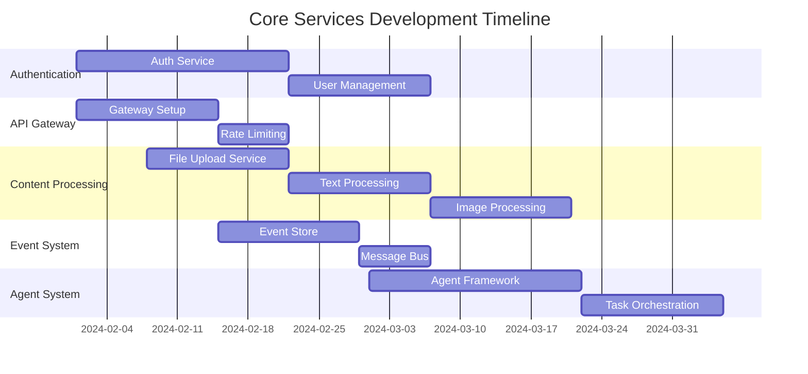
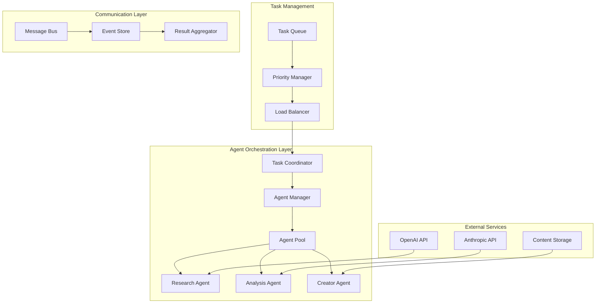

# Development Phase Planning

## Overview

This document outlines the phased approach to implementing the multimodal education system, including milestones, deliverables, and risk mitigation strategies for each phase.

## Development Methodology

### Agile-DevOps Hybrid Approach
- **Sprint Duration**: 2-week sprints
- **Release Cadence**: Bi-weekly releases to staging, monthly to production
- **Team Structure**: Cross-functional teams with embedded DevOps
- **Quality Gates**: Automated testing, code review, security scanning at each phase

### Architecture Decision Process
1. **Architecture Decision Records (ADRs)** for all major decisions
2. **Proof of Concepts (PoCs)** for high-risk technical choices
3. **Architecture Review Board** for cross-cutting concerns
4. **Technology Spike** allocation: 20% of sprint capacity

## Phase 1: Foundation Infrastructure (Weeks 1-8)

### Objectives
- Establish core infrastructure and development foundations
- Implement basic security and monitoring
- Set up CI/CD pipelines
- Create development and testing environments

### Key Deliverables

#### Infrastructure Setup
```yaml
Infrastructure_Components:
  Kubernetes_Cluster:
    - Multi-node cluster (3 masters, 6 workers)
    - Istio service mesh installation
    - Monitoring stack (Prometheus, Grafana, Jaeger)
    - Logging stack (ELK)
    
  Databases:
    - PostgreSQL cluster (primary + read replicas)
    - MongoDB replica set
    - Redis cluster
    - Event store setup
    
  Message_Queues:
    - Apache Kafka cluster (3 brokers)
    - RabbitMQ for task queues
    - Redis Streams for real-time data
    
  Security_Foundation:
    - Certificate management (cert-manager)
    - Secret management (HashiCorp Vault)
    - Network policies
    - Basic RBAC setup
```

#### Development Infrastructure
```yaml
CI_CD_Pipeline:
  Source_Control:
    - GitLab/GitHub setup with branch protection
    - Conventional commits enforcement
    - Automated changelog generation
    
  Build_Pipeline:
    - Dockerfile standards and base images
    - Multi-stage builds for optimization
    - Security scanning (Snyk, Trivy)
    - Static code analysis (SonarQube)
    
  Deployment_Pipeline:
    - GitOps with ArgoCD
    - Environment promotion (dev → staging → prod)
    - Automated rollback capabilities
    - Blue-green deployment setup
    
  Quality_Gates:
    - Unit test coverage ≥80%
    - Integration test execution
    - Performance test baselines
    - Security compliance checks
```

### Sprint Breakdown

#### Sprint 1-2: Infrastructure Foundation
**Week 1-4**
- Kubernetes cluster setup and configuration
- Basic monitoring and logging infrastructure
- Development environment provisioning
- Team onboarding and tooling setup

#### Sprint 3-4: CI/CD and Security
**Week 5-8**
- Complete CI/CD pipeline implementation
- Security foundation (Vault, certificates, policies)
- Database cluster setup and configuration
- Message queue infrastructure deployment

### Success Metrics
- **Infrastructure Uptime**: >99% during setup phase
- **Deployment Speed**: <5 minutes for application deployments
- **Security Compliance**: 100% security policies implemented
- **Developer Productivity**: Development environment setup <30 minutes

### Risks and Mitigation
```yaml
High_Risk_Items:
  - Risk: Kubernetes complexity learning curve
    Mitigation: Dedicated DevOps engineer, external training
    Contingency: Managed Kubernetes service (EKS/GKE)
    
  - Risk: Service mesh complexity
    Mitigation: Start with basic features, gradual adoption
    Contingency: Traditional load balancer approach
    
  - Risk: Multi-database management complexity
    Mitigation: Database-per-service pattern, automation
    Contingency: Shared database with clear schema boundaries
```

## Phase 2: Core Services Development (Weeks 9-20)

### Objectives
- Implement foundational microservices
- Establish event-driven communication
- Basic API Gateway and authentication
- Core business logic implementation

### Architecture Implementation

#### Service Implementation Priority


### Sprint Breakdown

#### Sprint 5-6: Authentication and API Gateway
**Week 9-12**
- JWT-based authentication service
- User registration and profile management
- API Gateway with basic routing
- Rate limiting and security middleware

**Deliverables:**
- User registration/login endpoints
- JWT token generation and validation
- API Gateway with service routing
- Basic admin dashboard for user management

#### Sprint 7-8: Content Processing Foundation
**Week 13-16**
- File upload service with S3/MinIO storage
- Content metadata extraction
- Text processing pipeline
- Basic content API endpoints

**Deliverables:**
- Multimodal file upload API
- Content storage and retrieval
- Text extraction from documents
- Content search functionality

#### Sprint 9-10: Event System and Messaging
**Week 17-20**
- Event store implementation
- Kafka message bus setup
- Basic event sourcing patterns
- Event-driven service communication

**Deliverables:**
- PostgreSQL event store
- Kafka topics and producers/consumers
- Event-driven user registration flow
- Content processing event pipeline

### Technical Implementation Details

#### Authentication Service Architecture
```typescript
// Authentication Service Structure
src/
├── domain/
│   ├── entities/
│   │   ├── User.ts
│   │   └── Session.ts
│   ├── repositories/
│   │   └── UserRepository.ts
│   └── services/
│       ├── AuthService.ts
│       └── TokenService.ts
├── infrastructure/
│   ├── database/
│   │   └── PostgreSQLUserRepository.ts
│   ├── security/
│   │   └── JWTTokenService.ts
│   └── messaging/
│       └── UserEventPublisher.ts
├── application/
│   ├── commands/
│   │   ├── RegisterUserCommand.ts
│   │   └── LoginCommand.ts
│   ├── handlers/
│   │   ├── RegisterUserHandler.ts
│   │   └── LoginHandler.ts
│   └── queries/
│       └── GetUserQuery.ts
└── api/
    ├── routes/
    │   ├── authRoutes.ts
    │   └── userRoutes.ts
    └── middleware/
        └── authMiddleware.ts
```

#### Content Processing Service
```python
# Content Processing Service Structure
content_processing/
├── domain/
│   ├── entities/
│   │   ├── content.py
│   │   └── processing_result.py
│   ├── services/
│   │   ├── text_processor.py
│   │   ├── image_processor.py
│   │   └── audio_processor.py
│   └── repositories/
│       └── content_repository.py
├── infrastructure/
│   ├── storage/
│   │   └── s3_storage.py
│   ├── processors/
│   │   ├── nlp_processor.py
│   │   ├── ocr_processor.py
│   │   └── speech_to_text.py
│   └── messaging/
│       └── kafka_publisher.py
├── application/
│   ├── commands/
│   │   └── process_content_command.py
│   ├── handlers/
│   │   └── content_processing_handler.py
│   └── tasks/
│       └── celery_tasks.py
└── api/
    ├── routes/
    │   └── content_routes.py
    └── schemas/
        └── content_schemas.py
```

### Success Metrics
- **API Response Time**: <100ms for 95th percentile
- **Service Availability**: >99.5% uptime
- **Event Processing**: <5 second end-to-end latency
- **Test Coverage**: >80% for all services

## Phase 3: Advanced Features (Weeks 21-32)

### Objectives
- Implement agent orchestration system
- Advanced content processing capabilities
- Learning management features
- Real-time collaboration and notifications

### Key Features Implementation

#### Agent Orchestration System
```yaml
Agent_System_Features:
  Agent_Types:
    - Research Agent: Content discovery and analysis
    - Analysis Agent: Data processing and insights
    - Creator Agent: Content generation and synthesis
    - Review Agent: Quality assurance and validation
    - Coordinator Agent: Task management and orchestration
    
  Orchestration_Capabilities:
    - Dynamic agent spawning and termination
    - Task queue management and prioritization
    - Load balancing across agent instances
    - Result aggregation and synthesis
    - Performance monitoring and optimization
    
  Integration_Features:
    - External AI service integration (OpenAI, Anthropic)
    - Multi-modal input processing
    - Real-time progress tracking
    - Quality metrics and feedback loops
```

#### Learning Management System
```yaml
LMS_Features:
  Content_Management:
    - Learning path creation and management
    - Module sequencing and dependencies
    - Assessment creation and grading
    - Progress tracking and analytics
    
  Personalization:
    - Adaptive learning algorithms
    - Recommendation engine
    - Learning style adaptation
    - Performance-based content adjustment
    
  Collaboration:
    - Real-time collaborative editing
    - Discussion forums and messaging
    - Peer review and feedback
    - Group project management
```

### Sprint Breakdown

#### Sprint 11-12: Agent Framework
**Week 21-24**
- Basic agent framework and lifecycle management
- Task queue implementation with RabbitMQ
- Agent communication protocols
- Simple agent types (researcher, analyzer)

#### Sprint 13-14: Advanced Content Processing
**Week 25-28**
- Image and video processing capabilities
- Audio transcription and analysis
- Multi-language content support
- Content enrichment and tagging

#### Sprint 15-16: Learning Management Core
**Week 29-32**
- Learning path creation and management
- User progress tracking
- Basic assessment functionality
- Recommendation engine foundation

### Technical Architecture

#### Agent System Architecture


### Success Metrics
- **Agent Utilization**: >85% average agent utilization
- **Task Completion**: <2 minutes average task completion time
- **Content Processing**: Support for 5+ content types
- **Learning Engagement**: >70% course completion rate

## Phase 4: Integration and Optimization (Weeks 33-44)

### Objectives
- Complete system integration
- Performance optimization
- Advanced analytics implementation
- Production readiness preparation

### Integration Priorities

#### System-Wide Integration
```yaml
Integration_Areas:
  Service_Communication:
    - Complete event-driven architecture
    - Service mesh implementation
    - Circuit breaker patterns
    - Distributed tracing
    
  Data_Consistency:
    - Event sourcing across all services
    - CQRS implementation
    - Saga patterns for distributed transactions
    - Data synchronization mechanisms
    
  Security_Hardening:
    - End-to-end encryption
    - Zero-trust security model
    - Advanced threat detection
    - Compliance validation (GDPR, CCPA)
    
  Performance_Optimization:
    - Database query optimization
    - Caching strategies implementation
    - CDN setup for content delivery
    - Auto-scaling configuration
```

#### Analytics and Reporting
```yaml
Analytics_Implementation:
  Real_Time_Analytics:
    - User behavior tracking
    - Performance monitoring
    - System health dashboards
    - Alert and notification systems
    
  Business_Intelligence:
    - Learning effectiveness metrics
    - Content engagement analysis
    - User progression analytics
    - ROI and success metrics
    
  Machine_Learning:
    - Recommendation algorithms
    - Predictive analytics
    - Content quality assessment
    - User behavior prediction
```

### Sprint Breakdown

#### Sprint 17-18: Service Integration
**Week 33-36**
- Complete service mesh implementation
- Advanced routing and load balancing
- Distributed tracing setup
- Circuit breaker implementation

#### Sprint 19-20: Performance Optimization
**Week 37-40**
- Database optimization and indexing
- Caching layer implementation
- CDN setup and optimization
- Load testing and optimization

#### Sprint 21-22: Analytics and Monitoring
**Week 41-44**
- Advanced monitoring and alerting
- Business intelligence dashboards
- User analytics implementation
- Performance metrics collection

### Success Metrics
- **System Performance**: <50ms average API response time
- **Scalability**: Support 10,000+ concurrent users
- **Reliability**: >99.9% system availability
- **Monitoring**: 100% service observability coverage

## Phase 5: Production Launch (Weeks 45-52)

### Objectives
- Production deployment preparation
- Security hardening and compliance
- User acceptance testing
- Go-live and initial user onboarding

### Launch Preparation

#### Production Environment Setup
```yaml
Production_Infrastructure:
  High_Availability:
    - Multi-region deployment
    - Auto-scaling groups
    - Load balancer redundancy
    - Database clustering
    
  Security_Measures:
    - Web Application Firewall (WAF)
    - DDoS protection
    - Security scanning automation
    - Compliance audit preparation
    
  Monitoring_and_Alerting:
    - 24/7 monitoring setup
    - Incident response procedures
    - Performance baseline establishment
    - Capacity planning implementation
    
  Backup_and_Disaster_Recovery:
    - Automated backup systems
    - Disaster recovery testing
    - Data retention policies
    - Business continuity planning
```

### Sprint Breakdown

#### Sprint 23-24: Security and Compliance
**Week 45-48**
- Security audit and penetration testing
- Compliance validation (GDPR, CCPA, FERPA)
- WAF and DDoS protection setup
- Security documentation completion

#### Sprint 25-26: Production Deployment
**Week 49-52**
- Production environment deployment
- User acceptance testing
- Performance testing at scale
- Go-live preparation and execution

### Launch Success Metrics
- **Security Score**: 100% security compliance
- **Performance**: System handles launch traffic without degradation
- **User Experience**: <3 second page load times
- **Reliability**: Zero critical issues during launch

## Risk Management Strategy

### High-Priority Risks
```yaml
Critical_Risks:
  Technical_Risks:
    - Microservices complexity management
    - Event sourcing implementation challenges
    - Third-party service dependencies
    - Data consistency across services
    
  Resource_Risks:
    - Key personnel availability
    - Technical skill gaps
    - Infrastructure cost overruns
    - Timeline compression pressure
    
  Business_Risks:
    - Changing requirements during development
    - Market competition acceleration
    - Regulatory compliance changes
    - User adoption uncertainty
```

### Mitigation Strategies
```yaml
Mitigation_Approaches:
  Technical_Mitigation:
    - Extensive prototyping and proof-of-concepts
    - Gradual complexity introduction
    - Comprehensive testing at each phase
    - Alternative technology stack preparation
    
  Resource_Mitigation:
    - Cross-training and knowledge sharing
    - External consultant relationships
    - Flexible team augmentation capability
    - Agile resource reallocation
    
  Business_Mitigation:
    - Regular stakeholder communication
    - Iterative feedback and validation
    - MVP and incremental delivery approach
    - Market research and competitive analysis
```

### Contingency Plans
```yaml
Contingency_Scenarios:
  Technical_Failures:
    - Service degradation response procedures
    - Rollback and recovery protocols
    - Alternative implementation strategies
    - External service failure handling
    
  Resource_Constraints:
    - Scope reduction strategies
    - Priority rebalancing approaches
    - External resource acquisition plans
    - Timeline extension procedures
    
  Market_Changes:
    - Feature pivot capabilities
    - Technology stack flexibility
    - Rapid deployment capabilities
    - User feedback integration processes
```

## Quality Assurance Strategy

### Testing Pyramid Implementation
```yaml
Testing_Strategy:
  Unit_Testing:
    - Coverage requirement: >80%
    - Automated test execution
    - Test-driven development approach
    - Continuous integration integration
    
  Integration_Testing:
    - Service-to-service testing
    - Database integration testing
    - Message queue testing
    - API contract testing
    
  End_to_End_Testing:
    - User journey testing
    - Cross-browser compatibility
    - Mobile responsiveness testing
    - Performance testing
    
  Security_Testing:
    - Vulnerability scanning
    - Penetration testing
    - Security code review
    - Compliance validation
```

### Quality Gates
```yaml
Quality_Requirements:
  Code_Quality:
    - SonarQube quality gate passing
    - Code review approval required
    - Technical debt ratio <5%
    - Complexity metrics within limits
    
  Performance_Quality:
    - Response time SLA compliance
    - Load testing criteria met
    - Resource utilization optimized
    - Scalability requirements validated
    
  Security_Quality:
    - Security scan pass rate 100%
    - Penetration test findings resolved
    - Compliance requirements met
    - Security documentation complete
```

This comprehensive development phase planning provides a structured approach to implementing the multimodal education system while managing risks and ensuring quality throughout the development lifecycle.