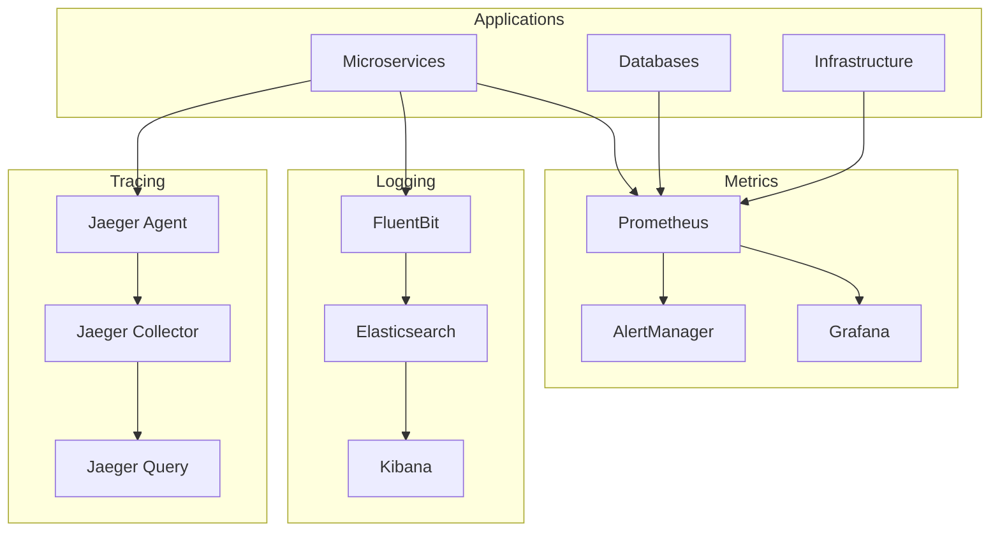

# Monitoring and Observability Implementation

## Overview

This document outlines the comprehensive monitoring and observability strategy for the multimodal education system, covering metrics, logging, tracing, alerting, and performance monitoring across all system components.

## Observability Strategy

### Three Pillars of Observability



### Observability Maturity Model

```yaml
Observability_Levels:
  Level_1_Basic:
    - System resource monitoring
    - Application uptime checks
    - Basic error logging
    - Simple dashboards
    
  Level_2_Intermediate:
    - Custom business metrics
    - Structured logging
    - Distributed tracing
    - SLA monitoring
    
  Level_3_Advanced:
    - Predictive analytics
    - Anomaly detection
    - Chaos engineering
    - Performance optimization
    
  Level_4_Expert:
    - AI-driven insights
    - Automated remediation
    - Cost optimization
    - Capacity planning
```

## Metrics Collection and Monitoring

### Prometheus Configuration

```yaml
# prometheus.yml
global:
  scrape_interval: 15s
  evaluation_interval: 15s
  external_labels:
    cluster: 'eduai-production'
    region: 'us-west-2'

rule_files:
  - "alerts/*.yml"
  - "recording_rules/*.yml"

alerting:
  alertmanagers:
    - static_configs:
        - targets:
          - alertmanager:9093

scrape_configs:
  # Kubernetes API Server
  - job_name: 'kubernetes-apiservers'
    kubernetes_sd_configs:
      - role: endpoints
    scheme: https
    tls_config:
      ca_file: /var/run/secrets/kubernetes.io/serviceaccount/ca.crt
    bearer_token_file: /var/run/secrets/kubernetes.io/serviceaccount/token
    relabel_configs:
      - source_labels: [__meta_kubernetes_namespace, __meta_kubernetes_service_name, __meta_kubernetes_endpoint_port_name]
        action: keep
        regex: default;kubernetes;https

  # Node Exporter
  - job_name: 'kubernetes-nodes'
    kubernetes_sd_configs:
      - role: node
    relabel_configs:
      - action: labelmap
        regex: __meta_kubernetes_node_label_(.+)

  # Pods with prometheus.io/scrape annotation
  - job_name: 'kubernetes-pods'
    kubernetes_sd_configs:
      - role: pod
    relabel_configs:
      - source_labels: [__meta_kubernetes_pod_annotation_prometheus_io_scrape]
        action: keep
        regex: true
      - source_labels: [__meta_kubernetes_pod_annotation_prometheus_io_path]
        action: replace
        target_label: __metrics_path__
        regex: (.+)
      - source_labels: [__address__, __meta_kubernetes_pod_annotation_prometheus_io_port]
        action: replace
        regex: ([^:]+)(?::\d+)?;(\d+)
        replacement: $1:$2
        target_label: __address__

  # Application Services
  - job_name: 'auth-service'
    static_configs:
      - targets: ['auth-service:8080']
    metrics_path: '/metrics'
    scrape_interval: 10s

  - job_name: 'content-service'
    static_configs:
      - targets: ['content-service:8080']
    metrics_path: '/metrics'
    scrape_interval: 10s

  - job_name: 'agent-service'
    static_configs:
      - targets: ['agent-service:8080']
    metrics_path: '/metrics'
    scrape_interval: 10s

  # Database Exporters
  - job_name: 'postgres-exporter'
    static_configs:
      - targets: ['postgres-exporter:9187']

  - job_name: 'redis-exporter'
    static_configs:
      - targets: ['redis-exporter:9121']

  - job_name: 'mongodb-exporter'
    static_configs:
      - targets: ['mongodb-exporter:9216']
```

### Custom Application Metrics

#### Go Service Metrics Implementation
```go
package monitoring

import (
    "github.com/prometheus/client_golang/prometheus"
    "github.com/prometheus/client_golang/prometheus/promauto"
    "time"
)

// Custom metrics for content service
var (
    // Request metrics
    httpRequestsTotal = promauto.NewCounterVec(
        prometheus.CounterOpts{
            Name: "http_requests_total",
            Help: "Total number of HTTP requests",
        },
        []string{"method", "endpoint", "status_code"},
    )

    httpRequestDuration = promauto.NewHistogramVec(
        prometheus.HistogramOpts{
            Name:    "http_request_duration_seconds",
            Help:    "HTTP request duration in seconds",
            Buckets: prometheus.DefBuckets,
        },
        []string{"method", "endpoint"},
    )

    // Business metrics
    contentUploadsTotal = promauto.NewCounterVec(
        prometheus.CounterOpts{
            Name: "content_uploads_total",
            Help: "Total number of content uploads",
        },
        []string{"content_type", "user_tier"},
    )

    contentProcessingDuration = promauto.NewHistogramVec(
        prometheus.HistogramOpts{
            Name:    "content_processing_duration_seconds",
            Help:    "Content processing duration in seconds",
            Buckets: []float64{0.1, 0.5, 1.0, 5.0, 10.0, 30.0, 60.0, 300.0},
        },
        []string{"content_type", "processor"},
    )

    // Agent metrics
    activeAgentsGauge = promauto.NewGaugeVec(
        prometheus.GaugeOpts{
            Name: "active_agents_total",
            Help: "Number of active agents",
        },
        []string{"agent_type"},
    )

    taskQueueLength = promauto.NewGaugeVec(
        prometheus.GaugeOpts{
            Name: "task_queue_length",
            Help: "Length of task queues",
        },
        []string{"queue_name", "priority"},
    )

    // Database metrics
    dbConnectionsActive = promauto.NewGaugeVec(
        prometheus.GaugeOpts{
            Name: "db_connections_active",
            Help: "Number of active database connections",
        },
        []string{"database"},
    )

    dbQueryDuration = promauto.NewHistogramVec(
        prometheus.HistogramOpts{
            Name:    "db_query_duration_seconds",
            Help:    "Database query duration in seconds",
            Buckets: []float64{0.001, 0.005, 0.01, 0.05, 0.1, 0.5, 1.0, 5.0},
        },
        []string{"operation", "table"},
    )
)

// Middleware for HTTP metrics
func MetricsMiddleware() gin.HandlerFunc {
    return func(c *gin.Context) {
        start := time.Now()
        
        c.Next()
        
        duration := time.Since(start).Seconds()
        status := fmt.Sprintf("%d", c.Writer.Status())
        
        httpRequestsTotal.WithLabelValues(
            c.Request.Method,
            c.FullPath(),
            status,
        ).Inc()
        
        httpRequestDuration.WithLabelValues(
            c.Request.Method,
            c.FullPath(),
        ).Observe(duration)
    }
}

// Business metrics helpers
func RecordContentUpload(contentType, userTier string) {
    contentUploadsTotal.WithLabelValues(contentType, userTier).Inc()
}

func RecordContentProcessing(contentType, processor string, duration time.Duration) {
    contentProcessingDuration.WithLabelValues(
        contentType, 
        processor,
    ).Observe(duration.Seconds())
}

func UpdateActiveAgents(agentType string, count int) {
    activeAgentsGauge.WithLabelValues(agentType).Set(float64(count))
}
```

#### Python FastAPI Metrics
```python
from prometheus_client import Counter, Histogram, Gauge, generate_latest
from prometheus_fastapi_instrumentator import Instrumentator
import time

# Custom metrics for content processing service
content_processing_requests = Counter(
    'content_processing_requests_total',
    'Total content processing requests',
    ['content_type', 'processor_type']
)

processing_duration = Histogram(
    'content_processing_duration_seconds',
    'Content processing duration',
    ['content_type', 'processor_type'],
    buckets=[0.1, 0.5, 1.0, 5.0, 10.0, 30.0, 60.0, 300.0]
)

ml_model_prediction_time = Histogram(
    'ml_model_prediction_duration_seconds',
    'ML model prediction time',
    ['model_name', 'input_type']
)

active_processing_jobs = Gauge(
    'active_processing_jobs',
    'Number of active processing jobs',
    ['processor_type']
)

# FastAPI instrumentator setup
instrumentator = Instrumentator()
instrumentator.instrument(app).expose(app)

# Custom metrics usage
@app.post("/process/text")
async def process_text_content(content: TextContent):
    start_time = time.time()
    
    try:
        active_processing_jobs.labels(processor_type='text').inc()
        content_processing_requests.labels(
            content_type='text',
            processor_type='nlp'
        ).inc()
        
        # Process content
        result = await process_text(content)
        
        processing_duration.labels(
            content_type='text',
            processor_type='nlp'
        ).observe(time.time() - start_time)
        
        return result
        
    finally:
        active_processing_jobs.labels(processor_type='text').dec()
```

### Recording Rules for Performance Optimization

```yaml
# recording_rules.yml
groups:
  - name: api_performance
    interval: 30s
    rules:
      # API success rate over 5 minutes
      - record: api:request_success_rate_5m
        expr: |
          sum(rate(http_requests_total{status_code!~"5.."}[5m])) by (service)
          /
          sum(rate(http_requests_total[5m])) by (service)

      # 95th percentile response time by service
      - record: api:response_time_p95_5m
        expr: |
          histogram_quantile(0.95,
            sum(rate(http_request_duration_seconds_bucket[5m])) by (service, le)
          )

      # Request rate by endpoint
      - record: api:request_rate_5m
        expr: |
          sum(rate(http_requests_total[5m])) by (service, endpoint, method)

  - name: business_metrics
    interval: 60s
    rules:
      # Content processing rate
      - record: business:content_processing_rate_1h
        expr: |
          sum(rate(content_uploads_total[1h])) by (content_type)

      # User engagement metrics
      - record: business:active_users_1h
        expr: |
          count(
            increase(user_sessions_total[1h]) > 0
          )

      # Agent utilization
      - record: business:agent_utilization_5m
        expr: |
          avg(active_agents_total) by (agent_type)
          /
          avg(max_agents_total) by (agent_type)

  - name: infrastructure
    interval: 30s
    rules:
      # CPU utilization by node
      - record: infrastructure:cpu_utilization_5m
        expr: |
          100 - (avg by (instance) (rate(node_cpu_seconds_total{mode="idle"}[5m])) * 100)

      # Memory utilization by node
      - record: infrastructure:memory_utilization
        expr: |
          (1 - (node_memory_MemAvailable_bytes / node_memory_MemTotal_bytes)) * 100

      # Database connection pool utilization
      - record: db:connection_pool_utilization
        expr: |
          db_connections_active / db_connections_max
```

## Distributed Tracing Implementation

### Jaeger Configuration

```yaml
# jaeger-all-in-one.yml
apiVersion: apps/v1
kind: Deployment
metadata:
  name: jaeger
spec:
  replicas: 1
  selector:
    matchLabels:
      app: jaeger
  template:
    metadata:
      labels:
        app: jaeger
    spec:
      containers:
      - name: jaeger
        image: jaegertracing/all-in-one:1.35
        ports:
        - containerPort: 16686  # UI
        - containerPort: 14268  # HTTP collector
        - containerPort: 6831   # UDP agent
        - containerPort: 6832   # UDP agent
        env:
        - name: COLLECTOR_ZIPKIN_HOST_PORT
          value: ":9411"
        - name: SPAN_STORAGE_TYPE
          value: elasticsearch
        - name: ES_SERVER_URLS
          value: http://elasticsearch:9200
        resources:
          requests:
            memory: "512Mi"
            cpu: "250m"
          limits:
            memory: "1Gi"
            cpu: "500m"

---
# Jaeger Agent DaemonSet
apiVersion: apps/v1
kind: DaemonSet
metadata:
  name: jaeger-agent
spec:
  selector:
    matchLabels:
      app: jaeger-agent
  template:
    metadata:
      labels:
        app: jaeger-agent
    spec:
      containers:
      - name: jaeger-agent
        image: jaegertracing/jaeger-agent:1.35
        ports:
        - containerPort: 6831
          protocol: UDP
        - containerPort: 6832
          protocol: UDP
        - containerPort: 5778
          protocol: TCP
        args:
          - --collector.host-port=jaeger-collector:14267
        resources:
          requests:
            memory: "128Mi"
            cpu: "100m"
          limits:
            memory: "256Mi"
            cpu: "200m"
```

### Application Tracing Implementation

#### Go OpenTelemetry Tracing
```go
package tracing

import (
    "context"
    "go.opentelemetry.io/otel"
    "go.opentelemetry.io/otel/attribute"
    "go.opentelemetry.io/otel/exporters/jaeger"
    "go.opentelemetry.io/otel/sdk/resource"
    "go.opentelemetry.io/otel/sdk/trace"
    "go.opentelemetry.io/otel/semconv/v1.4.0"
)

func InitTracing(serviceName, jaegerEndpoint string) error {
    // Create Jaeger exporter
    exp, err := jaeger.New(jaeger.WithCollectorEndpoint(
        jaeger.WithEndpoint(jaegerEndpoint),
    ))
    if err != nil {
        return err
    }

    // Create trace provider
    tp := trace.NewTracerProvider(
        trace.WithBatcher(exp),
        trace.WithResource(resource.NewWithAttributes(
            semconv.SchemaURL,
            semconv.ServiceNameKey.String(serviceName),
            semconv.ServiceVersionKey.String("1.0.0"),
        )),
        trace.WithSampler(trace.TraceIDRatioBased(0.1)), // 10% sampling
    )

    otel.SetTracerProvider(tp)
    return nil
}

// Middleware for automatic HTTP tracing
func TracingMiddleware() gin.HandlerFunc {
    tracer := otel.Tracer("http-server")
    
    return func(c *gin.Context) {
        ctx, span := tracer.Start(c.Request.Context(), c.Request.URL.Path)
        defer span.End()
        
        // Add span attributes
        span.SetAttributes(
            attribute.String("http.method", c.Request.Method),
            attribute.String("http.url", c.Request.URL.String()),
            attribute.String("http.user_agent", c.Request.UserAgent()),
        )
        
        // Inject context
        c.Request = c.Request.WithContext(ctx)
        
        c.Next()
        
        // Add response attributes
        span.SetAttributes(
            attribute.Int("http.status_code", c.Writer.Status()),
        )
        
        if c.Writer.Status() >= 400 {
            span.RecordError(fmt.Errorf("HTTP %d", c.Writer.Status()))
        }
    }
}

// Manual span creation for business logic
func ProcessContent(ctx context.Context, content Content) error {
    tracer := otel.Tracer("content-processor")
    ctx, span := tracer.Start(ctx, "process_content")
    defer span.End()
    
    span.SetAttributes(
        attribute.String("content.type", content.Type),
        attribute.String("content.id", content.ID),
        attribute.Int64("content.size", content.Size),
    )
    
    // Process content with tracing
    if err := validateContent(ctx, content); err != nil {
        span.RecordError(err)
        return err
    }
    
    result, err := analyzeContent(ctx, content)
    if err != nil {
        span.RecordError(err)
        return err
    }
    
    span.SetAttributes(
        attribute.Float64("analysis.confidence", result.Confidence),
        attribute.StringSlice("analysis.tags", result.Tags),
    )
    
    return nil
}
```

#### Python OpenTelemetry Integration
```python
from opentelemetry import trace
from opentelemetry.exporter.jaeger.thrift import JaegerExporter
from opentelemetry.sdk.trace import TracerProvider
from opentelemetry.sdk.trace.export import BatchSpanProcessor
from opentelemetry.instrumentation.fastapi import FastAPIInstrumentor
from opentelemetry.instrumentation.sqlalchemy import SQLAlchemyInstrumentor

# Initialize tracing
def init_tracing(service_name: str, jaeger_endpoint: str):
    trace.set_tracer_provider(TracerProvider())
    
    jaeger_exporter = JaegerExporter(
        agent_host_name="jaeger-agent",
        agent_port=6831,
    )
    
    span_processor = BatchSpanProcessor(jaeger_exporter)
    trace.get_tracer_provider().add_span_processor(span_processor)
    
    # Instrument FastAPI
    FastAPIInstrumentor.instrument_app(app)
    
    # Instrument SQLAlchemy
    SQLAlchemyInstrumentor().instrument(engine=database_engine)

# Manual tracing for business logic
tracer = trace.get_tracer(__name__)

async def process_text_content(content: str) -> ProcessingResult:
    with tracer.start_as_current_span("process_text_content") as span:
        span.set_attribute("content.length", len(content))
        
        # Extract text features
        with tracer.start_as_current_span("extract_features") as feature_span:
            features = await extract_text_features(content)
            feature_span.set_attribute("features.count", len(features))
        
        # Run ML model
        with tracer.start_as_current_span("ml_inference") as ml_span:
            ml_span.set_attribute("model.name", "text-classifier-v2")
            result = await run_ml_model(features)
            ml_span.set_attribute("model.confidence", result.confidence)
        
        span.set_attribute("processing.result", result.category)
        return result
```

## Comprehensive Logging Strategy

### Structured Logging Configuration

#### FluentBit Configuration
```yaml
# fluent-bit.conf
[SERVICE]
    Flush         1
    Log_Level     info
    Daemon        off
    Parsers_File  parsers.conf
    HTTP_Server   On
    HTTP_Listen   0.0.0.0
    HTTP_Port     2020

[INPUT]
    Name              tail
    Path              /var/log/containers/*.log
    Parser            docker
    Tag               kube.*
    Refresh_Interval  5
    Mem_Buf_Limit     50MB

[INPUT]
    Name              systemd
    Tag               host.*
    Systemd_Filter    _SYSTEMD_UNIT=kubelet.service
    Systemd_Filter    _SYSTEMD_UNIT=docker.service

[FILTER]
    Name                kubernetes
    Match               kube.*
    Kube_URL            https://kubernetes.default.svc:443
    Kube_CA_File        /var/run/secrets/kubernetes.io/serviceaccount/ca.crt
    Kube_Token_File     /var/run/secrets/kubernetes.io/serviceaccount/token
    Merge_Log           On
    K8S-Logging.Parser  On
    K8S-Logging.Exclude Off

[FILTER]
    Name                  modify
    Match                 kube.*
    Add                   cluster_name eduai-production
    Add                   environment production

[OUTPUT]
    Name            es
    Match           kube.*
    Host            elasticsearch.logging.svc.cluster.local
    Port            9200
    Index           kubernetes-logs
    Type            _doc
    Logstash_Format On
    Logstash_Prefix kubernetes
    Time_Key        @timestamp
    Include_Tag_Key On
    Tag_Key         tag

[OUTPUT]
    Name            es
    Match           host.*
    Host            elasticsearch.logging.svc.cluster.local
    Port            9200
    Index           system-logs
    Type            _doc
    Logstash_Format On
    Logstash_Prefix system
    Time_Key        @timestamp
```

#### Application Logging Standards

```go
// Go structured logging with logrus
package logging

import (
    "context"
    "github.com/sirupsen/logrus"
    "go.opentelemetry.io/otel/trace"
)

type Logger struct {
    *logrus.Logger
}

func NewLogger(level string, service string) *Logger {
    log := logrus.New()
    log.SetFormatter(&logrus.JSONFormatter{})
    
    logLevel, err := logrus.ParseLevel(level)
    if err != nil {
        logLevel = logrus.InfoLevel
    }
    log.SetLevel(logLevel)
    
    // Add default fields
    log = log.WithFields(logrus.Fields{
        "service":     service,
        "version":     "1.0.0",
        "environment": "production",
    }).Logger
    
    return &Logger{log}
}

// Context-aware logging with trace information
func (l *Logger) InfoCtx(ctx context.Context, msg string, fields logrus.Fields) {
    entry := l.WithFields(fields)
    
    // Add trace information
    span := trace.SpanFromContext(ctx)
    if span.SpanContext().IsValid() {
        entry = entry.WithFields(logrus.Fields{
            "trace_id": span.SpanContext().TraceID().String(),
            "span_id":  span.SpanContext().SpanID().String(),
        })
    }
    
    entry.Info(msg)
}

// Business event logging
func (l *Logger) LogBusinessEvent(ctx context.Context, event string, data map[string]interface{}) {
    fields := logrus.Fields{
        "event_type": "business",
        "event":      event,
    }
    
    for k, v := range data {
        fields[k] = v
    }
    
    l.InfoCtx(ctx, "Business event", fields)
}

// Error logging with stack traces
func (l *Logger) ErrorCtx(ctx context.Context, err error, msg string, fields logrus.Fields) {
    entry := l.WithError(err).WithFields(fields)
    
    span := trace.SpanFromContext(ctx)
    if span.SpanContext().IsValid() {
        entry = entry.WithFields(logrus.Fields{
            "trace_id": span.SpanContext().TraceID().String(),
            "span_id":  span.SpanContext().SpanID().String(),
        })
    }
    
    entry.Error(msg)
}

// Security event logging
func (l *Logger) LogSecurityEvent(ctx context.Context, event string, user string, details map[string]interface{}) {
    fields := logrus.Fields{
        "event_type": "security",
        "event":      event,
        "user_id":    user,
        "severity":   "high",
    }
    
    for k, v := range details {
        fields[k] = v
    }
    
    l.InfoCtx(ctx, "Security event", fields)
}
```

#### Python Structured Logging
```python
import logging
import json
from datetime import datetime
from opentelemetry import trace

class JSONFormatter(logging.Formatter):
    def format(self, record):
        log_data = {
            'timestamp': datetime.utcnow().isoformat(),
            'level': record.levelname,
            'logger': record.name,
            'message': record.getMessage(),
            'service': 'content-processing-service',
            'version': '1.0.0',
            'environment': 'production'
        }
        
        # Add trace context
        span = trace.get_current_span()
        if span.get_span_context().trace_id:
            log_data['trace_id'] = format(span.get_span_context().trace_id, '032x')
            log_data['span_id'] = format(span.get_span_context().span_id, '016x')
        
        # Add extra fields
        if hasattr(record, 'extra_fields'):
            log_data.update(record.extra_fields)
        
        if record.exc_info:
            log_data['exception'] = self.formatException(record.exc_info)
        
        return json.dumps(log_data)

# Logger setup
def setup_logger():
    logger = logging.getLogger('content-processor')
    logger.setLevel(logging.INFO)
    
    handler = logging.StreamHandler()
    handler.setFormatter(JSONFormatter())
    logger.addHandler(handler)
    
    return logger

logger = setup_logger()

# Usage examples
def log_business_event(event: str, user_id: str, **kwargs):
    extra = {
        'extra_fields': {
            'event_type': 'business',
            'event': event,
            'user_id': user_id,
            **kwargs
        }
    }
    logger.info(f"Business event: {event}", extra=extra)

def log_security_event(event: str, user_id: str, ip_address: str, **kwargs):
    extra = {
        'extra_fields': {
            'event_type': 'security',
            'event': event,
            'user_id': user_id,
            'ip_address': ip_address,
            'severity': 'high',
            **kwargs
        }
    }
    logger.warning(f"Security event: {event}", extra=extra)
```

## Alerting and Incident Response

### AlertManager Configuration

```yaml
# alertmanager.yml
global:
  smtp_smarthost: 'smtp.gmail.com:587'
  smtp_from: 'alerts@eduai.com'
  slack_api_url: 'https://hooks.slack.com/services/...'

templates:
  - '/etc/alertmanager/templates/*.tmpl'

route:
  group_by: ['alertname', 'severity']
  group_wait: 30s
  group_interval: 5m
  repeat_interval: 12h
  receiver: 'default'
  routes:
    - match:
        severity: critical
      receiver: 'critical-alerts'
      group_wait: 10s
      repeat_interval: 5m
    
    - match:
        severity: warning
      receiver: 'warning-alerts'
      repeat_interval: 1h
    
    - match:
        alertname: DeadMansSwitch
      receiver: 'deadmansswitch'
      repeat_interval: 1m

receivers:
  - name: 'default'
    slack_configs:
      - channel: '#alerts-general'
        title: '{{ range .Alerts }}{{ .Annotations.summary }}{{ end }}'
        text: '{{ range .Alerts }}{{ .Annotations.description }}{{ end }}'

  - name: 'critical-alerts'
    slack_configs:
      - channel: '#alerts-critical'
        title: '🚨 CRITICAL: {{ .GroupLabels.alertname }}'
        text: '{{ range .Alerts }}{{ .Annotations.description }}{{ end }}'
    pagerduty_configs:
      - routing_key: 'your-pagerduty-integration-key'
        description: '{{ .GroupLabels.alertname }}: {{ .CommonAnnotations.summary }}'
    
  - name: 'warning-alerts'
    slack_configs:
      - channel: '#alerts-warning'
        title: '⚠️ WARNING: {{ .GroupLabels.alertname }}'
        text: '{{ range .Alerts }}{{ .Annotations.description }}{{ end }}'

  - name: 'deadmansswitch'
    slack_configs:
      - channel: '#monitoring'
        title: 'DeadMansSwitch'
        text: 'Monitoring system is alive'
```

### Alert Rules Configuration

```yaml
# alerts.yml
groups:
  - name: infrastructure.rules
    rules:
      - alert: HighCPUUsage
        expr: 100 - (avg by(instance) (rate(node_cpu_seconds_total{mode="idle"}[2m])) * 100) > 80
        for: 2m
        labels:
          severity: warning
          team: infrastructure
        annotations:
          summary: "High CPU usage detected"
          description: "CPU usage is above 80% for instance {{ $labels.instance }}"

      - alert: HighMemoryUsage
        expr: (1 - (node_memory_MemAvailable_bytes / node_memory_MemTotal_bytes)) * 100 > 90
        for: 2m
        labels:
          severity: critical
          team: infrastructure
        annotations:
          summary: "High memory usage detected"
          description: "Memory usage is above 90% for instance {{ $labels.instance }}"

      - alert: DiskSpaceLow
        expr: (node_filesystem_size_bytes{fstype!~"tmpfs|fuse.lxcfs"} - node_filesystem_free_bytes{fstype!~"tmpfs|fuse.lxcfs"}) / node_filesystem_size_bytes{fstype!~"tmpfs|fuse.lxcfs"} > 0.85
        for: 5m
        labels:
          severity: warning
          team: infrastructure
        annotations:
          summary: "Disk space is running low"
          description: "Disk usage is above 85% for {{ $labels.device }} on {{ $labels.instance }}"

  - name: application.rules
    rules:
      - alert: HighErrorRate
        expr: sum(rate(http_requests_total{status_code=~"5.."}[5m])) by (service) / sum(rate(http_requests_total[5m])) by (service) > 0.05
        for: 5m
        labels:
          severity: critical
          team: backend
        annotations:
          summary: "High error rate detected for {{ $labels.service }}"
          description: "Error rate is {{ $value | humanizePercentage }} for service {{ $labels.service }}"

      - alert: HighResponseTime
        expr: histogram_quantile(0.95, sum(rate(http_request_duration_seconds_bucket[5m])) by (service, le)) > 2
        for: 5m
        labels:
          severity: warning
          team: backend
        annotations:
          summary: "High response time for {{ $labels.service }}"
          description: "95th percentile response time is {{ $value }}s for service {{ $labels.service }}"

      - alert: ServiceDown
        expr: up == 0
        for: 1m
        labels:
          severity: critical
          team: backend
        annotations:
          summary: "Service {{ $labels.instance }} is down"
          description: "Service {{ $labels.instance }} has been down for more than 1 minute"

  - name: business.rules
    rules:
      - alert: LowContentUploadRate
        expr: rate(content_uploads_total[1h]) < 10
        for: 30m
        labels:
          severity: warning
          team: product
        annotations:
          summary: "Content upload rate is unusually low"
          description: "Content upload rate is {{ $value }} per hour, which is below normal"

      - alert: HighTaskFailureRate
        expr: sum(rate(task_failures_total[5m])) by (task_type) / sum(rate(tasks_total[5m])) by (task_type) > 0.1
        for: 5m
        labels:
          severity: warning
          team: backend
        annotations:
          summary: "High task failure rate for {{ $labels.task_type }}"
          description: "Task failure rate is {{ $value | humanizePercentage }} for {{ $labels.task_type }}"

  - name: security.rules
    rules:
      - alert: SuspiciousLoginActivity
        expr: increase(failed_login_attempts_total[5m]) > 100
        for: 1m
        labels:
          severity: critical
          team: security
        annotations:
          summary: "Suspicious login activity detected"
          description: "{{ $value }} failed login attempts in the last 5 minutes"

      - alert: UnauthorizedAPIAccess
        expr: increase(http_requests_total{status_code="403"}[5m]) > 50
        for: 2m
        labels:
          severity: warning
          team: security
        annotations:
          summary: "High number of unauthorized API access attempts"
          description: "{{ $value }} 403 errors in the last 5 minutes"
```

## Dashboard and Visualization

### Grafana Dashboard Configuration

```json
{
  "dashboard": {
    "title": "Multimodal Education Platform Overview",
    "tags": ["eduai", "overview"],
    "timezone": "browser",
    "panels": [
      {
        "title": "System Health Overview",
        "type": "stat",
        "targets": [
          {
            "expr": "up",
            "legendFormat": "{{instance}}"
          }
        ],
        "fieldConfig": {
          "defaults": {
            "color": {
              "mode": "thresholds"
            },
            "thresholds": {
              "steps": [
                {"color": "red", "value": 0},
                {"color": "green", "value": 1}
              ]
            }
          }
        }
      },
      {
        "title": "Request Rate",
        "type": "graph",
        "targets": [
          {
            "expr": "sum(rate(http_requests_total[5m])) by (service)",
            "legendFormat": "{{service}}"
          }
        ],
        "yAxes": [
          {
            "label": "Requests/sec"
          }
        ]
      },
      {
        "title": "Error Rate",
        "type": "graph",
        "targets": [
          {
            "expr": "sum(rate(http_requests_total{status_code=~\"5..\"}[5m])) by (service) / sum(rate(http_requests_total[5m])) by (service)",
            "legendFormat": "{{service}} error rate"
          }
        ],
        "yAxes": [
          {
            "label": "Error Rate",
            "max": 1,
            "min": 0
          }
        ]
      },
      {
        "title": "Response Time Distribution",
        "type": "heatmap",
        "targets": [
          {
            "expr": "sum(rate(http_request_duration_seconds_bucket[5m])) by (le)",
            "format": "heatmap",
            "legendFormat": "{{le}}"
          }
        ]
      },
      {
        "title": "Active Agents",
        "type": "stat",
        "targets": [
          {
            "expr": "sum(active_agents_total) by (agent_type)",
            "legendFormat": "{{agent_type}}"
          }
        ]
      },
      {
        "title": "Content Processing Rate",
        "type": "graph",
        "targets": [
          {
            "expr": "sum(rate(content_uploads_total[5m])) by (content_type)",
            "legendFormat": "{{content_type}}"
          }
        ]
      }
    ],
    "time": {
      "from": "now-1h",
      "to": "now"
    },
    "refresh": "30s"
  }
}
```

This comprehensive monitoring and observability implementation provides complete visibility into the multimodal education system's health, performance, and business metrics, enabling proactive issue detection and resolution.