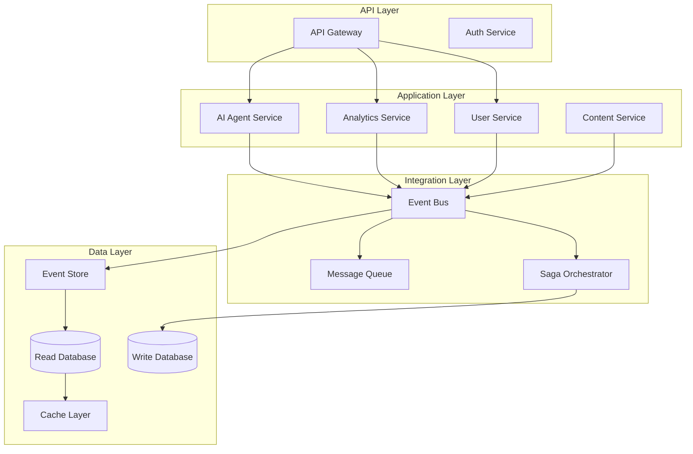

# Integration Patterns Architecture

Comprehensive integration patterns for the parallel AI system, covering event-driven architecture, message queues, distributed transactions, and CQRS/Event Sourcing implementations.

## Directory Structure

- `event-driven-architecture.md` - Event-driven patterns and implementations
- `message-queue-patterns.md` - Message queue patterns and dead letter handling
- `distributed-transactions.md` - Saga patterns and distributed transaction management
- `cqrs-event-sourcing.md` - CQRS and Event Sourcing implementation
- `api-integration.md` - External API integration patterns
- `data-synchronization.md` - Data consistency and synchronization strategies
- `workflow-orchestration.md` - Business process orchestration patterns

## Integration Principles

### 1. Event-Driven First
- **Loose coupling**: Services communicate through events
- **Asynchronous processing**: Non-blocking operations
- **Event sourcing**: Complete audit trail of system changes
- **Eventual consistency**: Accept eventual rather than immediate consistency

### 2. Resilience Patterns
- **Circuit breakers**: Prevent cascade failures
- **Retry mechanisms**: Handle transient failures
- **Dead letter queues**: Manage failed message processing
- **Compensating transactions**: Rollback distributed operations

### 3. Scalability Patterns
- **Message partitioning**: Distribute load across consumers
- **Competing consumers**: Scale message processing horizontally
- **Event streaming**: High-throughput event processing
- **CQRS separation**: Scale reads and writes independently

## Key Components

### Message Brokers
- **Apache Kafka**: High-throughput event streaming
- **RabbitMQ**: Reliable message queuing
- **Apache Pulsar**: Cloud-native messaging
- **Redis Streams**: Lightweight streaming solution

### Event Processing
- **Event Store**: Persistent event storage
- **Event Bus**: Service-to-service communication
- **Saga Orchestrator**: Distributed transaction coordination
- **Command Handler**: Command processing and validation

### Data Integration
- **CDC (Change Data Capture)**: Database change streaming
- **ETL/ELT Pipelines**: Data transformation and loading
- **API Gateways**: External service integration
- **Data Mesh**: Decentralized data architecture

## Architecture Overview



## Integration Patterns

### 1. Event-Driven Communication
- **Domain Events**: Business-meaningful state changes
- **Integration Events**: Cross-service communication
- **Command Events**: Action requests
- **Query Events**: Data retrieval requests

### 2. Message Processing Patterns
- **Publish-Subscribe**: One-to-many communication
- **Request-Response**: Synchronous-style communication
- **Message Router**: Dynamic message routing
- **Content-Based Router**: Route based on message content

### 3. Data Consistency Patterns
- **Eventual Consistency**: Accept temporary inconsistency
- **Strong Consistency**: Immediate consistency requirements
- **Causal Consistency**: Maintain cause-effect relationships
- **Session Consistency**: Per-session consistency guarantees

## Performance Targets

```yaml
performance_targets:
  message_throughput:
    kafka: 1M+ messages/second
    rabbitmq: 100K+ messages/second
    redis_streams: 500K+ messages/second
  
  latency:
    event_processing: < 10ms
    message_delivery: < 50ms
    saga_completion: < 5 seconds
  
  reliability:
    message_delivery: 99.99%
    event_ordering: guaranteed_per_partition
    duplicate_handling: idempotent_processing
```

## Quick Start Guide

1. **Event-Driven Architecture**: Start with [event-driven-architecture.md](event-driven-architecture.md)
2. **Message Queues**: Configure messaging with [message-queue-patterns.md](message-queue-patterns.md)
3. **Distributed Transactions**: Implement sagas using [distributed-transactions.md](distributed-transactions.md)
4. **CQRS/ES**: Separate reads/writes with [cqrs-event-sourcing.md](cqrs-event-sourcing.md)
5. **External APIs**: Integrate external services with [api-integration.md](api-integration.md)

## Technology Stack

### Primary Integration Technologies

```yaml
message_brokers:
  kafka:
    use_case: high_throughput_streaming
    deployment: kubernetes_operator
    retention: 7_days
    partitions: auto_scaling
  
  rabbitmq:
    use_case: reliable_messaging
    deployment: cluster_operator
    durability: persistent_queues
    clustering: enabled

event_processing:
  event_store:
    technology: postgresql_events
    partitioning: by_aggregate_id
    retention: indefinite
  
  saga_orchestration:
    technology: conductor
    workflow_definition: json
    state_persistence: redis
```

## Integration Security

### Authentication and Authorization
- **Service-to-service**: mTLS certificates
- **API integration**: OAuth 2.0 client credentials
- **Message security**: End-to-end encryption
- **Event integrity**: Digital signatures

### Network Security
- **Network policies**: Kubernetes network segmentation
- **Service mesh**: Istio for secure communication
- **API gateway**: Centralized security policies
- **Zero-trust networking**: Never trust, always verify

See individual pattern documents for detailed implementation guidance and best practices.