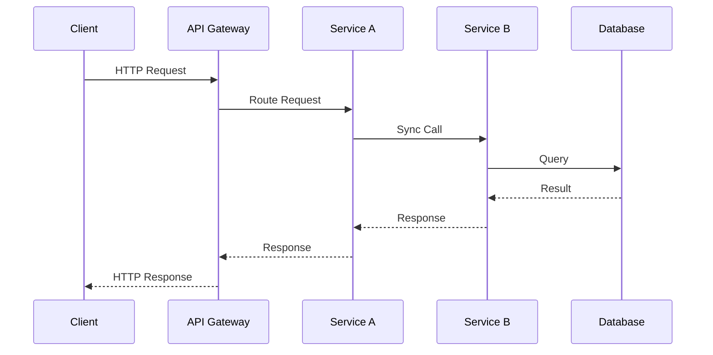
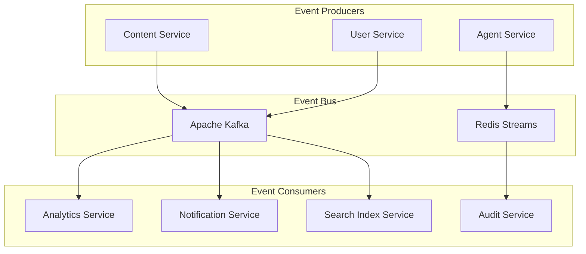

# Inter-service Communication Patterns

## Overview

This document defines the communication patterns, protocols, and integration strategies for the multimodal education system's microservices architecture.

## Communication Pattern Categories

### 1. Synchronous Communication Patterns

#### Request-Response Pattern
**Use Cases**: Real-time data retrieval, user interactions, transactional operations
**Technologies**: REST APIs, GraphQL, gRPC
**Characteristics**: 
- Immediate response required
- Strong consistency
- Direct service dependency
- Higher latency sensitivity



#### Circuit Breaker Implementation
```javascript
class CircuitBreaker {
  constructor(options = {}) {
    this.failureThreshold = options.failureThreshold || 5;
    this.resetTimeout = options.resetTimeout || 60000;
    this.monitoringPeriod = options.monitoringPeriod || 10000;
    
    this.state = 'CLOSED'; // CLOSED, OPEN, HALF_OPEN
    this.failureCount = 0;
    this.lastFailureTime = null;
  }

  async call(serviceCall) {
    if (this.state === 'OPEN') {
      if (Date.now() - this.lastFailureTime > this.resetTimeout) {
        this.state = 'HALF_OPEN';
      } else {
        throw new Error('Circuit breaker is OPEN');
      }
    }

    try {
      const result = await serviceCall();
      this.onSuccess();
      return result;
    } catch (error) {
      this.onFailure();
      throw error;
    }
  }

  onSuccess() {
    this.failureCount = 0;
    this.state = 'CLOSED';
  }

  onFailure() {
    this.failureCount++;
    this.lastFailureTime = Date.now();
    
    if (this.failureCount >= this.failureThreshold) {
      this.state = 'OPEN';
    }
  }
}
```

#### Timeout and Retry Strategy
```yaml
service_timeouts:
  api_gateway_to_service: 5s
  service_to_service: 10s
  service_to_database: 15s
  service_to_external_api: 30s

retry_configuration:
  max_attempts: 3
  base_delay: 100ms
  max_delay: 5s
  multiplier: 2.0
  jitter: true
  
  retry_conditions:
    - network_timeout
    - service_unavailable (503)
    - internal_server_error (500)
    
  non_retry_conditions:
    - bad_request (400)
    - unauthorized (401)
    - forbidden (403)
    - not_found (404)
```

### 2. Asynchronous Communication Patterns

#### Event-Driven Architecture
**Use Cases**: System-wide notifications, data synchronization, workflow triggers
**Technologies**: Apache Kafka, RabbitMQ, Redis Streams
**Characteristics**:
- Loose coupling
- Eventually consistent
- High scalability
- Resilient to failures



#### Event Schema Evolution Strategy
```json
{
  "event_schema": {
    "version": "1.2.0",
    "backward_compatible": true,
    "forward_compatible": true,
    "evolution_rules": {
      "field_addition": "allowed_with_defaults",
      "field_removal": "deprecated_first",
      "field_type_change": "new_version_required",
      "field_rename": "new_version_required"
    }
  },
  
  "versioning_strategy": {
    "schema_registry": "Confluent Schema Registry",
    "compatibility_mode": "BACKWARD_TRANSITIVE",
    "deprecation_period": "90_days",
    "migration_support": "6_months"
  }
}
```

#### Message Queue Patterns

**Work Queue Pattern**
```yaml
pattern: work_queue
use_case: Background task processing, content analysis
implementation:
  queue: RabbitMQ
  exchange_type: direct
  routing_key: task_type
  
configuration:
  message_durability: true
  queue_durability: true
  acknowledgment: manual
  prefetch_count: 10
  
consumer_scaling:
  min_consumers: 2
  max_consumers: 20
  scaling_metric: queue_length
  scale_up_threshold: 100
  scale_down_threshold: 10
```

**Publish-Subscribe Pattern**
```yaml
pattern: publish_subscribe
use_case: System-wide event notifications
implementation:
  message_broker: Apache Kafka
  topic_partitioning: by_tenant_id
  replication_factor: 3
  
configuration:
  retention_period: 7_days
  compression_type: snappy
  batch_size: 16KB
  linger_ms: 5
  
consumer_groups:
  analytics_service: 
    consumer_count: 3
    offset_reset: earliest
  notification_service:
    consumer_count: 2
    offset_reset: latest
```

### 3. Event Sourcing Pattern

#### Event Store Implementation
```javascript
class EventStore {
  constructor(database) {
    this.db = database;
  }

  async appendEvents(streamId, expectedVersion, events) {
    const transaction = await this.db.beginTransaction();
    
    try {
      // Check current version
      const currentVersion = await this.getCurrentVersion(streamId);
      if (currentVersion !== expectedVersion) {
        throw new ConcurrencyError('Version mismatch');
      }

      // Append events
      for (let event of events) {
        await this.db.query(`
          INSERT INTO events (stream_id, version, event_type, event_data, metadata, timestamp)
          VALUES ($1, $2, $3, $4, $5, $6)
        `, [
          streamId,
          ++currentVersion,
          event.type,
          JSON.stringify(event.data),
          JSON.stringify(event.metadata),
          new Date()
        ]);
      }

      await transaction.commit();
      
      // Publish events to event bus
      await this.publishEvents(events);
      
      return currentVersion;
    } catch (error) {
      await transaction.rollback();
      throw error;
    }
  }

  async getEvents(streamId, fromVersion = 0) {
    const result = await this.db.query(`
      SELECT version, event_type, event_data, metadata, timestamp
      FROM events
      WHERE stream_id = $1 AND version > $2
      ORDER BY version ASC
    `, [streamId, fromVersion]);
    
    return result.rows.map(row => ({
      version: row.version,
      type: row.event_type,
      data: JSON.parse(row.event_data),
      metadata: JSON.parse(row.metadata),
      timestamp: row.timestamp
    }));
  }
}
```

#### Event Sourcing Aggregate Pattern
```javascript
class ContentAggregate {
  constructor(id) {
    this.id = id;
    this.version = 0;
    this.title = '';
    this.status = 'draft';
    this.processingResults = {};
  }

  static fromEvents(events) {
    const aggregate = new ContentAggregate(events[0].streamId);
    events.forEach(event => aggregate.apply(event));
    return aggregate;
  }

  apply(event) {
    switch (event.type) {
      case 'ContentUploaded':
        this.title = event.data.title;
        this.status = 'uploaded';
        break;
      case 'ContentProcessingStarted':
        this.status = 'processing';
        break;
      case 'ContentProcessingCompleted':
        this.status = 'completed';
        this.processingResults = event.data.results;
        break;
      case 'ContentPublished':
        this.status = 'published';
        break;
    }
    this.version = event.version;
  }

  uploadContent(title, contentType, metadata) {
    if (this.status !== 'draft') {
      throw new Error('Content already uploaded');
    }

    return new Event('ContentUploaded', {
      title,
      contentType,
      metadata,
      timestamp: new Date()
    });
  }

  startProcessing(processorType) {
    if (this.status !== 'uploaded') {
      throw new Error('Content not ready for processing');
    }

    return new Event('ContentProcessingStarted', {
      processorType,
      timestamp: new Date()
    });
  }
}
```

### 4. CQRS (Command Query Responsibility Segregation)

#### Command and Query Separation
```javascript
// Command Side - Write Model
class ContentCommandHandler {
  constructor(eventStore, eventBus) {
    this.eventStore = eventStore;
    this.eventBus = eventBus;
  }

  async handle(command) {
    switch (command.type) {
      case 'UploadContent':
        return this.handleUploadContent(command);
      case 'StartProcessing':
        return this.handleStartProcessing(command);
      default:
        throw new Error(`Unknown command type: ${command.type}`);
    }
  }

  async handleUploadContent(command) {
    const { contentId, title, contentType, metadata } = command.data;
    
    // Load aggregate from event store
    const events = await this.eventStore.getEvents(contentId);
    const aggregate = ContentAggregate.fromEvents(events);
    
    // Execute business logic
    const newEvent = aggregate.uploadContent(title, contentType, metadata);
    
    // Save event
    await this.eventStore.appendEvents(contentId, aggregate.version, [newEvent]);
    
    return { success: true, version: aggregate.version + 1 };
  }
}

// Query Side - Read Model
class ContentQueryHandler {
  constructor(readDatabase) {
    this.db = readDatabase;
  }

  async getContent(contentId) {
    const result = await this.db.query(`
      SELECT * FROM content_read_model WHERE id = $1
    `, [contentId]);
    
    return result.rows[0];
  }

  async searchContent(query, filters) {
    let sql = `SELECT * FROM content_read_model WHERE 1=1`;
    const params = [];
    let paramIndex = 1;

    if (query) {
      sql += ` AND (title ILIKE $${paramIndex} OR description ILIKE $${paramIndex})`;
      params.push(`%${query}%`);
      paramIndex++;
    }

    if (filters.contentType) {
      sql += ` AND content_type = $${paramIndex}`;
      params.push(filters.contentType);
      paramIndex++;
    }

    if (filters.status) {
      sql += ` AND status = $${paramIndex}`;
      params.push(filters.status);
    }

    const result = await this.db.query(sql, params);
    return result.rows;
  }
}
```

### 5. Saga Pattern for Distributed Transactions

#### Orchestration-Based Saga
```javascript
class ContentProcessingSaga {
  constructor(sagaStore, commandBus) {
    this.sagaStore = sagaStore;
    this.commandBus = commandBus;
  }

  async handle(event) {
    const sagaId = event.metadata.sagaId;
    const sagaState = await this.sagaStore.get(sagaId);

    switch (event.type) {
      case 'ContentUploaded':
        return this.handleContentUploaded(sagaState, event);
      case 'ContentProcessingCompleted':
        return this.handleContentProcessingCompleted(sagaState, event);
      case 'IndexingCompleted':
        return this.handleIndexingCompleted(sagaState, event);
      case 'NotificationSent':
        return this.handleNotificationSent(sagaState, event);
    }
  }

  async handleContentUploaded(sagaState, event) {
    sagaState.contentId = event.data.contentId;
    sagaState.step = 'processing';

    // Start content processing
    await this.commandBus.send({
      type: 'StartContentProcessing',
      data: {
        contentId: event.data.contentId,
        processingOptions: event.data.processingOptions
      }
    });

    await this.sagaStore.save(sagaState);
  }

  async handleContentProcessingCompleted(sagaState, event) {
    if (event.data.status === 'failed') {
      return this.handleProcessingFailure(sagaState, event);
    }

    sagaState.step = 'indexing';
    sagaState.processingResults = event.data.results;

    // Start indexing
    await this.commandBus.send({
      type: 'StartIndexing',
      data: {
        contentId: sagaState.contentId,
        content: event.data.results.extractedText
      }
    });

    await this.sagaStore.save(sagaState);
  }

  async handleProcessingFailure(sagaState, event) {
    // Compensating actions
    await this.commandBus.send({
      type: 'DeleteUploadedContent',
      data: { contentId: sagaState.contentId }
    });

    await this.commandBus.send({
      type: 'NotifyProcessingFailure',
      data: { 
        userId: sagaState.userId,
        contentId: sagaState.contentId,
        error: event.data.error
      }
    });

    sagaState.status = 'failed';
    await this.sagaStore.save(sagaState);
  }
}
```

#### Choreography-Based Saga
```javascript
// Each service handles its own compensation
class ContentProcessingService {
  async processContent(command) {
    const { contentId, processingOptions } = command.data;
    
    try {
      // Process content
      const results = await this.performProcessing(contentId, processingOptions);
      
      // Publish success event
      await this.eventBus.publish({
        type: 'ContentProcessingCompleted',
        data: { contentId, results },
        metadata: { sagaId: command.metadata.sagaId }
      });
      
    } catch (error) {
      // Publish failure event
      await this.eventBus.publish({
        type: 'ContentProcessingFailed',
        data: { contentId, error: error.message },
        metadata: { sagaId: command.metadata.sagaId }
      });
    }
  }

  // Handle compensation
  async handleContentDeletionRequired(event) {
    const { contentId } = event.data;
    await this.deleteProcessingResults(contentId);
    
    await this.eventBus.publish({
      type: 'ContentProcessingResultsDeleted',
      data: { contentId }
    });
  }
}
```

### 6. API Gateway Patterns

#### Backend for Frontend (BFF) Pattern
```javascript
// Web BFF
class WebBFF {
  constructor(services) {
    this.authService = services.auth;
    this.contentService = services.content;
    this.learningService = services.learning;
  }

  async getDashboard(userId) {
    const [user, learningProgress, recommendations] = await Promise.all([
      this.authService.getUser(userId),
      this.learningService.getUserProgress(userId),
      this.contentService.getRecommendations(userId)
    ]);

    return {
      user: {
        name: `${user.profile.firstName} ${user.profile.lastName}`,
        avatar: user.profile.avatarUrl
      },
      progress: {
        completedCourses: learningProgress.completedPaths,
        currentCourse: learningProgress.currentPath,
        totalPoints: learningProgress.totalPoints
      },
      recommendations: recommendations.map(r => ({
        id: r.id,
        title: r.title,
        thumbnail: r.thumbnail,
        difficulty: r.difficulty
      }))
    };
  }
}

// Mobile BFF  
class MobileBFF {
  constructor(services) {
    this.authService = services.auth;
    this.contentService = services.content;
  }

  async getDashboard(userId) {
    // Optimized for mobile - fewer data fields
    const [user, summary] = await Promise.all([
      this.authService.getUser(userId),
      this.learningService.getProgressSummary(userId)
    ]);

    return {
      userName: user.profile.firstName,
      avatar: user.profile.avatarUrl,
      streak: summary.currentStreak,
      nextLesson: summary.nextLesson
    };
  }
}
```

#### Rate Limiting and Throttling
```yaml
rate_limiting:
  strategies:
    - type: "fixed_window"
      window: "1m"
      limit: 1000
      scope: "user"
      
    - type: "sliding_window"
      window: "1h"
      limit: 10000
      scope: "user"
      
    - type: "token_bucket"
      capacity: 100
      refill_rate: 10
      scope: "api_key"

  tiers:
    free:
      requests_per_minute: 60
      requests_per_hour: 1000
      concurrent_requests: 5
      
    premium:
      requests_per_minute: 300
      requests_per_hour: 10000
      concurrent_requests: 20
      
    enterprise:
      requests_per_minute: 1000
      requests_per_hour: 50000
      concurrent_requests: 100

  responses:
    rate_limited:
      status_code: 429
      headers:
        - "X-RateLimit-Limit"
        - "X-RateLimit-Remaining"
        - "X-RateLimit-Reset"
        - "Retry-After"
```

### 7. Service Mesh Communication

#### Istio Configuration
```yaml
apiVersion: networking.istio.io/v1alpha3
kind: VirtualService
metadata:
  name: content-service
spec:
  http:
  - match:
    - headers:
        end-user:
          exact: "premium"
    route:
    - destination:
        host: content-service
        subset: v2
      weight: 100
  - route:
    - destination:
        host: content-service
        subset: v1
      weight: 80
    - destination:
        host: content-service
        subset: v2
      weight: 20
---
apiVersion: networking.istio.io/v1alpha3
kind: DestinationRule
metadata:
  name: content-service
spec:
  host: content-service
  trafficPolicy:
    connectionPool:
      tcp:
        maxConnections: 100
      http:
        http1MaxPendingRequests: 100
        maxRequestsPerConnection: 2
    loadBalancer:
      simple: LEAST_CONN
    outlierDetection:
      consecutiveErrors: 3
      interval: 30s
      baseEjectionTime: 30s
  subsets:
  - name: v1
    labels:
      version: v1
  - name: v2
    labels:
      version: v2
```

#### Security Policies
```yaml
apiVersion: security.istio.io/v1beta1
kind: AuthorizationPolicy
metadata:
  name: content-service-authz
spec:
  selector:
    matchLabels:
      app: content-service
  rules:
  - from:
    - source:
        principals: ["cluster.local/ns/default/sa/api-gateway"]
  - to:
    - operation:
        methods: ["GET", "POST"]
  - when:
    - key: request.headers[authorization]
      values: ["Bearer *"]
```

This comprehensive communication pattern documentation provides the foundation for implementing robust, scalable, and maintainable inter-service communication in the multimodal education system.