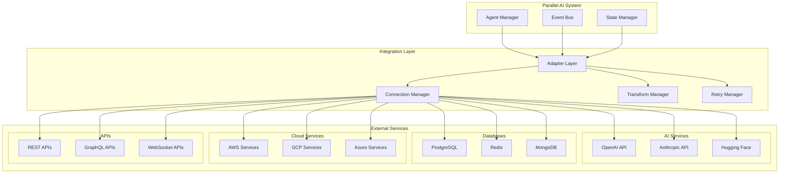

# External Service Integration Specifications

## Overview
This document defines the patterns and specifications for integrating external AI services, databases, APIs, and third-party systems with the parallel AI agent framework.

## Integration Architecture



## Core Integration Components

### 1. Service Adapter Interface
```typescript
interface ServiceAdapter<TRequest, TResponse> {
  readonly serviceType: ServiceType;
  readonly name: string;
  readonly version: string;
  
  connect(config: ServiceConfig): Promise<void>;
  disconnect(): Promise<void>;
  isConnected(): boolean;
  
  request(request: TRequest): Promise<TResponse>;
  healthCheck(): Promise<HealthStatus>;
  
  onError(handler: (error: ServiceError) => void): void;
  onConnect(handler: () => void): void;
  onDisconnect(handler: () => void): void;
}

abstract class BaseServiceAdapter<TRequest, TResponse> implements ServiceAdapter<TRequest, TResponse> {
  protected config: ServiceConfig;
  protected connectionManager: ConnectionManager;
  protected retryManager: RetryManager;
  protected metrics: AdapterMetrics;
  protected circuitBreaker: CircuitBreaker;
  
  constructor(
    public readonly serviceType: ServiceType,
    public readonly name: string,
    public readonly version: string
  ) {
    this.circuitBreaker = new CircuitBreaker({
      failureThreshold: 5,
      resetTimeout: 30000
    });
    this.metrics = new AdapterMetrics(name);
  }
  
  async connect(config: ServiceConfig): Promise<void> {
    this.config = config;
    
    try {
      await this.establishConnection();
      await this.initializeAdapter();
      this.startHealthMonitoring();
      
      this.metrics.recordConnection('success');
    } catch (error) {
      this.metrics.recordConnection('failure');
      throw new ConnectionError(`Failed to connect to ${this.name}: ${error.message}`);
    }
  }
  
  async request(request: TRequest): Promise<TResponse> {
    const startTime = Date.now();
    
    try {
      const transformedRequest = await this.transformRequest(request);
      const response = await this.circuitBreaker.execute(() => 
        this.executeRequest(transformedRequest)
      );
      const transformedResponse = await this.transformResponse(response);
      
      this.metrics.recordRequest('success', Date.now() - startTime);
      return transformedResponse;
      
    } catch (error) {
      this.metrics.recordRequest('failure', Date.now() - startTime);
      throw this.handleError(error);
    }
  }
  
  protected abstract establishConnection(): Promise<void>;
  protected abstract executeRequest(request: any): Promise<any>;
  protected abstract transformRequest(request: TRequest): Promise<any>;
  protected abstract transformResponse(response: any): Promise<TResponse>;
  protected abstract initializeAdapter(): Promise<void>;
}
```

### 2. Connection Manager
```typescript
class ConnectionManager {
  private connections: Map<string, Connection> = new Map();
  private connectionPools: Map<string, ConnectionPool> = new Map();
  private healthCheckers: Map<string, HealthChecker> = new Map();
  
  async createConnection(
    serviceId: string,
    config: ConnectionConfig
  ): Promise<Connection> {
    const connectionKey = this.generateConnectionKey(serviceId, config);
    
    if (this.connections.has(connectionKey)) {
      return this.connections.get(connectionKey)!;
    }
    
    const connection = await this.establishConnection(config);
    this.connections.set(connectionKey, connection);
    
    // Setup health monitoring
    const healthChecker = new HealthChecker(connection, {
      interval: 30000,
      timeout: 5000,
      retries: 3
    });
    
    healthChecker.onUnhealthy(() => {
      this.handleUnhealthyConnection(connectionKey, connection);
    });
    
    this.healthCheckers.set(connectionKey, healthChecker);
    await healthChecker.start();
    
    return connection;
  }
  
  async createConnectionPool(
    serviceId: string,
    config: ConnectionPoolConfig
  ): Promise<ConnectionPool> {
    if (this.connectionPools.has(serviceId)) {
      return this.connectionPools.get(serviceId)!;
    }
    
    const pool = new ConnectionPool({
      factory: () => this.establishConnection(config.connectionConfig),
      min: config.minConnections || 2,
      max: config.maxConnections || 10,
      acquireTimeoutMillis: config.acquireTimeout || 10000,
      idleTimeoutMillis: config.idleTimeout || 300000
    });
    
    this.connectionPools.set(serviceId, pool);
    return pool;
  }
  
  async getConnection(serviceId: string): Promise<Connection> {
    // Try pool first
    const pool = this.connectionPools.get(serviceId);
    if (pool) {
      return await pool.acquire();
    }
    
    // Fallback to direct connections
    const connections = Array.from(this.connections.entries())
      .filter(([key, _]) => key.startsWith(serviceId))
      .map(([_, conn]) => conn);
    
    if (connections.length > 0) {
      return connections[0];
    }
    
    throw new Error(`No connections available for service ${serviceId}`);
  }
  
  async releaseConnection(serviceId: string, connection: Connection): Promise<void> {
    const pool = this.connectionPools.get(serviceId);
    if (pool) {
      await pool.release(connection);
    }
  }
  
  private async handleUnhealthyConnection(
    connectionKey: string,
    connection: Connection
  ): Promise<void> {
    console.warn(`Connection ${connectionKey} became unhealthy, attempting recovery`);
    
    try {
      await connection.close();
    } catch (error) {
      console.error(`Error closing unhealthy connection: ${error.message}`);
    }
    
    this.connections.delete(connectionKey);
    this.healthCheckers.delete(connectionKey);
    
    // Attempt to recreate connection
    try {
      const newConnection = await this.establishConnection(connection.config);
      this.connections.set(connectionKey, newConnection);
    } catch (error) {
      console.error(`Failed to recreate connection ${connectionKey}: ${error.message}`);
    }
  }
}
```

### 3. Data Transform Manager
```typescript
class TransformManager {
  private transformers: Map<string, DataTransformer> = new Map();
  private schemas: Map<string, Schema> = new Map();
  
  registerTransformer(
    transformerType: string,
    transformer: DataTransformer
  ): void {
    this.transformers.set(transformerType, transformer);
  }
  
  registerSchema(schemaId: string, schema: Schema): void {
    this.schemas.set(schemaId, schema);
  }
  
  async transform<TInput, TOutput>(
    data: TInput,
    transformerType: string,
    options?: TransformOptions
  ): Promise<TOutput> {
    const transformer = this.transformers.get(transformerType);
    if (!transformer) {
      throw new Error(`Transformer ${transformerType} not found`);
    }
    
    // Validate input if schema provided
    if (options?.inputSchema) {
      const schema = this.schemas.get(options.inputSchema);
      if (schema) {
        await this.validateData(data, schema);
      }
    }
    
    const result = await transformer.transform(data, options);
    
    // Validate output if schema provided
    if (options?.outputSchema) {
      const schema = this.schemas.get(options.outputSchema);
      if (schema) {
        await this.validateData(result, schema);
      }
    }
    
    return result;
  }
  
  private async validateData(data: any, schema: Schema): Promise<void> {
    const validation = await schema.validate(data);
    if (!validation.valid) {
      throw new ValidationError(
        `Data validation failed: ${validation.errors.join(', ')}`
      );
    }
  }
}

interface DataTransformer {
  transform(data: any, options?: TransformOptions): Promise<any>;
}

class JsonToProtobufTransformer implements DataTransformer {
  private protoDefinition: ProtobufDefinition;
  
  constructor(protoDefinition: ProtobufDefinition) {
    this.protoDefinition = protoDefinition;
  }
  
  async transform(data: any, options?: TransformOptions): Promise<Buffer> {
    try {
      const message = this.protoDefinition.create(data);
      return this.protoDefinition.encode(message).finish();
    } catch (error) {
      throw new TransformError(`Failed to transform JSON to Protobuf: ${error.message}`);
    }
  }
}

class XmlToJsonTransformer implements DataTransformer {
  private xmlParser: XMLParser;
  
  constructor() {
    this.xmlParser = new XMLParser({
      ignoreAttributes: false,
      attributeNamePrefix: '@_'
    });
  }
  
  async transform(xmlData: string, options?: TransformOptions): Promise<any> {
    try {
      return this.xmlParser.parse(xmlData);
    } catch (error) {
      throw new TransformError(`Failed to transform XML to JSON: ${error.message}`);
    }
  }
}
```

## AI Service Integration

### 1. OpenAI Integration
```typescript
class OpenAIAdapter extends BaseServiceAdapter<OpenAIRequest, OpenAIResponse> {
  private client: OpenAI;
  private rateLimiter: RateLimiter;
  
  constructor() {
    super(ServiceType.AI_MODEL, 'OpenAI', '1.0.0');
    this.rateLimiter = new RateLimiter({
      tokensPerMinute: 90000,
      requestsPerMinute: 3500
    });
  }
  
  protected async establishConnection(): Promise<void> {
    this.client = new OpenAI({
      apiKey: this.config.apiKey,
      organization: this.config.organizationId,
      timeout: this.config.timeout || 60000
    });
    
    // Test connection
    await this.client.models.list();
  }
  
  protected async executeRequest(request: OpenAIRequest): Promise<any> {
    await this.rateLimiter.acquire(request.estimatedTokens || 1000);
    
    switch (request.type) {
      case 'completion':
        return await this.client.chat.completions.create(request.params);
        
      case 'embedding':
        return await this.client.embeddings.create(request.params);
        
      case 'image':
        return await this.client.images.generate(request.params);
        
      case 'audio':
        return await this.client.audio.transcriptions.create(request.params);
        
      default:
        throw new Error(`Unsupported OpenAI request type: ${request.type}`);
    }
  }
  
  protected async transformRequest(request: OpenAIRequest): Promise<any> {
    return {
      ...request,
      params: {
        ...request.params,
        // Add default parameters
        temperature: request.params.temperature ?? 0.7,
        max_tokens: request.params.max_tokens ?? 2048
      }
    };
  }
  
  protected async transformResponse(response: any): Promise<OpenAIResponse> {
    return {
      id: response.id,
      model: response.model,
      usage: response.usage,
      choices: response.choices,
      created: response.created,
      finishReason: response.choices?.[0]?.finish_reason,
      content: response.choices?.[0]?.message?.content || response.data
    };
  }
  
  protected async initializeAdapter(): Promise<void> {
    // Initialize any adapter-specific features
    await this.loadModelCapabilities();
    await this.setupUsageTracking();
  }
  
  private async loadModelCapabilities(): Promise<void> {
    try {
      const models = await this.client.models.list();
      this.config.availableModels = models.data.map(model => model.id);
    } catch (error) {
      console.warn('Failed to load model capabilities:', error.message);
    }
  }
}
```

### 2. Database Integration
```typescript
class PostgreSQLAdapter extends BaseServiceAdapter<SQLRequest, SQLResponse> {
  private pool: Pool;
  private queryBuilder: QueryBuilder;
  
  constructor() {
    super(ServiceType.DATABASE, 'PostgreSQL', '1.0.0');
    this.queryBuilder = new QueryBuilder('postgresql');
  }
  
  protected async establishConnection(): Promise<void> {
    this.pool = new Pool({
      user: this.config.username,
      host: this.config.host,
      database: this.config.database,
      password: this.config.password,
      port: this.config.port || 5432,
      max: this.config.maxConnections || 20,
      idleTimeoutMillis: this.config.idleTimeout || 30000,
      connectionTimeoutMillis: this.config.connectionTimeout || 10000
    });
    
    // Test connection
    const client = await this.pool.connect();
    try {
      await client.query('SELECT 1');
    } finally {
      client.release();
    }
  }
  
  protected async executeRequest(request: SQLRequest): Promise<any> {
    const client = await this.pool.connect();
    
    try {
      if (request.transaction) {
        await client.query('BEGIN');
      }
      
      const result = await client.query(request.query, request.params);
      
      if (request.transaction) {
        await client.query('COMMIT');
      }
      
      return result;
    } catch (error) {
      if (request.transaction) {
        await client.query('ROLLBACK');
      }
      throw error;
    } finally {
      client.release();
    }
  }
  
  protected async transformRequest(request: SQLRequest): Promise<any> {
    if (request.queryBuilder) {
      const builtQuery = this.queryBuilder.build(request.queryBuilder);
      return {
        ...request,
        query: builtQuery.sql,
        params: builtQuery.params
      };
    }
    
    return request;
  }
  
  protected async transformResponse(response: any): Promise<SQLResponse> {
    return {
      rows: response.rows,
      rowCount: response.rowCount,
      command: response.command,
      fields: response.fields?.map((field: any) => ({
        name: field.name,
        dataTypeID: field.dataTypeID,
        dataTypeModifier: field.dataTypeModifier
      })) || []
    };
  }
  
  async executeTransaction(
    operations: SQLRequest[]
  ): Promise<SQLResponse[]> {
    const client = await this.pool.connect();
    
    try {
      await client.query('BEGIN');
      
      const results: SQLResponse[] = [];
      for (const operation of operations) {
        const result = await client.query(operation.query, operation.params);
        results.push(await this.transformResponse(result));
      }
      
      await client.query('COMMIT');
      return results;
    } catch (error) {
      await client.query('ROLLBACK');
      throw error;
    } finally {
      client.release();
    }
  }
}
```

### 3. Redis Integration
```typescript
class RedisAdapter extends BaseServiceAdapter<RedisRequest, RedisResponse> {
  private client: Redis;
  private subscriber: Redis;
  private publisher: Redis;
  
  constructor() {
    super(ServiceType.CACHE, 'Redis', '1.0.0');
  }
  
  protected async establishConnection(): Promise<void> {
    const redisConfig = {
      host: this.config.host,
      port: this.config.port || 6379,
      password: this.config.password,
      db: this.config.database || 0,
      retryDelayOnFailover: 100,
      maxRetriesPerRequest: 3,
      lazyConnect: true
    };
    
    this.client = new Redis(redisConfig);
    this.subscriber = new Redis({ ...redisConfig, lazyConnect: true });
    this.publisher = new Redis({ ...redisConfig, lazyConnect: true });
    
    await Promise.all([
      this.client.connect(),
      this.subscriber.connect(),
      this.publisher.connect()
    ]);
  }
  
  protected async executeRequest(request: RedisRequest): Promise<any> {
    const { command, args, pipeline } = request;
    
    if (pipeline) {
      return await this.executePipeline(pipeline);
    }
    
    switch (command) {
      case 'GET':
        return await this.client.get(args[0]);
        
      case 'SET':
        return await this.client.set(args[0], args[1], ...args.slice(2));
        
      case 'DEL':
        return await this.client.del(...args);
        
      case 'EXISTS':
        return await this.client.exists(...args);
        
      case 'EXPIRE':
        return await this.client.expire(args[0], parseInt(args[1]));
        
      case 'HGET':
        return await this.client.hget(args[0], args[1]);
        
      case 'HSET':
        return await this.client.hset(args[0], args[1], args[2]);
        
      case 'HGETALL':
        return await this.client.hgetall(args[0]);
        
      case 'LPUSH':
        return await this.client.lpush(args[0], ...args.slice(1));
        
      case 'RPOP':
        return await this.client.rpop(args[0]);
        
      case 'SADD':
        return await this.client.sadd(args[0], ...args.slice(1));
        
      case 'SMEMBERS':
        return await this.client.smembers(args[0]);
        
      default:
        return await (this.client as any)[command.toLowerCase()](...args);
    }
  }
  
  private async executePipeline(operations: RedisOperation[]): Promise<any[]> {
    const pipeline = this.client.pipeline();
    
    for (const operation of operations) {
      (pipeline as any)[operation.command.toLowerCase()](...operation.args);
    }
    
    const results = await pipeline.exec();
    return results?.map(result => result[1]) || [];
  }
  
  async subscribe(
    patterns: string[],
    handler: (channel: string, message: string) => void
  ): Promise<void> {
    this.subscriber.on('pmessage', (pattern, channel, message) => {
      handler(channel, message);
    });
    
    await this.subscriber.psubscribe(...patterns);
  }
  
  async publish(channel: string, message: string): Promise<number> {
    return await this.publisher.publish(channel, message);
  }
}
```

## Cloud Service Integration

### 1. AWS Services Integration
```typescript
class AWSAdapter extends BaseServiceAdapter<AWSRequest, AWSResponse> {
  private clients: Map<string, any> = new Map();
  
  constructor() {
    super(ServiceType.CLOUD, 'AWS', '1.0.0');
  }
  
  protected async establishConnection(): Promise<void> {
    const awsConfig = {
      region: this.config.region || 'us-east-1',
      credentials: {
        accessKeyId: this.config.accessKeyId,
        secretAccessKey: this.config.secretAccessKey
      }
    };
    
    // Initialize commonly used AWS clients
    const { S3Client } = await import('@aws-sdk/client-s3');
    const { DynamoDBClient } = await import('@aws-sdk/client-dynamodb');
    const { LambdaClient } = await import('@aws-sdk/client-lambda');
    const { SQSClient } = await import('@aws-sdk/client-sqs');
    const { SNSClient } = await import('@aws-sdk/client-sns');
    
    this.clients.set('s3', new S3Client(awsConfig));
    this.clients.set('dynamodb', new DynamoDBClient(awsConfig));
    this.clients.set('lambda', new LambdaClient(awsConfig));
    this.clients.set('sqs', new SQSClient(awsConfig));
    this.clients.set('sns', new SNSClient(awsConfig));
  }
  
  protected async executeRequest(request: AWSRequest): Promise<any> {
    const { service, operation, params } = request;
    const client = this.clients.get(service);
    
    if (!client) {
      throw new Error(`AWS service ${service} not initialized`);
    }
    
    const commandClass = await this.getCommandClass(service, operation);
    const command = new commandClass(params);
    
    return await client.send(command);
  }
  
  private async getCommandClass(service: string, operation: string) {
    switch (service) {
      case 's3':
        const s3Commands = await import('@aws-sdk/client-s3');
        return (s3Commands as any)[`${operation}Command`];
        
      case 'dynamodb':
        const dynamoCommands = await import('@aws-sdk/client-dynamodb');
        return (dynamoCommands as any)[`${operation}Command`];
        
      case 'lambda':
        const lambdaCommands = await import('@aws-sdk/client-lambda');
        return (lambdaCommands as any)[`${operation}Command`];
        
      case 'sqs':
        const sqsCommands = await import('@aws-sdk/client-sqs');
        return (sqsCommands as any)[`${operation}Command`];
        
      case 'sns':
        const snsCommands = await import('@aws-sdk/client-sns');
        return (snsCommands as any)[`${operation}Command`];
        
      default:
        throw new Error(`Unsupported AWS service: ${service}`);
    }
  }
  
  // Convenience methods for common operations
  async uploadToS3(bucket: string, key: string, body: any): Promise<any> {
    return await this.request({
      service: 's3',
      operation: 'PutObject',
      params: { Bucket: bucket, Key: key, Body: body }
    });
  }
  
  async getFromS3(bucket: string, key: string): Promise<any> {
    return await this.request({
      service: 's3',
      operation: 'GetObject',
      params: { Bucket: bucket, Key: key }
    });
  }
  
  async invokeLambda(functionName: string, payload: any): Promise<any> {
    return await this.request({
      service: 'lambda',
      operation: 'Invoke',
      params: {
        FunctionName: functionName,
        Payload: JSON.stringify(payload)
      }
    });
  }
  
  async sendSQSMessage(queueUrl: string, message: any): Promise<any> {
    return await this.request({
      service: 'sqs',
      operation: 'SendMessage',
      params: {
        QueueUrl: queueUrl,
        MessageBody: JSON.stringify(message)
      }
    });
  }
}
```

## API Integration Patterns

### 1. REST API Integration
```typescript
class RESTAdapter extends BaseServiceAdapter<RESTRequest, RESTResponse> {
  private httpClient: AxiosInstance;
  private authManager: AuthenticationManager;
  
  constructor() {
    super(ServiceType.API, 'REST', '1.0.0');
  }
  
  protected async establishConnection(): Promise<void> {
    this.httpClient = axios.create({
      baseURL: this.config.baseUrl,
      timeout: this.config.timeout || 30000,
      headers: {
        'Content-Type': 'application/json',
        'User-Agent': 'ParallelAI-Agent/1.0',
        ...this.config.defaultHeaders
      }
    });
    
    // Setup authentication
    this.authManager = new AuthenticationManager(this.config.auth);
    await this.authManager.authenticate();
    
    // Setup interceptors
    this.setupRequestInterceptors();
    this.setupResponseInterceptors();
  }
  
  protected async executeRequest(request: RESTRequest): Promise<AxiosResponse> {
    const config: AxiosRequestConfig = {
      method: request.method,
      url: request.endpoint,
      data: request.body,
      params: request.queryParams,
      headers: {
        ...await this.authManager.getAuthHeaders(),
        ...request.headers
      }
    };
    
    return await this.httpClient.request(config);
  }
  
  private setupRequestInterceptors(): void {
    this.httpClient.interceptors.request.use(
      async (config) => {
        // Add authentication
        const authHeaders = await this.authManager.getAuthHeaders();
        config.headers = { ...config.headers, ...authHeaders };
        
        // Add request ID for tracing
        config.headers['X-Request-ID'] = this.generateRequestId();
        
        // Log request
        this.metrics.recordRequest('sent', config.method || 'unknown');
        
        return config;
      },
      (error) => {
        this.metrics.recordRequest('error', 'request-setup');
        return Promise.reject(error);
      }
    );
  }
  
  private setupResponseInterceptors(): void {
    this.httpClient.interceptors.response.use(
      (response) => {
        this.metrics.recordRequest('success', response.config.method || 'unknown');
        return response;
      },
      async (error) => {
        this.metrics.recordRequest('failure', error.config?.method || 'unknown');
        
        // Handle authentication errors
        if (error.response?.status === 401) {
          await this.authManager.refreshAuthentication();
          // Retry original request
          return this.httpClient.request(error.config);
        }
        
        // Handle rate limiting
        if (error.response?.status === 429) {
          const retryAfter = parseInt(error.response.headers['retry-after'] || '60');
          await this.delay(retryAfter * 1000);
          return this.httpClient.request(error.config);
        }
        
        return Promise.reject(error);
      }
    );
  }
  
  protected async transformRequest(request: RESTRequest): Promise<RESTRequest> {
    return {
      ...request,
      // Add default query parameters
      queryParams: {
        ...this.config.defaultQueryParams,
        ...request.queryParams
      },
      // Ensure proper serialization
      body: request.body ? JSON.parse(JSON.stringify(request.body)) : undefined
    };
  }
  
  protected async transformResponse(response: AxiosResponse): Promise<RESTResponse> {
    return {
      status: response.status,
      statusText: response.statusText,
      headers: response.headers,
      data: response.data,
      requestId: response.headers['x-request-id'],
      responseTime: response.headers['x-response-time']
    };
  }
}
```

### 2. GraphQL Integration
```typescript
class GraphQLAdapter extends BaseServiceAdapter<GraphQLRequest, GraphQLResponse> {
  private client: GraphQLClient;
  private schema: GraphQLSchema;
  private queryCache: Map<string, DocumentNode> = new Map();
  
  constructor() {
    super(ServiceType.API, 'GraphQL', '1.0.0');
  }
  
  protected async establishConnection(): Promise<void> {
    this.client = new GraphQLClient(this.config.endpoint, {
      timeout: this.config.timeout || 30000,
      headers: {
        ...this.config.defaultHeaders,
        'Content-Type': 'application/json'
      }
    });
    
    // Load schema for validation
    if (this.config.introspection) {
      await this.loadSchema();
    }
  }
  
  protected async executeRequest(request: GraphQLRequest): Promise<any> {
    const { query, variables, operationName } = request;
    
    // Parse and validate query
    const document = this.parseQuery(query);
    if (this.schema) {
      this.validateQuery(document);
    }
    
    const response = await this.client.request(document, variables, {
      operationName,
      ...await this.getAuthHeaders()
    });
    
    return response;
  }
  
  private parseQuery(query: string): DocumentNode {
    // Check cache first
    const cacheKey = this.hashQuery(query);
    if (this.queryCache.has(cacheKey)) {
      return this.queryCache.get(cacheKey)!;
    }
    
    try {
      const document = parse(query);
      this.queryCache.set(cacheKey, document);
      return document;
    } catch (error) {
      throw new GraphQLError(`Invalid GraphQL query: ${error.message}`);
    }
  }
  
  private validateQuery(document: DocumentNode): void {
    if (!this.schema) return;
    
    const errors = validate(this.schema, document);
    if (errors.length > 0) {
      throw new GraphQLError(`Query validation failed: ${errors.map(e => e.message).join(', ')}`);
    }
  }
  
  private async loadSchema(): Promise<void> {
    try {
      const introspectionQuery = getIntrospectionQuery();
      const result = await this.client.request(introspectionQuery);
      this.schema = buildClientSchema(result);
    } catch (error) {
      console.warn('Failed to load GraphQL schema:', error.message);
    }
  }
  
  async executeQuery(query: string, variables?: any): Promise<any> {
    return await this.request({
      query,
      variables,
      type: 'query'
    });
  }
  
  async executeMutation(mutation: string, variables?: any): Promise<any> {
    return await this.request({
      query: mutation,
      variables,
      type: 'mutation'
    });
  }
  
  async executeSubscription(
    subscription: string,
    variables?: any,
    callback?: (data: any) => void
  ): Promise<Subscription> {
    // Implementation depends on transport (WebSocket, Server-Sent Events, etc.)
    const wsClient = new SubscriptionClient(this.config.wsEndpoint, {
      reconnect: true,
      connectionParams: await this.getAuthHeaders()
    });
    
    return wsClient.request({
      query: subscription,
      variables
    }).subscribe(callback || (() => {}));
  }
}
```

## Integration Patterns

### 1. Circuit Breaker Pattern
```typescript
class CircuitBreaker {
  private state: CircuitState = CircuitState.CLOSED;
  private failureCount = 0;
  private nextAttempt = 0;
  private config: CircuitBreakerConfig;
  
  constructor(config: CircuitBreakerConfig) {
    this.config = {
      failureThreshold: 5,
      resetTimeout: 30000,
      monitoringPeriod: 10000,
      ...config
    };
  }
  
  async execute<T>(fn: () => Promise<T>): Promise<T> {
    if (this.state === CircuitState.OPEN) {
      if (Date.now() < this.nextAttempt) {
        throw new CircuitBreakerOpenError('Circuit breaker is OPEN');
      }
      this.state = CircuitState.HALF_OPEN;
    }
    
    try {
      const result = await fn();
      this.onSuccess();
      return result;
    } catch (error) {
      this.onFailure(error);
      throw error;
    }
  }
  
  private onSuccess(): void {
    this.failureCount = 0;
    if (this.state === CircuitState.HALF_OPEN) {
      this.state = CircuitState.CLOSED;
    }
  }
  
  private onFailure(error: Error): void {
    this.failureCount++;
    
    if (this.failureCount >= this.config.failureThreshold) {
      this.state = CircuitState.OPEN;
      this.nextAttempt = Date.now() + this.config.resetTimeout;
    }
  }
  
  getState(): CircuitState {
    return this.state;
  }
  
  getFailureCount(): number {
    return this.failureCount;
  }
}
```

### 2. Retry Pattern with Exponential Backoff
```typescript
class RetryManager {
  private config: RetryConfig;
  
  constructor(config: RetryConfig) {
    this.config = {
      maxRetries: 3,
      baseDelay: 1000,
      maxDelay: 30000,
      backoffMultiplier: 2,
      jitter: true,
      retryableErrors: ['ECONNRESET', 'ETIMEDOUT', 'ENOTFOUND'],
      ...config
    };
  }
  
  async execute<T>(fn: () => Promise<T>): Promise<T> {
    let attempt = 0;
    let lastError: Error;
    
    while (attempt <= this.config.maxRetries) {
      try {
        return await fn();
      } catch (error) {
        lastError = error;
        attempt++;
        
        if (attempt > this.config.maxRetries || !this.isRetryable(error)) {
          throw error;
        }
        
        const delay = this.calculateDelay(attempt);
        await this.delay(delay);
      }
    }
    
    throw lastError!;
  }
  
  private isRetryable(error: Error): boolean {
    // Check error type/code
    if (this.config.retryableErrors.some(code => 
      error.message.includes(code) || (error as any).code === code
    )) {
      return true;
    }
    
    // Check HTTP status codes
    if ((error as any).response?.status) {
      const status = (error as any).response.status;
      return status >= 500 || status === 429 || status === 408;
    }
    
    return false;
  }
  
  private calculateDelay(attempt: number): number {
    let delay = this.config.baseDelay * Math.pow(this.config.backoffMultiplier, attempt - 1);
    delay = Math.min(delay, this.config.maxDelay);
    
    // Add jitter to prevent thundering herd
    if (this.config.jitter) {
      delay = delay * (0.5 + Math.random() * 0.5);
    }
    
    return delay;
  }
  
  private delay(ms: number): Promise<void> {
    return new Promise(resolve => setTimeout(resolve, ms));
  }
}
```

### 3. Rate Limiting
```typescript
class RateLimiter {
  private tokens: number;
  private lastRefill: number;
  private queue: Array<{ resolve: () => void; tokens: number }> = [];
  private config: RateLimitConfig;
  
  constructor(config: RateLimitConfig) {
    this.config = {
      tokensPerSecond: 10,
      bucketSize: 10,
      ...config
    };
    
    this.tokens = this.config.bucketSize;
    this.lastRefill = Date.now();
    
    this.startRefillProcess();
  }
  
  async acquire(tokens: number = 1): Promise<void> {
    return new Promise<void>((resolve) => {
      if (this.tokens >= tokens) {
        this.tokens -= tokens;
        resolve();
      } else {
        this.queue.push({ resolve, tokens });
      }
    });
  }
  
  private startRefillProcess(): void {
    setInterval(() => {
      this.refillTokens();
      this.processQueue();
    }, 100); // Check every 100ms
  }
  
  private refillTokens(): void {
    const now = Date.now();
    const timePassed = (now - this.lastRefill) / 1000;
    const tokensToAdd = timePassed * this.config.tokensPerSecond;
    
    this.tokens = Math.min(this.config.bucketSize, this.tokens + tokensToAdd);
    this.lastRefill = now;
  }
  
  private processQueue(): void {
    while (this.queue.length > 0 && this.tokens >= this.queue[0].tokens) {
      const item = this.queue.shift()!;
      this.tokens -= item.tokens;
      item.resolve();
    }
  }
  
  getAvailableTokens(): number {
    return this.tokens;
  }
  
  getQueueLength(): number {
    return this.queue.length;
  }
}
```

## Monitoring and Observability

### 1. Integration Metrics
```typescript
class IntegrationMetrics {
  private requestCounter: Counter;
  private responseTimeHistogram: Histogram;
  private errorRate: Gauge;
  private connectionStatus: Gauge;
  
  constructor(serviceName: string) {
    this.requestCounter = new Counter({
      name: `integration_requests_total`,
      help: 'Total number of integration requests',
      labelNames: ['service', 'operation', 'status']
    });
    
    this.responseTimeHistogram = new Histogram({
      name: `integration_request_duration_seconds`,
      help: 'Integration request duration',
      labelNames: ['service', 'operation']
    });
    
    this.errorRate = new Gauge({
      name: `integration_error_rate`,
      help: 'Integration error rate',
      labelNames: ['service']
    });
    
    this.connectionStatus = new Gauge({
      name: `integration_connection_status`,
      help: 'Integration connection status',
      labelNames: ['service']
    });
  }
  
  recordRequest(service: string, operation: string, status: string, duration?: number): void {
    this.requestCounter.inc({ service, operation, status });
    
    if (duration !== undefined) {
      this.responseTimeHistogram.observe({ service, operation }, duration / 1000);
    }
  }
  
  updateConnectionStatus(service: string, connected: boolean): void {
    this.connectionStatus.set({ service }, connected ? 1 : 0);
  }
  
  updateErrorRate(service: string, rate: number): void {
    this.errorRate.set({ service }, rate);
  }
}
```

### 2. Health Monitoring
```typescript
class IntegrationHealthMonitor {
  private healthCheckers: Map<string, HealthChecker> = new Map();
  private healthStatus: Map<string, ServiceHealth> = new Map();
  
  registerService(serviceId: string, adapter: ServiceAdapter<any, any>): void {
    const healthChecker = new HealthChecker(serviceId, adapter, {
      checkInterval: 30000,
      timeout: 5000,
      consecutiveFailures: 3
    });
    
    healthChecker.onHealthChange((status) => {
      this.updateHealthStatus(serviceId, status);
    });
    
    this.healthCheckers.set(serviceId, healthChecker);
    healthChecker.start();
  }
  
  private updateHealthStatus(serviceId: string, health: ServiceHealth): void {
    this.healthStatus.set(serviceId, health);
    
    // Emit health change event
    this.eventBus.emit('service.health.changed', {
      serviceId,
      health,
      timestamp: new Date()
    });
  }
  
  getHealthStatus(serviceId: string): ServiceHealth | null {
    return this.healthStatus.get(serviceId) || null;
  }
  
  getAllHealthStatuses(): Map<string, ServiceHealth> {
    return new Map(this.healthStatus);
  }
  
  async runHealthCheck(serviceId: string): Promise<ServiceHealth> {
    const healthChecker = this.healthCheckers.get(serviceId);
    if (!healthChecker) {
      throw new Error(`No health checker for service ${serviceId}`);
    }
    
    return await healthChecker.check();
  }
}
```

## Configuration

### Integration Configuration
```yaml
integration:
  connection_pools:
    default:
      min_connections: 2
      max_connections: 10
      acquire_timeout: 10s
      idle_timeout: 5m
      
  retry_policy:
    max_retries: 3
    base_delay: 1s
    max_delay: 30s
    backoff_multiplier: 2
    jitter: true
    
  circuit_breaker:
    failure_threshold: 5
    reset_timeout: 30s
    monitoring_period: 10s
    
  rate_limiting:
    default:
      requests_per_second: 10
      burst_size: 20
      
  timeouts:
    connect: 10s
    request: 30s
    read: 30s
    
  health_monitoring:
    check_interval: 30s
    timeout: 5s
    consecutive_failures: 3
    
  metrics:
    enabled: true
    export_interval: 15s
    retention_period: 7d
    
services:
  openai:
    type: ai_model
    endpoint: https://api.openai.com/v1
    auth:
      type: bearer
      token: ${OPENAI_API_KEY}
    rate_limit:
      requests_per_minute: 3500
      tokens_per_minute: 90000
      
  postgresql:
    type: database
    host: localhost
    port: 5432
    database: parallel_ai
    username: ${DB_USERNAME}
    password: ${DB_PASSWORD}
    pool:
      max_connections: 20
      idle_timeout: 30s
      
  redis:
    type: cache
    host: localhost
    port: 6379
    database: 0
    password: ${REDIS_PASSWORD}
    
  aws:
    type: cloud
    region: us-east-1
    credentials:
      access_key_id: ${AWS_ACCESS_KEY_ID}
      secret_access_key: ${AWS_SECRET_ACCESS_KEY}
```

## Best Practices

### 1. Integration Design
- Use adapter pattern for consistent interfaces
- Implement proper connection pooling
- Design for idempotency
- Handle partial failures gracefully
- Use circuit breakers for resilience

### 2. Error Handling
- Categorize errors appropriately
- Implement proper retry strategies
- Use dead letter queues for failed requests
- Provide meaningful error messages
- Log all integration events

### 3. Performance
- Use connection pooling and reuse
- Implement proper caching strategies
- Monitor and optimize request patterns
- Use compression for large payloads
- Implement request batching where possible

### 4. Security
- Secure credential management
- Implement proper authentication
- Use TLS for all communications
- Validate all input/output data
- Monitor for security anomalies