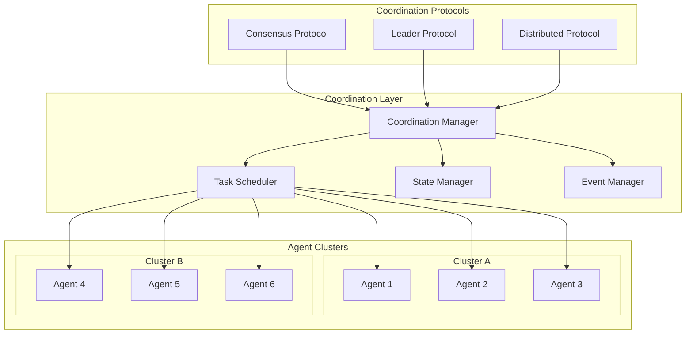

# Agent Coordination Mechanisms

## Overview
This document defines the coordination mechanisms for managing multi-agent interactions, task distribution, synchronization, and collaborative problem-solving in the parallel AI system.

## Coordination Architecture



## Core Coordination Components

### 1. Coordination Manager
```typescript
class CoordinationManager {
  private agents: Map<string, AgentProxy> = new Map();
  private coordinationStrategies: Map<CoordinationType, CoordinationStrategy> = new Map();
  private activeCoordinations: Map<string, ActiveCoordination> = new Map();
  private eventBus: EventBus;
  private stateManager: StateManager;
  
  constructor(eventBus: EventBus, stateManager: StateManager) {
    this.eventBus = eventBus;
    this.stateManager = stateManager;
    this.initializeStrategies();
  }
  
  private initializeStrategies(): void {
    this.coordinationStrategies.set(
      CoordinationType.LEADER_FOLLOWER, 
      new LeaderFollowerStrategy()
    );
    this.coordinationStrategies.set(
      CoordinationType.CONSENSUS, 
      new ConsensusStrategy()
    );
    this.coordinationStrategies.set(
      CoordinationType.AUCTION, 
      new AuctionStrategy()
    );
    this.coordinationStrategies.set(
      CoordinationType.CONTRACT_NET, 
      new ContractNetStrategy()
    );
    this.coordinationStrategies.set(
      CoordinationType.SWARM, 
      new SwarmStrategy()
    );
  }
  
  async startCoordination(
    coordinationId: string,
    type: CoordinationType,
    participants: string[],
    objective: CoordinationObjective
  ): Promise<CoordinationResult> {
    const strategy = this.coordinationStrategies.get(type);
    if (!strategy) {
      throw new Error(`Unknown coordination type: ${type}`);
    }
    
    const coordination: ActiveCoordination = {
      id: coordinationId,
      type,
      participants: participants.map(id => this.agents.get(id)!),
      objective,
      status: CoordinationStatus.INITIALIZING,
      strategy,
      startTime: new Date(),
      metrics: new CoordinationMetrics()
    };
    
    this.activeCoordinations.set(coordinationId, coordination);
    
    try {
      coordination.status = CoordinationStatus.ACTIVE;
      const result = await strategy.coordinate(coordination);
      
      coordination.status = CoordinationStatus.COMPLETED;
      coordination.endTime = new Date();
      
      await this.recordCoordinationResult(coordination, result);
      return result;
      
    } catch (error) {
      coordination.status = CoordinationStatus.FAILED;
      coordination.error = error;
      throw error;
    } finally {
      this.activeCoordinations.delete(coordinationId);
    }
  }
  
  registerAgent(agent: AgentProxy): void {
    this.agents.set(agent.id, agent);
    agent.onStatusChange((status) => {
      this.handleAgentStatusChange(agent.id, status);
    });
  }
  
  async getCoordinationStatus(coordinationId: string): Promise<CoordinationStatus | null> {
    const coordination = this.activeCoordinations.get(coordinationId);
    return coordination ? coordination.status : null;
  }
  
  private async handleAgentStatusChange(
    agentId: string, 
    status: AgentStatus
  ): Promise<void> {
    // Handle agent failures during coordination
    for (const [coordId, coordination] of this.activeCoordinations) {
      if (coordination.participants.some(p => p.id === agentId)) {
        await coordination.strategy.handleAgentStatusChange(agentId, status);
      }
    }
  }
}
```

### 2. Agent Proxy
```typescript
class AgentProxy {
  public readonly id: string;
  private messageChannel: MessageChannel;
  private capabilities: AgentCapabilities;
  private currentLoad: number = 0;
  private statusListeners: ((status: AgentStatus) => void)[] = [];
  
  constructor(id: string, messageChannel: MessageChannel) {
    this.id = id;
    this.messageChannel = messageChannel;
    this.startStatusMonitoring();
  }
  
  async sendCommand(command: CoordinationCommand): Promise<CommandResult> {
    const message: Message = {
      id: generateId(),
      timestamp: new Date(),
      version: '1.0',
      source: 'coordination-manager',
      destination: this.id,
      type: MessageType.COMMAND,
      category: MessageCategory.SYSTEM,
      priority: Priority.HIGH,
      payload: command,
      headers: { commandType: 'coordination' },
      deliveryMode: DeliveryMode.EXACTLY_ONCE,
      processingMode: ProcessingMode.SYNC,
      metadata: { coordinationContext: true }
    };
    
    return await this.sendRequestWithTimeout(message, 30000);
  }
  
  async requestCapabilities(): Promise<AgentCapabilities> {
    if (this.capabilities) {
      return this.capabilities;
    }
    
    const result = await this.sendCommand({
      type: 'GET_CAPABILITIES',
      data: {}
    });
    
    this.capabilities = result.data as AgentCapabilities;
    return this.capabilities;
  }
  
  async requestStatus(): Promise<AgentStatus> {
    const result = await this.sendCommand({
      type: 'GET_STATUS',
      data: {}
    });
    
    return result.data as AgentStatus;
  }
  
  onStatusChange(listener: (status: AgentStatus) => void): void {
    this.statusListeners.push(listener);
  }
  
  private startStatusMonitoring(): void {
    setInterval(async () => {
      try {
        const status = await this.requestStatus();
        this.notifyStatusChange(status);
      } catch (error) {
        this.notifyStatusChange({
          id: this.id,
          state: AgentState.UNAVAILABLE,
          health: 0,
          load: 100,
          timestamp: new Date()
        });
      }
    }, 10000); // Check every 10 seconds
  }
  
  private notifyStatusChange(status: AgentStatus): void {
    for (const listener of this.statusListeners) {
      try {
        listener(status);
      } catch (error) {
        console.error('Error in status change listener:', error);
      }
    }
  }
}
```

## Coordination Strategies

### 1. Leader-Follower Strategy
```typescript
class LeaderFollowerStrategy implements CoordinationStrategy {
  async coordinate(coordination: ActiveCoordination): Promise<CoordinationResult> {
    const leader = await this.electLeader(coordination.participants);
    const followers = coordination.participants.filter(p => p.id !== leader.id);
    
    // Notify participants of their roles
    await leader.sendCommand({
      type: 'ASSUME_LEADERSHIP',
      data: {
        coordinationId: coordination.id,
        followers: followers.map(f => f.id),
        objective: coordination.objective
      }
    });
    
    for (const follower of followers) {
      await follower.sendCommand({
        type: 'FOLLOW_LEADER',
        data: {
          coordinationId: coordination.id,
          leaderId: leader.id,
          objective: coordination.objective
        }
      });
    }
    
    // Monitor coordination progress
    return await this.monitorLeaderFollowerCoordination(coordination, leader, followers);
  }
  
  private async electLeader(participants: AgentProxy[]): Promise<AgentProxy> {
    // Get capabilities and load for each participant
    const candidateInfo = await Promise.all(
      participants.map(async (agent) => ({
        agent,
        capabilities: await agent.requestCapabilities(),
        status: await agent.requestStatus()
      }))
    );
    
    // Select leader based on capabilities, load, and reliability
    return candidateInfo.reduce((best, current) => {
      const bestScore = this.calculateLeadershipScore(best);
      const currentScore = this.calculateLeadershipScore(current);
      
      return currentScore > bestScore ? current : best;
    }).agent;
  }
  
  private calculateLeadershipScore(info: any): number {
    const capabilities = info.capabilities as AgentCapabilities;
    const status = info.status as AgentStatus;
    
    // Higher score is better
    let score = 0;
    
    // Capability score (0-40 points)
    score += capabilities.leadership * 10;
    score += capabilities.reliability * 10;
    score += capabilities.communicationSkills * 10;
    score += capabilities.decisionMaking * 10;
    
    // Load score (0-30 points, inverse of current load)
    score += Math.max(0, 30 - status.load);
    
    // Health score (0-30 points)
    score += status.health * 0.3;
    
    return score;
  }
  
  private async monitorLeaderFollowerCoordination(
    coordination: ActiveCoordination,
    leader: AgentProxy,
    followers: AgentProxy[]
  ): Promise<CoordinationResult> {
    const startTime = Date.now();
    const timeout = 300000; // 5 minutes
    
    while (Date.now() - startTime < timeout) {
      const leaderStatus = await leader.requestStatus();
      
      if (leaderStatus.state === AgentState.UNAVAILABLE) {
        // Leader failed, elect new one
        const newLeader = await this.electLeader(followers);
        return await this.handleLeaderFailover(coordination, newLeader, followers);
      }
      
      // Check if coordination is complete
      const progress = await this.checkCoordinationProgress(coordination.id, leader);
      if (progress.complete) {
        return {
          success: true,
          coordinationId: coordination.id,
          result: progress.result,
          duration: Date.now() - startTime,
          participantResults: progress.participantResults
        };
      }
      
      await this.delay(5000); // Check every 5 seconds
    }
    
    throw new Error(`Coordination ${coordination.id} timed out`);
  }
}
```

### 2. Consensus Strategy
```typescript
class ConsensusStrategy implements CoordinationStrategy {
  private consensusAlgorithm: ConsensusAlgorithm;
  
  constructor(algorithm: ConsensusAlgorithm = ConsensusAlgorithm.RAFT) {
    this.consensusAlgorithm = algorithm;
  }
  
  async coordinate(coordination: ActiveCoordination): Promise<CoordinationResult> {
    switch (this.consensusAlgorithm) {
      case ConsensusAlgorithm.RAFT:
        return await this.raftConsensus(coordination);
      case ConsensusAlgorithm.PBFT:
        return await this.pbftConsensus(coordination);
      case ConsensusAlgorithm.PAXOS:
        return await this.paxosConsensus(coordination);
      default:
        throw new Error(`Unsupported consensus algorithm: ${this.consensusAlgorithm}`);
    }
  }
  
  private async raftConsensus(coordination: ActiveCoordination): Promise<CoordinationResult> {
    const participants = coordination.participants;
    const majority = Math.floor(participants.length / 2) + 1;
    
    // Phase 1: Leader Election
    const leader = await this.conductRaftElection(participants);
    
    // Phase 2: Log Replication
    const proposal = await this.createProposal(coordination.objective);
    const logEntries = await this.replicateLog(leader, participants, proposal);
    
    // Phase 3: Commitment
    const commitResult = await this.commitEntries(participants, logEntries, majority);
    
    return {
      success: commitResult.committed,
      coordinationId: coordination.id,
      result: commitResult.result,
      duration: Date.now() - coordination.startTime.getTime(),
      participantResults: commitResult.participantResults,
      consensusDetails: {
        algorithm: 'RAFT',
        leaderId: leader.id,
        entriesCommitted: logEntries.length,
        nodesAgreed: commitResult.agreementCount
      }
    };
  }
  
  private async conductRaftElection(participants: AgentProxy[]): Promise<AgentProxy> {
    let currentTerm = 1;
    const maxTerms = 5;
    
    while (currentTerm <= maxTerms) {
      const votes = await this.requestVotes(participants, currentTerm);
      const majority = Math.floor(participants.length / 2) + 1;
      
      const voteCount = new Map<string, number>();
      for (const vote of votes) {
        if (vote.granted) {
          const candidateId = vote.candidateId;
          voteCount.set(candidateId, (voteCount.get(candidateId) || 0) + 1);
        }
      }
      
      // Check if any candidate has majority
      for (const [candidateId, count] of voteCount) {
        if (count >= majority) {
          const leader = participants.find(p => p.id === candidateId)!;
          await this.notifyElectionResult(participants, leader, currentTerm);
          return leader;
        }
      }
      
      currentTerm++;
      await this.delay(1000 * currentTerm); // Exponential backoff
    }
    
    throw new Error('Failed to elect leader after maximum terms');
  }
  
  private async requestVotes(
    participants: AgentProxy[], 
    term: number
  ): Promise<VoteResult[]> {
    const votePromises = participants.map(async (participant) => {
      try {
        const result = await participant.sendCommand({
          type: 'REQUEST_VOTE',
          data: {
            term,
            candidateId: participant.id,
            lastLogIndex: 0,
            lastLogTerm: 0
          }
        });
        
        return result.data as VoteResult;
      } catch (error) {
        return {
          term,
          candidateId: participant.id,
          granted: false,
          reason: error.message
        };
      }
    });
    
    return await Promise.all(votePromises);
  }
}
```

### 3. Auction Strategy
```typescript
class AuctionStrategy implements CoordinationStrategy {
  async coordinate(coordination: ActiveCoordination): Promise<CoordinationResult> {
    const tasks = this.decomposeTasks(coordination.objective);
    const auctionResults: AuctionResult[] = [];
    
    for (const task of tasks) {
      const result = await this.conductAuction(
        coordination.participants, 
        task,
        coordination.id
      );
      auctionResults.push(result);
    }
    
    // Execute awarded tasks
    const executionResults = await this.executeAwardedTasks(auctionResults);
    
    return {
      success: executionResults.every(r => r.success),
      coordinationId: coordination.id,
      result: {
        tasksCompleted: executionResults.filter(r => r.success).length,
        totalTasks: tasks.length,
        auctionResults,
        executionResults
      },
      duration: Date.now() - coordination.startTime.getTime(),
      participantResults: this.aggregateParticipantResults(executionResults)
    };
  }
  
  private async conductAuction(
    participants: AgentProxy[],
    task: Task,
    coordinationId: string
  ): Promise<AuctionResult> {
    // Phase 1: Announce auction
    await this.announceAuction(participants, task, coordinationId);
    
    // Phase 2: Collect bids
    const bids = await this.collectBids(participants, task, coordinationId);
    
    // Phase 3: Evaluate bids
    const winner = this.evaluateBids(bids, task);
    
    // Phase 4: Award task
    if (winner) {
      await this.awardTask(winner, task, coordinationId);
      
      return {
        taskId: task.id,
        winnerId: winner.bidder.id,
        winningBid: winner,
        allBids: bids,
        auctionTime: new Date(),
        success: true
      };
    } else {
      return {
        taskId: task.id,
        winnerId: null,
        winningBid: null,
        allBids: bids,
        auctionTime: new Date(),
        success: false,
        reason: 'No valid bids received'
      };
    }
  }
  
  private async collectBids(
    participants: AgentProxy[],
    task: Task,
    coordinationId: string
  ): Promise<Bid[]> {
    const bidPromises = participants.map(async (participant) => {
      try {
        const result = await participant.sendCommand({
          type: 'REQUEST_BID',
          data: {
            coordinationId,
            task,
            deadline: new Date(Date.now() + 30000) // 30 second deadline
          }
        });
        
        if (result.data.bid) {
          return {
            bidder: participant,
            taskId: task.id,
            cost: result.data.bid.cost,
            estimatedDuration: result.data.bid.estimatedDuration,
            qualityScore: result.data.bid.qualityScore,
            capabilities: result.data.bid.capabilities,
            bidTime: new Date()
          } as Bid;
        }
        
        return null;
      } catch (error) {
        console.log(`Agent ${participant.id} failed to bid: ${error.message}`);
        return null;
      }
    });
    
    const results = await Promise.allSettled(bidPromises);
    return results
      .filter(r => r.status === 'fulfilled' && r.value !== null)
      .map(r => (r as PromiseFulfilledResult<Bid>).value);
  }
  
  private evaluateBids(bids: Bid[], task: Task): Bid | null {
    if (bids.length === 0) return null;
    
    // Score each bid based on multiple criteria
    const scoredBids = bids.map(bid => ({
      bid,
      score: this.calculateBidScore(bid, task)
    }));
    
    // Sort by score (higher is better)
    scoredBids.sort((a, b) => b.score - a.score);
    
    return scoredBids[0].bid;
  }
  
  private calculateBidScore(bid: Bid, task: Task): number {
    let score = 0;
    
    // Cost efficiency (lower cost is better, max 30 points)
    const maxCost = 1000; // Assume max reasonable cost
    score += Math.max(0, 30 - (bid.cost / maxCost) * 30);
    
    // Time efficiency (shorter duration is better, max 25 points)
    const maxDuration = 3600; // 1 hour max
    score += Math.max(0, 25 - (bid.estimatedDuration / maxDuration) * 25);
    
    // Quality score (max 25 points)
    score += (bid.qualityScore / 100) * 25;
    
    // Capability match (max 20 points)
    const capabilityMatch = this.calculateCapabilityMatch(bid.capabilities, task.requiredCapabilities);
    score += capabilityMatch * 20;
    
    return score;
  }
  
  private calculateCapabilityMatch(
    bidCapabilities: AgentCapabilities, 
    requiredCapabilities: TaskCapabilities
  ): number {
    let matchScore = 0;
    let totalRequirements = 0;
    
    for (const [capability, requiredLevel] of Object.entries(requiredCapabilities)) {
      totalRequirements++;
      const agentLevel = (bidCapabilities as any)[capability] || 0;
      
      if (agentLevel >= requiredLevel) {
        matchScore += 1;
      } else {
        matchScore += agentLevel / requiredLevel;
      }
    }
    
    return totalRequirements > 0 ? matchScore / totalRequirements : 0;
  }
}
```

### 4. Contract Net Strategy
```typescript
class ContractNetStrategy implements CoordinationStrategy {
  async coordinate(coordination: ActiveCoordination): Promise<CoordinationResult> {
    const manager = this.selectManager(coordination.participants);
    const contractors = coordination.participants.filter(p => p.id !== manager.id);
    
    const tasks = this.decomposeTasks(coordination.objective);
    const contracts: Contract[] = [];
    
    for (const task of tasks) {
      const contract = await this.negotiateContract(manager, contractors, task);
      if (contract) {
        contracts.push(contract);
      }
    }
    
    // Execute contracts
    const executionResults = await this.executeContracts(contracts);
    
    return {
      success: executionResults.every(r => r.success),
      coordinationId: coordination.id,
      result: {
        contractsNegotiated: contracts.length,
        contractsCompleted: executionResults.filter(r => r.success).length,
        totalValue: contracts.reduce((sum, c) => sum + c.value, 0),
        contracts,
        executionResults
      },
      duration: Date.now() - coordination.startTime.getTime(),
      participantResults: this.aggregateContractResults(executionResults)
    };
  }
  
  private async negotiateContract(
    manager: AgentProxy,
    contractors: AgentProxy[],
    task: Task
  ): Promise<Contract | null> {
    // Phase 1: Call for proposals
    const proposals = await this.callForProposals(manager, contractors, task);
    
    if (proposals.length === 0) {
      return null;
    }
    
    // Phase 2: Select best proposal
    const selectedProposal = this.selectBestProposal(proposals, task);
    
    // Phase 3: Negotiate contract details
    const contract = await this.finalizeContract(manager, selectedProposal, task);
    
    return contract;
  }
  
  private async callForProposals(
    manager: AgentProxy,
    contractors: AgentProxy[],
    task: Task
  ): Promise<Proposal[]> {
    const cfp: CallForProposals = {
      id: generateId(),
      taskId: task.id,
      issuerId: manager.id,
      taskDescription: task.description,
      requirements: task.requiredCapabilities,
      deadline: new Date(Date.now() + 60000), // 1 minute to respond
      budget: task.maxBudget,
      evaluationCriteria: ['cost', 'time', 'quality', 'reliability']
    };
    
    const proposalPromises = contractors.map(async (contractor) => {
      try {
        const result = await contractor.sendCommand({
          type: 'CALL_FOR_PROPOSALS',
          data: cfp
        });
        
        if (result.data.proposal) {
          return {
            ...result.data.proposal,
            contractorId: contractor.id,
            contractor,
            cfpId: cfp.id
          } as Proposal;
        }
        
        return null;
      } catch (error) {
        console.log(`Contractor ${contractor.id} failed to respond to CFP: ${error.message}`);
        return null;
      }
    });
    
    const results = await Promise.allSettled(proposalPromises);
    return results
      .filter(r => r.status === 'fulfilled' && r.value !== null)
      .map(r => (r as PromiseFulfilledResult<Proposal>).value);
  }
  
  private selectBestProposal(proposals: Proposal[], task: Task): Proposal {
    // Multi-criteria decision analysis
    const scoredProposals = proposals.map(proposal => ({
      proposal,
      score: this.evaluateProposal(proposal, task)
    }));
    
    scoredProposals.sort((a, b) => b.score - a.score);
    return scoredProposals[0].proposal;
  }
  
  private evaluateProposal(proposal: Proposal, task: Task): number {
    let score = 0;
    const weights = {
      cost: 0.3,
      time: 0.25,
      quality: 0.25,
      reliability: 0.2
    };
    
    // Normalize and weight each criterion
    score += this.normalizeCostScore(proposal.cost, task.maxBudget) * weights.cost;
    score += this.normalizeTimeScore(proposal.estimatedDuration, task.maxDuration) * weights.time;
    score += (proposal.qualityGuarantee / 100) * weights.quality;
    score += (proposal.contractor.reliability / 100) * weights.reliability;
    
    return score;
  }
  
  private async finalizeContract(
    manager: AgentProxy,
    proposal: Proposal,
    task: Task
  ): Promise<Contract> {
    const contractTerms: ContractTerms = {
      taskId: task.id,
      contractorId: proposal.contractorId,
      managerId: manager.id,
      cost: proposal.cost,
      duration: proposal.estimatedDuration,
      deliverables: proposal.deliverables,
      qualityMetrics: proposal.qualityMetrics,
      penaltyClauses: this.generatePenaltyClauses(proposal),
      startDate: new Date(),
      endDate: new Date(Date.now() + proposal.estimatedDuration * 1000)
    };
    
    // Send contract for acceptance
    const acceptanceResult = await proposal.contractor.sendCommand({
      type: 'CONTRACT_ACCEPTANCE',
      data: contractTerms
    });
    
    if (acceptanceResult.data.accepted) {
      return {
        id: generateId(),
        terms: contractTerms,
        status: ContractStatus.ACTIVE,
        createdAt: new Date(),
        value: proposal.cost
      };
    } else {
      throw new Error(`Contract rejected by ${proposal.contractorId}: ${acceptanceResult.data.reason}`);
    }
  }
}
```

## Advanced Coordination Features

### 1. Multi-Level Coordination
```typescript
class HierarchicalCoordinator {
  private coordinationLevels: Map<number, CoordinationLevel> = new Map();
  private maxLevels: number = 3;
  
  async coordinateHierarchically(
    agents: AgentProxy[],
    objective: CoordinationObjective
  ): Promise<CoordinationResult> {
    // Level 0: Organize agents into clusters
    const clusters = await this.organizeIntoClusters(agents);
    
    // Level 1: Coordinate within clusters
    const clusterResults = await this.coordinateWithinClusters(clusters, objective);
    
    // Level 2: Coordinate between cluster leaders
    const interClusterResult = await this.coordinateBetweenClusters(
      clusterResults.map(cr => cr.leader),
      objective,
      clusterResults
    );
    
    return {
      success: interClusterResult.success,
      coordinationId: generateId(),
      result: {
        hierarchyLevels: 2,
        clusterResults,
        interClusterResult,
        totalAgents: agents.length,
        clustersFormed: clusters.length
      },
      duration: clusterResults.reduce((sum, cr) => sum + cr.duration, 0) + interClusterResult.duration,
      participantResults: this.aggregateHierarchicalResults(clusterResults, interClusterResult)
    };
  }
  
  private async organizeIntoClusters(agents: AgentProxy[]): Promise<AgentCluster[]> {
    const clusters: AgentCluster[] = [];
    const maxClusterSize = Math.ceil(Math.sqrt(agents.length));
    
    // Use k-means clustering based on agent capabilities
    const agentFeatures = await this.extractAgentFeatures(agents);
    const clusterAssignments = this.performKMeansClustering(agentFeatures, maxClusterSize);
    
    for (let i = 0; i < maxClusterSize; i++) {
      const clusterAgents = agents.filter((_, index) => clusterAssignments[index] === i);
      if (clusterAgents.length > 0) {
        clusters.push({
          id: generateId(),
          agents: clusterAgents,
          leader: await this.selectClusterLeader(clusterAgents),
          capabilities: this.aggregateClusterCapabilities(clusterAgents)
        });
      }
    }
    
    return clusters;
  }
  
  private async coordinateWithinClusters(
    clusters: AgentCluster[],
    objective: CoordinationObjective
  ): Promise<ClusterCoordinationResult[]> {
    const coordinationPromises = clusters.map(async (cluster) => {
      const clusterObjective = this.decomposeObjectiveForCluster(objective, cluster);
      
      const coordinator = new CoordinationManager(this.eventBus, this.stateManager);
      for (const agent of cluster.agents) {
        coordinator.registerAgent(agent);
      }
      
      const startTime = Date.now();
      const result = await coordinator.startCoordination(
        generateId(),
        this.selectOptimalStrategy(cluster.agents, clusterObjective),
        cluster.agents.map(a => a.id),
        clusterObjective
      );
      
      return {
        clusterId: cluster.id,
        leader: cluster.leader,
        result,
        duration: Date.now() - startTime,
        agentCount: cluster.agents.length
      };
    });
    
    return await Promise.all(coordinationPromises);
  }
}
```

### 2. Dynamic Coalition Formation
```typescript
class CoalitionFormationManager {
  private agents: Map<string, AgentProxy> = new Map();
  private activeCoalitions: Map<string, Coalition> = new Map();
  private coalitionHistory: CoalitionHistory = new CoalitionHistory();
  
  async formCoalition(
    task: Task,
    availableAgents: AgentProxy[],
    constraints: CoalitionConstraints
  ): Promise<Coalition | null> {
    // Step 1: Filter agents by basic requirements
    const eligibleAgents = await this.filterEligibleAgents(availableAgents, task);
    
    if (eligibleAgents.length === 0) {
      return null;
    }
    
    // Step 2: Calculate coalition values for different combinations
    const possibleCoalitions = this.generatePossibleCoalitions(eligibleAgents, constraints);
    const valuedCoalitions = await this.evaluateCoalitions(possibleCoalitions, task);
    
    // Step 3: Select optimal coalition using cooperative game theory
    const optimalCoalition = this.selectOptimalCoalition(valuedCoalitions, task);
    
    if (optimalCoalition) {
      // Step 4: Negotiate profit sharing
      const profitSharing = await this.negotiateProfitSharing(optimalCoalition, task);
      
      // Step 5: Form coalition and establish governance
      return await this.establishCoalition(optimalCoalition, profitSharing, task);
    }
    
    return null;
  }
  
  private async evaluateCoalitions(
    coalitions: AgentProxy[][],
    task: Task
  ): Promise<ValuedCoalition[]> {
    const evaluationPromises = coalitions.map(async (coalition) => {
      const value = await this.calculateCoalitionValue(coalition, task);
      const stability = this.assessStability(coalition, task);
      const feasibility = await this.checkFeasibility(coalition, task);
      
      return {
        agents: coalition,
        value,
        stability,
        feasibility,
        expectedUtility: this.calculateExpectedUtility(coalition, task, value)
      };
    });
    
    return await Promise.all(evaluationPromises);
  }
  
  private async calculateCoalitionValue(
    coalition: AgentProxy[],
    task: Task
  ): Promise<CoalitionValue> {
    // Shapley value calculation for fair payoff distribution
    const marginalContributions = await this.calculateMarginalContributions(coalition, task);
    
    let totalValue = 0;
    const individualContributions = new Map<string, number>();
    
    // Calculate each agent's Shapley value
    for (const agent of coalition) {
      let shapleyValue = 0;
      
      // Consider all possible orderings
      const otherAgents = coalition.filter(a => a.id !== agent.id);
      const allSubsets = this.generateSubsets(otherAgents);
      
      for (const subset of allSubsets) {
        const withoutAgent = await this.getSubsetValue(subset, task);
        const withAgent = await this.getSubsetValue([...subset, agent], task);
        const marginalContrib = withAgent - withoutAgent;
        
        // Weight by probability of this ordering
        const weight = this.factorial(subset.length) * this.factorial(otherAgents.length - subset.length) / this.factorial(coalition.length);
        shapleyValue += marginalContrib * weight;
      }
      
      individualContributions.set(agent.id, shapleyValue);
      totalValue += shapleyValue;
    }
    
    return {
      total: totalValue,
      individualContributions,
      synergy: this.calculateSynergy(coalition, task),
      riskAdjusted: totalValue * this.calculateRiskFactor(coalition, task)
    };
  }
  
  private async negotiateProfitSharing(
    coalition: ValuedCoalition,
    task: Task
  ): Promise<ProfitSharingAgreement> {
    const negotiations: NegotiationRound[] = [];
    let currentProposal = this.generateInitialProposal(coalition);
    let round = 0;
    const maxRounds = 10;
    
    while (round < maxRounds) {
      round++;
      const responses = await this.collectNegotiationResponses(
        coalition.agents,
        currentProposal,
        task
      );
      
      if (responses.every(r => r.accepted)) {
        // All agents accepted the proposal
        return {
          proposal: currentProposal,
          acceptanceRate: 1.0,
          negotiationRounds: round,
          finalizedAt: new Date()
        };
      }
      
      // Adjust proposal based on feedback
      currentProposal = this.adjustProposal(currentProposal, responses, coalition);
      negotiations.push({
        round,
        proposal: currentProposal,
        responses: responses.map(r => ({ agentId: r.agentId, accepted: r.accepted }))
      });
      
      // Check if we've reached a stable point
      if (this.isNegotiationStable(negotiations)) {
        break;
      }
    }
    
    // If negotiation failed, use fallback mechanism
    return this.createFallbackAgreement(coalition, task);
  }
  
  private async establishCoalition(
    coalition: ValuedCoalition,
    profitSharing: ProfitSharingAgreement,
    task: Task
  ): Promise<Coalition> {
    const coalitionId = generateId();
    
    // Create coalition governance structure
    const governance = await this.createGovernanceStructure(coalition, task);
    
    // Establish communication channels
    const communicationChannels = await this.setupCoalitionCommunication(coalition);
    
    // Create coalition contract
    const contract = this.createCoalitionContract(
      coalitionId,
      coalition,
      profitSharing,
      task,
      governance
    );
    
    // Get agreement from all participants
    const agreements = await this.getParticipantAgreements(coalition.agents, contract);
    
    if (agreements.every(a => a.agreed)) {
      const newCoalition: Coalition = {
        id: coalitionId,
        agents: coalition.agents,
        task,
        value: coalition.value,
        profitSharing,
        governance,
        contract,
        status: CoalitionStatus.ACTIVE,
        createdAt: new Date(),
        communicationChannels
      };
      
      this.activeCoalitions.set(coalitionId, newCoalition);
      this.coalitionHistory.recordFormation(newCoalition);
      
      return newCoalition;
    } else {
      throw new Error('Failed to get unanimous agreement for coalition formation');
    }
  }
}
```

## Synchronization Mechanisms

### 1. Distributed Synchronization
```typescript
class DistributedSynchronizer {
  private synchronizationPoints: Map<string, SyncPoint> = new Map();
  private agents: Map<string, AgentProxy> = new Map();
  
  async createSynchronizationPoint(
    syncId: string,
    participants: string[],
    condition: SynchronizationCondition,
    timeout: number = 60000
  ): Promise<SynchronizationResult> {
    const syncPoint: SyncPoint = {
      id: syncId,
      participants: new Set(participants),
      condition,
      arrived: new Set<string>(),
      status: SyncStatus.WAITING,
      createdAt: new Date(),
      timeout
    };
    
    this.synchronizationPoints.set(syncId, syncPoint);
    
    // Notify participants about sync point
    await this.notifyParticipants(syncPoint);
    
    // Wait for synchronization or timeout
    return await this.waitForSynchronization(syncPoint);
  }
  
  async agentArrive(syncId: string, agentId: string, data?: any): Promise<void> {
    const syncPoint = this.synchronizationPoints.get(syncId);
    if (!syncPoint) {
      throw new Error(`Synchronization point ${syncId} not found`);
    }
    
    if (!syncPoint.participants.has(agentId)) {
      throw new Error(`Agent ${agentId} not part of synchronization ${syncId}`);
    }
    
    syncPoint.arrived.add(agentId);
    
    if (data) {
      if (!syncPoint.data) syncPoint.data = new Map();
      syncPoint.data.set(agentId, data);
    }
    
    // Check if synchronization condition is met
    if (await this.checkSynchronizationCondition(syncPoint)) {
      await this.triggerSynchronization(syncPoint);
    }
  }
  
  private async checkSynchronizationCondition(syncPoint: SyncPoint): Promise<boolean> {
    switch (syncPoint.condition.type) {
      case 'ALL_ARRIVED':
        return syncPoint.arrived.size === syncPoint.participants.size;
        
      case 'MAJORITY_ARRIVED':
        const majority = Math.floor(syncPoint.participants.size / 2) + 1;
        return syncPoint.arrived.size >= majority;
        
      case 'MINIMUM_COUNT':
        return syncPoint.arrived.size >= (syncPoint.condition.value as number);
        
      case 'CUSTOM_PREDICATE':
        const predicate = syncPoint.condition.value as SyncPredicate;
        return await predicate(syncPoint);
        
      default:
        return false;
    }
  }
  
  private async triggerSynchronization(syncPoint: SyncPoint): Promise<void> {
    syncPoint.status = SyncStatus.SYNCHRONIZED;
    syncPoint.synchronizedAt = new Date();
    
    // Notify all participants that synchronization occurred
    const notificationPromises = Array.from(syncPoint.participants).map(async (agentId) => {
      const agent = this.agents.get(agentId);
      if (agent) {
        await agent.sendCommand({
          type: 'SYNCHRONIZATION_TRIGGERED',
          data: {
            syncId: syncPoint.id,
            arrivedAgents: Array.from(syncPoint.arrived),
            syncData: syncPoint.data ? Object.fromEntries(syncPoint.data) : undefined,
            triggeredAt: syncPoint.synchronizedAt
          }
        });
      }
    });
    
    await Promise.allSettled(notificationPromises);
  }
  
  private async waitForSynchronization(syncPoint: SyncPoint): Promise<SynchronizationResult> {
    return new Promise((resolve) => {
      const timeoutHandle = setTimeout(() => {
        syncPoint.status = SyncStatus.TIMEOUT;
        resolve({
          syncId: syncPoint.id,
          success: false,
          reason: 'timeout',
          arrivedAgents: Array.from(syncPoint.arrived),
          totalAgents: syncPoint.participants.size,
          duration: Date.now() - syncPoint.createdAt.getTime()
        });
      }, syncPoint.timeout);
      
      // Check periodically for synchronization
      const checkInterval = setInterval(() => {
        if (syncPoint.status === SyncStatus.SYNCHRONIZED) {
          clearInterval(checkInterval);
          clearTimeout(timeoutHandle);
          resolve({
            syncId: syncPoint.id,
            success: true,
            arrivedAgents: Array.from(syncPoint.arrived),
            totalAgents: syncPoint.participants.size,
            syncData: syncPoint.data ? Object.fromEntries(syncPoint.data) : undefined,
            duration: Date.now() - syncPoint.createdAt.getTime()
          });
        }
      }, 100);
    });
  }
}
```

### 2. Barrier Synchronization
```typescript
class BarrierSynchronizer {
  private barriers: Map<string, Barrier> = new Map();
  
  async createBarrier(
    barrierId: string,
    participantCount: number,
    action?: BarrierAction
  ): Promise<Barrier> {
    const barrier: Barrier = {
      id: barrierId,
      participantCount,
      arrived: 0,
      waitingAgents: new Set<string>(),
      action,
      status: BarrierStatus.WAITING,
      createdAt: new Date()
    };
    
    this.barriers.set(barrierId, barrier);
    return barrier;
  }
  
  async wait(barrierId: string, agentId: string): Promise<BarrierResult> {
    const barrier = this.barriers.get(barrierId);
    if (!barrier) {
      throw new Error(`Barrier ${barrierId} not found`);
    }
    
    if (barrier.status !== BarrierStatus.WAITING) {
      throw new Error(`Barrier ${barrierId} is no longer active`);
    }
    
    barrier.waitingAgents.add(agentId);
    barrier.arrived++;
    
    if (barrier.arrived === barrier.participantCount) {
      // All agents have arrived, trigger barrier
      await this.triggerBarrier(barrier);
    }
    
    // Wait for barrier to be triggered
    return await this.waitForBarrierTrigger(barrier, agentId);
  }
  
  private async triggerBarrier(barrier: Barrier): Promise<void> {
    barrier.status = BarrierStatus.TRIGGERED;
    barrier.triggeredAt = new Date();
    
    // Execute barrier action if specified
    if (barrier.action) {
      try {
        await barrier.action.execute(Array.from(barrier.waitingAgents));
      } catch (error) {
        console.error(`Error executing barrier action for ${barrier.id}:`, error);
      }
    }
    
    // Notify all waiting agents
    const notificationPromises = Array.from(barrier.waitingAgents).map(async (agentId) => {
      const agent = this.agents.get(agentId);
      if (agent) {
        await agent.sendCommand({
          type: 'BARRIER_RELEASED',
          data: {
            barrierId: barrier.id,
            releasedAt: barrier.triggeredAt
          }
        });
      }
    });
    
    await Promise.allSettled(notificationPromises);
    
    // Clean up barrier after a delay
    setTimeout(() => {
      this.barriers.delete(barrier.id);
    }, 60000); // Clean up after 1 minute
  }
  
  private async waitForBarrierTrigger(
    barrier: Barrier, 
    agentId: string
  ): Promise<BarrierResult> {
    return new Promise((resolve) => {
      const checkInterval = setInterval(() => {
        if (barrier.status === BarrierStatus.TRIGGERED) {
          clearInterval(checkInterval);
          resolve({
            barrierId: barrier.id,
            success: true,
            participantCount: barrier.participantCount,
            waitTime: Date.now() - barrier.createdAt.getTime(),
            triggeredAt: barrier.triggeredAt
          });
        }
      }, 100);
      
      // Timeout after 5 minutes
      setTimeout(() => {
        if (barrier.status === BarrierStatus.WAITING) {
          clearInterval(checkInterval);
          resolve({
            barrierId: barrier.id,
            success: false,
            reason: 'timeout',
            participantCount: barrier.participantCount,
            arrivedCount: barrier.arrived,
            waitTime: Date.now() - barrier.createdAt.getTime()
          });
        }
      }, 300000);
    });
  }
}
```

## Configuration

### Coordination Configuration
```yaml
coordination:
  manager:
    max_concurrent_coordinations: 10
    coordination_timeout: 300s
    health_check_interval: 10s
    
  strategies:
    leader_follower:
      election_timeout: 30s
      heartbeat_interval: 5s
      failover_threshold: 3
      
    consensus:
      algorithm: raft  # raft, pbft, paxos
      election_timeout: 10s
      heartbeat_interval: 2s
      log_replication_batch_size: 100
      
    auction:
      bidding_timeout: 30s
      evaluation_criteria:
        cost: 0.3
        time: 0.25
        quality: 0.25
        reliability: 0.2
        
    contract_net:
      proposal_timeout: 60s
      negotiation_rounds: 5
      contract_duration: 24h
      
  synchronization:
    default_timeout: 60s
    barrier_cleanup_delay: 60s
    sync_check_interval: 100ms
    
  coalition:
    max_coalition_size: 10
    formation_timeout: 120s
    profit_sharing_rounds: 10
    stability_threshold: 0.7
    
  monitoring:
    metrics_collection: true
    coordination_logging: true
    performance_tracking: true
```

## Best Practices

### 1. Strategy Selection
- Use leader-follower for hierarchical tasks
- Use consensus for critical decisions
- Use auctions for resource allocation
- Use contract net for complex negotiations
- Use swarm for emergent behaviors

### 2. Performance Optimization
- Cache agent capabilities
- Batch coordination requests
- Use efficient communication protocols
- Monitor coordination overhead
- Implement failfast mechanisms

### 3. Fault Tolerance
- Design for agent failures
- Implement coordination recovery
- Use timeouts and circuit breakers
- Provide graceful degradation
- Monitor coordination health

### 4. Scalability
- Design for dynamic agent sets
- Implement hierarchical coordination
- Use efficient synchronization
- Monitor coordination complexity
- Plan for growth patterns