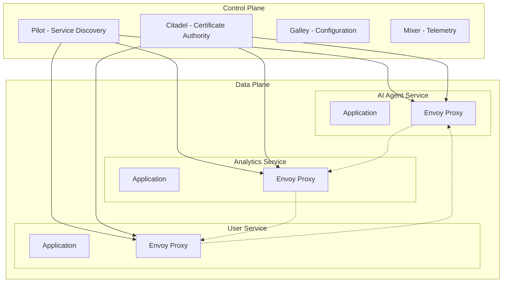

# Service Mesh Core Design

## Overview

The service mesh provides a dedicated infrastructure layer for secure, fast, and reliable service-to-service communication in the parallel AI system. It abstracts network complexity from application code and provides observability, security, and traffic management capabilities.

## Architecture Components

### 1. Service Mesh Topology



### 2. Core Components

#### Control Plane

**Istio Control Plane Configuration:**

```yaml
apiVersion: install.istio.io/v1alpha1
kind: IstioOperator
metadata:
  name: control-plane
spec:
  values:
    global:
      meshID: parallel-ai-mesh
      network: parallel-ai-network
      hub: gcr.io/istio-release
      tag: 1.20.0
    pilot:
      resources:
        requests:
          cpu: 500m
          memory: 2048Mi
        limits:
          cpu: 1000m
          memory: 4096Mi
      env:
        PILOT_ENABLE_WORKLOAD_ENTRY_CROSS_CLUSTER: true
        PILOT_ENABLE_CROSS_CLUSTER_WORKLOAD_ENTRY: true
    istiod:
      resources:
        requests:
          cpu: 500m
          memory: 2048Mi
  components:
    pilot:
      k8s:
        resources:
          requests:
            cpu: 100m
            memory: 128Mi
    ingressGateways:
    - name: istio-ingressgateway
      enabled: true
      k8s:
        service:
          type: LoadBalancer
        resources:
          requests:
            cpu: 100m
            memory: 128Mi
          limits:
            cpu: 2000m
            memory: 1024Mi
```

#### Data Plane

**Envoy Proxy Configuration:**

```yaml
apiVersion: v1
kind: ConfigMap
metadata:
  name: envoy-config
data:
  envoy.yaml: |
    static_resources:
      clusters:
      - name: ai_agent_cluster
        connect_timeout: 5s
        type: STRICT_DNS
        lb_policy: ROUND_ROBIN
        http2_protocol_options: {}
        load_assignment:
          cluster_name: ai_agent_cluster
          endpoints:
          - lb_endpoints:
            - endpoint:
                address:
                  socket_address:
                    address: ai-agent-service
                    port_value: 8080
        health_checks:
        - timeout: 5s
          interval: 30s
          path: "/health"
          http_health_check:
            path: "/health"
    
    admin:
      access_log_path: /dev/stdout
      address:
        socket_address:
          address: 0.0.0.0
          port_value: 15000
```

## Service Discovery and Registration

### 1. Kubernetes Native Discovery

```yaml
apiVersion: v1
kind: Service
metadata:
  name: ai-agent-service
  labels:
    app: ai-agent
    version: v1
    tier: application
spec:
  selector:
    app: ai-agent
  ports:
  - port: 8080
    name: http
    protocol: TCP
  - port: 9090
    name: metrics
    protocol: TCP
---
apiVersion: networking.istio.io/v1beta1
kind: ServiceEntry
metadata:
  name: external-ai-api
spec:
  hosts:
  - api.openai.com
  ports:
  - number: 443
    name: https
    protocol: HTTPS
  location: MESH_EXTERNAL
  resolution: DNS
```

### 2. Multi-Cluster Service Discovery

```yaml
apiVersion: networking.istio.io/v1beta1
kind: Gateway
metadata:
  name: cross-cluster-gateway
spec:
  selector:
    istio: eastwestgateway
  servers:
  - port:
      number: 15443
      name: tls
      protocol: TLS
    tls:
      mode: ISTIO_MUTUAL
    hosts:
    - "*.local"
---
apiVersion: networking.istio.io/v1alpha3
kind: DestinationRule
metadata:
  name: cross-cluster-dr
spec:
  host: "*.local"
  trafficPolicy:
    tls:
      mode: ISTIO_MUTUAL
```

## Traffic Management

### 1. Load Balancing Policies

```yaml
apiVersion: networking.istio.io/v1beta1
kind: DestinationRule
metadata:
  name: ai-agent-destination
spec:
  host: ai-agent-service
  trafficPolicy:
    loadBalancer:
      simple: LEAST_CONN
    connectionPool:
      tcp:
        maxConnections: 100
      http:
        http1MaxPendingRequests: 50
        http2MaxRequests: 100
        maxRequestsPerConnection: 10
        maxRetries: 3
        connectTimeout: 30s
        h2UpgradePolicy: UPGRADE
    circuitBreaker:
      consecutiveGatewayErrors: 5
      consecutive5xxErrors: 5
      interval: 30s
      baseEjectionTime: 30s
      maxEjectionPercent: 50
      minHealthPercent: 50
  subsets:
  - name: v1
    labels:
      version: v1
  - name: v2
    labels:
      version: v2
```

### 2. Advanced Routing

```yaml
apiVersion: networking.istio.io/v1beta1
kind: VirtualService
metadata:
  name: ai-agent-routing
spec:
  hosts:
  - ai-agent-service
  http:
  - match:
    - headers:
        x-user-tier:
          exact: premium
    route:
    - destination:
        host: ai-agent-service
        subset: v2
      weight: 100
    timeout: 60s
    retries:
      attempts: 3
      perTryTimeout: 20s
      retryOn: 5xx,gateway-error,connect-failure,refused-stream
  - match:
    - headers:
        x-canary:
          exact: "true"
    route:
    - destination:
        host: ai-agent-service
        subset: v2
      weight: 100
    fault:
      delay:
        percentage:
          value: 0.1
        fixedDelay: 5s
  - route:
    - destination:
        host: ai-agent-service
        subset: v1
      weight: 90
    - destination:
        host: ai-agent-service
        subset: v2
      weight: 10
```

## Security Architecture

### 1. Mutual TLS (mTLS)

```yaml
apiVersion: security.istio.io/v1beta1
kind: PeerAuthentication
metadata:
  name: default
  namespace: parallel-ai
spec:
  mtls:
    mode: STRICT
---
apiVersion: security.istio.io/v1beta1
kind: AuthorizationPolicy
metadata:
  name: ai-agent-authz
  namespace: parallel-ai
spec:
  selector:
    matchLabels:
      app: ai-agent
  rules:
  - from:
    - source:
        principals:
        - "cluster.local/ns/parallel-ai/sa/api-gateway"
        - "cluster.local/ns/parallel-ai/sa/analytics-service"
  - to:
    - operation:
        methods: ["GET", "POST"]
        paths: ["/api/v1/*"]
```

### 2. Certificate Management

```yaml
apiVersion: v1
kind: Secret
metadata:
  name: cacerts
  namespace: istio-system
type: Opaque
data:
  root-cert.pem: LS0tLS1CRUdJTi...
  cert-chain.pem: LS0tLS1CRUdJTi...
  ca-cert.pem: LS0tLS1CRUdJTi...
  ca-key.pem: LS0tLS1CRUdJTi...
---
apiVersion: install.istio.io/v1alpha1
kind: IstioOperator
metadata:
  name: control-plane
spec:
  values:
    pilot:
      env:
        EXTERNAL_CA: ISTIOD_RA_KUBERNETES_API
    global:
      meshID: parallel-ai-mesh
      trustDomain: cluster.local
      caAddress: istiod.istio-system.svc:15012
```

## Performance Optimization

### 1. Resource Allocation

```yaml
apiVersion: v1
kind: Pod
metadata:
  annotations:
    sidecar.istio.io/proxyCPU: "100m"
    sidecar.istio.io/proxyMemory: "128Mi"
    sidecar.istio.io/proxyCPULimit: "200m"
    sidecar.istio.io/proxyMemoryLimit: "256Mi"
spec:
  containers:
  - name: istio-proxy
    resources:
      requests:
        cpu: 100m
        memory: 128Mi
      limits:
        cpu: 200m
        memory: 256Mi
```

### 2. Connection Pooling

```yaml
apiVersion: networking.istio.io/v1beta1
kind: DestinationRule
metadata:
  name: connection-pool-settings
spec:
  host: "*.parallel-ai.svc.cluster.local"
  trafficPolicy:
    connectionPool:
      tcp:
        maxConnections: 50
        connectTimeout: 30s
        keepAlive:
          time: 7200s
          interval: 75s
          probes: 9
      http:
        http1MaxPendingRequests: 10
        http2MaxRequests: 100
        maxRequestsPerConnection: 2
        maxRetries: 3
        connectTimeout: 30s
        h2UpgradePolicy: UPGRADE
        useClientProtocol: true
```

## Observability Integration

### 1. Metrics Collection

```yaml
apiVersion: telemetry.istio.io/v1alpha1
kind: Telemetry
metadata:
  name: custom-metrics
spec:
  metrics:
  - providers:
    - name: prometheus
  - overrides:
    - match:
        metric: ALL_METRICS
      tagOverrides:
        request_protocol:
          value: "%{REQUEST_PROTOCOL}"
        response_code:
          value: "%{RESPONSE_CODE}"
        source_app:
          value: "%{SOURCE_APP}"
        destination_service:
          value: "%{DESTINATION_SERVICE_NAME}"
```

### 2. Distributed Tracing

```yaml
apiVersion: telemetry.istio.io/v1alpha1
kind: Telemetry
metadata:
  name: tracing-config
spec:
  tracing:
  - providers:
    - name: jaeger
  - randomSamplingPercentage: 1.0
  - customTags:
      user_id:
        header:
          name: x-user-id
      request_size:
        header:
          name: content-length
```

## Multi-Environment Configuration

### Development Environment

```yaml
apiVersion: install.istio.io/v1alpha1
kind: IstioOperator
metadata:
  name: dev-config
spec:
  values:
    global:
      proxy:
        resources:
          requests:
            cpu: 10m
            memory: 40Mi
    pilot:
      resources:
        requests:
          cpu: 50m
          memory: 256Mi
  meshConfig:
    accessLogFile: /dev/stdout
    defaultConfig:
      proxyStatsMatcher:
        inclusionRegexps:
        - ".*_cx_.*"
        - ".*_rq_.*"
```

### Production Environment

```yaml
apiVersion: install.istio.io/v1alpha1
kind: IstioOperator
metadata:
  name: prod-config
spec:
  values:
    global:
      proxy:
        resources:
          requests:
            cpu: 100m
            memory: 128Mi
          limits:
            cpu: 200m
            memory: 256Mi
    pilot:
      resources:
        requests:
          cpu: 500m
          memory: 2048Mi
        limits:
          cpu: 1000m
          memory: 4096Mi
  meshConfig:
    trustDomain: parallel-ai.cluster.local
    defaultConfig:
      holdApplicationUntilProxyStarts: true
      proxyStatsMatcher:
        exclusionRegexps:
        - ".*_bucket"
```

## Disaster Recovery

### 1. Multi-Cluster Failover

```yaml
apiVersion: networking.istio.io/v1beta1
kind: DestinationRule
metadata:
  name: failover-config
spec:
  host: ai-agent-service.parallel-ai.global
  trafficPolicy:
    outlierDetection:
      consecutiveGatewayErrors: 3
      consecutive5xxErrors: 3
      interval: 30s
      baseEjectionTime: 30s
    failover:
    - from: us-east
      to: us-west
    - from: us-west
      to: eu-west
```

### 2. Circuit Breaker Configuration

```yaml
apiVersion: networking.istio.io/v1beta1
kind: DestinationRule
metadata:
  name: circuit-breaker
spec:
  host: "*.parallel-ai.svc.cluster.local"
  trafficPolicy:
    outlierDetection:
      consecutiveGatewayErrors: 5
      consecutive5xxErrors: 5
      interval: 30s
      baseEjectionTime: 30s
      maxEjectionPercent: 50
      minHealthPercent: 30
    circuitBreaker:
      consecutiveErrors: 5
      interval: 30s
      baseEjectionTime: 30s
      maxEjectionPercent: 50
```

## Migration Strategy

### Phase 1: Control Plane Installation
- Install Istio control plane
- Configure basic networking
- Set up certificate management

### Phase 2: Service Onboarding
- Enable sidecar injection namespace by namespace
- Configure service discovery
- Implement basic traffic policies

### Phase 3: Security Implementation
- Enable mTLS across all services
- Implement authorization policies
- Configure external service access

### Phase 4: Advanced Features
- Implement advanced routing
- Enable full observability
- Configure multi-cluster communication

See [communication-patterns.md](communication-patterns.md) for detailed inter-service communication strategies and [security-policies.md](security-policies.md) for comprehensive security configuration.