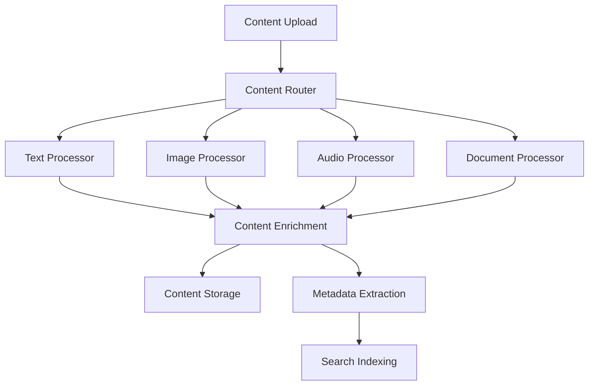

# Service Specifications and API Contracts

## Overview

This document provides detailed specifications for each microservice in the multimodal education system, including API contracts, data models, and service responsibilities.

## Service Catalog

### 1. API Gateway Service

**Purpose**: Central entry point for all client requests with routing, authentication, and rate limiting.

**Technology Stack**:
- Kong Gateway / Istio Gateway
- Lua/Go plugins for custom logic
- Redis for rate limiting and caching

**API Contract**:
```yaml
openapi: 3.0.3
info:
  title: API Gateway
  version: 1.0.0

paths:
  /api/v1/{service}/{path}:
    all:
      summary: Route requests to microservices
      parameters:
        - name: service
          in: path
          required: true
          schema:
            type: string
        - name: path
          in: path
          required: true
          schema:
            type: string
      responses:
        '200':
          description: Successful proxy response
        '429':
          description: Rate limit exceeded
        '401':
          description: Authentication required
        '403':
          description: Access forbidden
```

**Configuration**:
```yaml
rate_limiting:
  requests_per_minute: 1000
  requests_per_hour: 10000
  
routing:
  timeout: 30s
  retries: 3
  
authentication:
  jwt_validation: true
  oauth2_support: true
```

### 2. Authentication & Authorization Service

**Purpose**: Handle user authentication, authorization, and session management.

**Technology Stack**:
- Node.js/Express or Go
- PostgreSQL for user data
- Redis for session storage
- JWT for tokens

**Data Models**:
```typescript
interface User {
  id: string;
  email: string;
  username: string;
  passwordHash: string;
  roles: Role[];
  profile: UserProfile;
  createdAt: Date;
  updatedAt: Date;
}

interface Role {
  id: string;
  name: string;
  permissions: Permission[];
}

interface Permission {
  id: string;
  resource: string;
  action: string; // CREATE, READ, UPDATE, DELETE
}
```

**API Contract**:
```yaml
paths:
  /auth/login:
    post:
      summary: Authenticate user
      requestBody:
        required: true
        content:
          application/json:
            schema:
              type: object
              properties:
                email:
                  type: string
                password:
                  type: string
      responses:
        '200':
          description: Authentication successful
          content:
            application/json:
              schema:
                type: object
                properties:
                  token:
                    type: string
                  refreshToken:
                    type: string
                  expiresIn:
                    type: integer

  /auth/verify:
    post:
      summary: Verify JWT token
      security:
        - BearerAuth: []
      responses:
        '200':
          description: Token valid
        '401':
          description: Token invalid
```

### 3. Content Processing Service

**Purpose**: Process multimodal content (text, images, audio, documents) and extract meaningful information.

**Technology Stack**:
- Python/FastAPI
- TensorFlow/PyTorch for ML models
- Celery for async processing
- MinIO/S3 for file storage

**Service Architecture**:


**Data Models**:
```python
from pydantic import BaseModel
from typing import Optional, List, Dict, Any
from datetime import datetime

class ContentItem(BaseModel):
    id: str
    type: ContentType  # TEXT, IMAGE, AUDIO, DOCUMENT
    title: str
    description: Optional[str]
    file_url: Optional[str]
    metadata: Dict[str, Any]
    processing_status: ProcessingStatus
    created_at: datetime
    updated_at: datetime

class ProcessingResult(BaseModel):
    content_id: str
    processor_type: str
    extracted_text: Optional[str]
    entities: List[Entity]
    sentiment: Optional[float]
    topics: List[Topic]
    confidence_score: float
```

**API Contract**:
```yaml
paths:
  /content/upload:
    post:
      summary: Upload content for processing
      requestBody:
        required: true
        content:
          multipart/form-data:
            schema:
              type: object
              properties:
                file:
                  type: string
                  format: binary
                content_type:
                  type: string
                metadata:
                  type: object
      responses:
        '202':
          description: Content accepted for processing
          content:
            application/json:
              schema:
                type: object
                properties:
                  content_id:
                    type: string
                  status:
                    type: string

  /content/{content_id}/status:
    get:
      summary: Get processing status
      parameters:
        - name: content_id
          in: path
          required: true
          schema:
            type: string
      responses:
        '200':
          description: Processing status
          content:
            application/json:
              schema:
                $ref: '#/components/schemas/ProcessingResult'
```

### 4. Agent Orchestration Service

**Purpose**: Coordinate AI agents, manage task distribution, and aggregate results.

**Technology Stack**:
- Go/Gin or Node.js
- RabbitMQ for task queuing
- PostgreSQL for agent state
- Redis for real-time coordination

**Agent Types**:
```go
type AgentType string

const (
    ResearcherAgent  AgentType = "researcher"
    AnalyzerAgent   AgentType = "analyzer"
    CreatorAgent    AgentType = "creator"
    ReviewerAgent   AgentType = "reviewer"
    CoordinatorAgent AgentType = "coordinator"
)

type Agent struct {
    ID          string    `json:"id"`
    Type        AgentType `json:"type"`
    Status      string    `json:"status"`
    Capabilities []string  `json:"capabilities"`
    CurrentTask string    `json:"current_task"`
    Metrics     AgentMetrics `json:"metrics"`
}

type Task struct {
    ID          string            `json:"id"`
    Type        string            `json:"type"`
    Priority    int               `json:"priority"`
    Payload     map[string]interface{} `json:"payload"`
    AssignedTo  []string          `json:"assigned_to"`
    Status      TaskStatus        `json:"status"`
    Result      *TaskResult       `json:"result,omitempty"`
    CreatedAt   time.Time         `json:"created_at"`
    CompletedAt *time.Time        `json:"completed_at,omitempty"`
}
```

**API Contract**:
```yaml
paths:
  /agents:
    get:
      summary: List available agents
      responses:
        '200':
          description: List of agents
          content:
            application/json:
              schema:
                type: array
                items:
                  $ref: '#/components/schemas/Agent'
    
    post:
      summary: Create new agent
      requestBody:
        required: true
        content:
          application/json:
            schema:
              type: object
              properties:
                type:
                  type: string
                capabilities:
                  type: array
                  items:
                    type: string
      responses:
        '201':
          description: Agent created

  /tasks:
    post:
      summary: Submit task for processing
      requestBody:
        required: true
        content:
          application/json:
            schema:
              $ref: '#/components/schemas/Task'
      responses:
        '202':
          description: Task accepted
          content:
            application/json:
              schema:
                type: object
                properties:
                  task_id:
                    type: string

  /tasks/{task_id}/status:
    get:
      summary: Get task status and results
      parameters:
        - name: task_id
          in: path
          required: true
          schema:
            type: string
      responses:
        '200':
          description: Task status
          content:
            application/json:
              schema:
                $ref: '#/components/schemas/Task'
```

### 5. Learning Management Service

**Purpose**: Manage educational content, user progress, and personalized learning paths.

**Technology Stack**:
- Java/Spring Boot or C#/.NET Core
- PostgreSQL for structured data
- MongoDB for flexible content
- Elasticsearch for search

**Data Models**:
```java
@Entity
public class LearningPath {
    @Id
    private String id;
    private String title;
    private String description;
    private List<String> prerequisites;
    private List<Module> modules;
    private String difficulty;
    private Long estimatedDuration; // in minutes
    private LocalDateTime createdAt;
    private LocalDateTime updatedAt;
}

@Entity
public class UserProgress {
    @Id
    private String id;
    private String userId;
    private String learningPathId;
    private String currentModule;
    private Integer completionPercentage;
    private Map<String, Object> performanceMetrics;
    private LocalDateTime lastAccessed;
}

@Entity
public class Assessment {
    @Id
    private String id;
    private String moduleId;
    private List<Question> questions;
    private Integer passingScore;
    private String adaptiveRules;
}
```

**API Contract**:
```yaml
paths:
  /learning-paths:
    get:
      summary: Get available learning paths
      parameters:
        - name: user_id
          in: query
          schema:
            type: string
        - name: difficulty
          in: query
          schema:
            type: string
      responses:
        '200':
          description: List of learning paths
          content:
            application/json:
              schema:
                type: array
                items:
                  $ref: '#/components/schemas/LearningPath'

  /progress/{user_id}:
    get:
      summary: Get user's learning progress
      parameters:
        - name: user_id
          in: path
          required: true
          schema:
            type: string
      responses:
        '200':
          description: User progress
          content:
            application/json:
              schema:
                $ref: '#/components/schemas/UserProgress'

  /assessments/{assessment_id}/submit:
    post:
      summary: Submit assessment answers
      parameters:
        - name: assessment_id
          in: path
          required: true
          schema:
            type: string
      requestBody:
        required: true
        content:
          application/json:
            schema:
              type: object
              properties:
                user_id:
                  type: string
                answers:
                  type: array
                  items:
                    type: object
      responses:
        '200':
          description: Assessment results
```

### 6. User Interface Services

**Purpose**: Provide web and mobile interfaces for the multimodal education system.

**Technology Stack**:
- React/Next.js for web frontend
- React Native for mobile
- TypeScript for type safety
- Tailwind CSS for styling

**Component Architecture**:
```typescript
// Multimodal Input Component
interface MultimodalInputProps {
  onTextInput: (text: string) => void;
  onImageUpload: (file: File) => void;
  onVoiceInput: (audio: Blob) => void;
  onDocumentUpload: (file: File) => void;
  supportedTypes: InputType[];
}

// Agent Interaction Component
interface AgentInteractionProps {
  agents: Agent[];
  onTaskSubmit: (task: Task) => void;
  onAgentSelect: (agentId: string) => void;
  realTimeUpdates: boolean;
}

// Learning Dashboard Component
interface LearningDashboardProps {
  userId: string;
  learningPaths: LearningPath[];
  progress: UserProgress;
  recommendations: Recommendation[];
}
```

**API Integration**:
```typescript
// API Client Service
class ApiService {
  private baseUrl: string;
  private authToken: string;

  async uploadContent(file: File, type: ContentType): Promise<ContentUploadResponse> {
    const formData = new FormData();
    formData.append('file', file);
    formData.append('content_type', type);
    
    return this.post('/content/upload', formData);
  }

  async submitTask(task: TaskSubmission): Promise<TaskResponse> {
    return this.post('/tasks', task);
  }

  async getAgents(): Promise<Agent[]> {
    return this.get('/agents');
  }

  async getUserProgress(userId: string): Promise<UserProgress> {
    return this.get(`/progress/${userId}`);
  }
}
```

### 7. Notification Service

**Purpose**: Handle real-time notifications and communication with users.

**Technology Stack**:
- Node.js with Socket.io
- Redis for pub/sub
- SendGrid for email
- Firebase for push notifications

**Notification Types**:
```typescript
enum NotificationType {
  CONTENT_PROCESSED = 'content_processed',
  TASK_COMPLETED = 'task_completed',
  LEARNING_MILESTONE = 'learning_milestone',
  AGENT_UPDATE = 'agent_update',
  SYSTEM_ALERT = 'system_alert'
}

interface Notification {
  id: string;
  userId: string;
  type: NotificationType;
  title: string;
  message: string;
  data?: any;
  channels: NotificationChannel[];
  createdAt: Date;
  readAt?: Date;
}
```

**API Contract**:
```yaml
paths:
  /notifications:
    get:
      summary: Get user notifications
      parameters:
        - name: user_id
          in: query
          required: true
          schema:
            type: string
        - name: unread_only
          in: query
          schema:
            type: boolean
      responses:
        '200':
          description: List of notifications

  /notifications/send:
    post:
      summary: Send notification
      requestBody:
        required: true
        content:
          application/json:
            schema:
              $ref: '#/components/schemas/Notification'
      responses:
        '202':
          description: Notification queued

  /notifications/{notification_id}/read:
    put:
      summary: Mark notification as read
      parameters:
        - name: notification_id
          in: path
          required: true
          schema:
            type: string
      responses:
        '200':
          description: Notification marked as read
```

### 8. Analytics and Reporting Service

**Purpose**: Collect, process, and provide insights on system usage and learning effectiveness.

**Technology Stack**:
- Python/FastAPI
- Apache Spark for big data processing
- ClickHouse for analytics database
- Apache Superset for dashboards

**Analytics Models**:
```python
class UserEngagement(BaseModel):
    user_id: str
    session_duration: int
    pages_visited: int
    content_interactions: int
    timestamp: datetime

class LearningAnalytics(BaseModel):
    user_id: str
    learning_path_id: str
    completion_rate: float
    time_spent: int
    assessment_scores: List[float]
    difficulty_progression: str

class SystemMetrics(BaseModel):
    service_name: str
    request_count: int
    average_response_time: float
    error_rate: float
    timestamp: datetime
```

**API Contract**:
```yaml
paths:
  /analytics/users/{user_id}/engagement:
    get:
      summary: Get user engagement metrics
      parameters:
        - name: user_id
          in: path
          required: true
          schema:
            type: string
        - name: date_range
          in: query
          schema:
            type: string
      responses:
        '200':
          description: User engagement data

  /analytics/system/performance:
    get:
      summary: Get system performance metrics
      parameters:
        - name: service
          in: query
          schema:
            type: string
        - name: time_window
          in: query
          schema:
            type: string
      responses:
        '200':
          description: System performance data

  /analytics/learning/effectiveness:
    get:
      summary: Get learning effectiveness metrics
      parameters:
        - name: learning_path_id
          in: query
          schema:
            type: string
      responses:
        '200':
          description: Learning effectiveness data
```

## Service Discovery and Registration

**Technology**: Consul/Eureka for service registry

**Registration Pattern**:
```yaml
service_registration:
  name: content-processing-service
  id: content-processing-001
  address: 10.0.1.15
  port: 8080
  health_check:
    http: http://10.0.1.15:8080/health
    interval: 10s
    timeout: 5s
  tags:
    - content
    - processing
    - v1.2.0
```

## Cross-Cutting Concerns

### Health Checks
Each service must implement:
```yaml
/health:
  get:
    summary: Health check endpoint
    responses:
      '200':
        description: Service healthy
        content:
          application/json:
            schema:
              type: object
              properties:
                status:
                  type: string
                dependencies:
                  type: array
                version:
                  type: string
```

### Metrics Exposition
All services expose Prometheus metrics:
```
/metrics:
  - http_requests_total
  - http_request_duration_seconds
  - service_specific_metrics
```

### Configuration Management
Services use environment-based configuration:
```yaml
database:
  host: ${DB_HOST:localhost}
  port: ${DB_PORT:5432}
  name: ${DB_NAME:edudb}
  
auth:
  jwt_secret: ${JWT_SECRET}
  token_expiry: ${TOKEN_EXPIRY:3600}

external_services:
  ai_provider_url: ${AI_PROVIDER_URL}
  ai_provider_key: ${AI_PROVIDER_KEY}
```

This comprehensive service specification provides the foundation for implementing each microservice with clear API contracts, data models, and integration patterns.