# Data Flow Diagrams and Service Interactions

## Overview

This document details the data flow patterns and service interactions within the multimodal education system, focusing on how information moves through the system and how services collaborate to deliver functionality.

## Core Data Flow Patterns

### 1. Multimodal Content Processing Flow

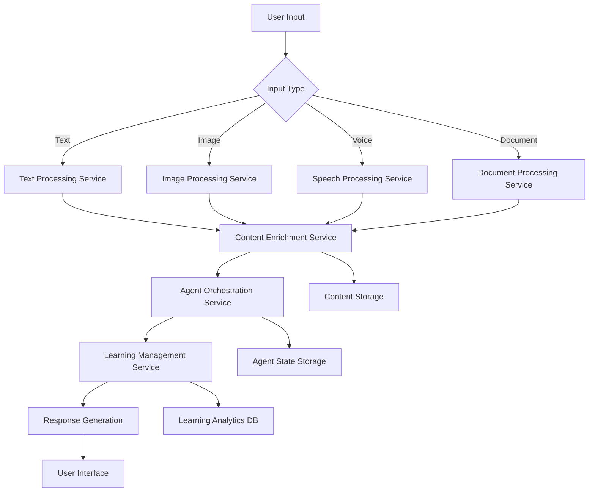

### 2. User Authentication and Authorization Flow

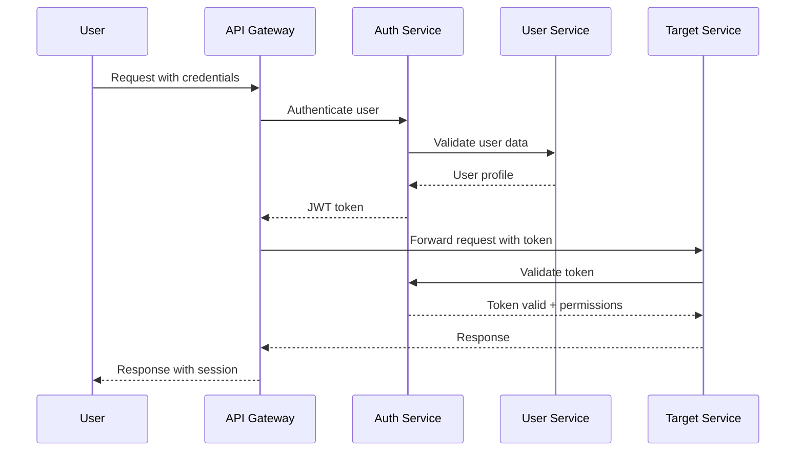

### 3. Agent Orchestration and Task Management Flow

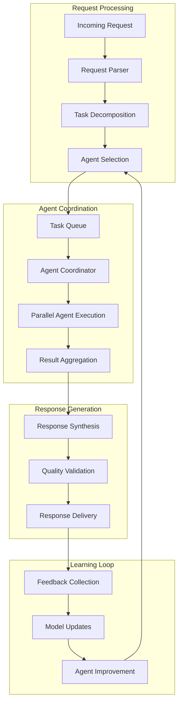

## Service Interaction Patterns

### 1. Synchronous Service Communication

#### REST API Communication Pattern
```yaml
Pattern: Request-Response
Use Cases:
  - User profile retrieval
  - Content metadata queries
  - Real-time validation
  
Communication Flow:
  Client → API Gateway → Service → Database → Response
  
Characteristics:
  - Immediate response required
  - Simple request-response cycle
  - HTTP status codes for error handling
```

#### GraphQL Communication Pattern
```yaml
Pattern: Flexible Query
Use Cases:
  - Complex data retrieval
  - Mobile app data loading
  - Dashboard aggregations
  
Communication Flow:
  Client → GraphQL Gateway → Multiple Services → Aggregated Response
  
Characteristics:
  - Single endpoint
  - Optimized data fetching
  - Type-safe schema
```

### 2. Asynchronous Service Communication

#### Event-Driven Communication
```yaml
Pattern: Publish-Subscribe
Use Cases:
  - Content processing completion
  - User action tracking
  - System state changes
  
Communication Flow:
  Service A → Event Bus → Multiple Subscribers
  
Characteristics:
  - Loose coupling
  - Scalable processing
  - Eventually consistent
```

#### Message Queue Communication
```yaml
Pattern: Task Distribution
Use Cases:
  - Agent task assignment
  - Batch processing jobs
  - Background operations
  
Communication Flow:
  Producer → Message Queue → Consumer Workers
  
Characteristics:
  - Load balancing
  - Fault tolerance
  - Processing guarantees
```

## Detailed Service Interactions

### Content Processing Workflow

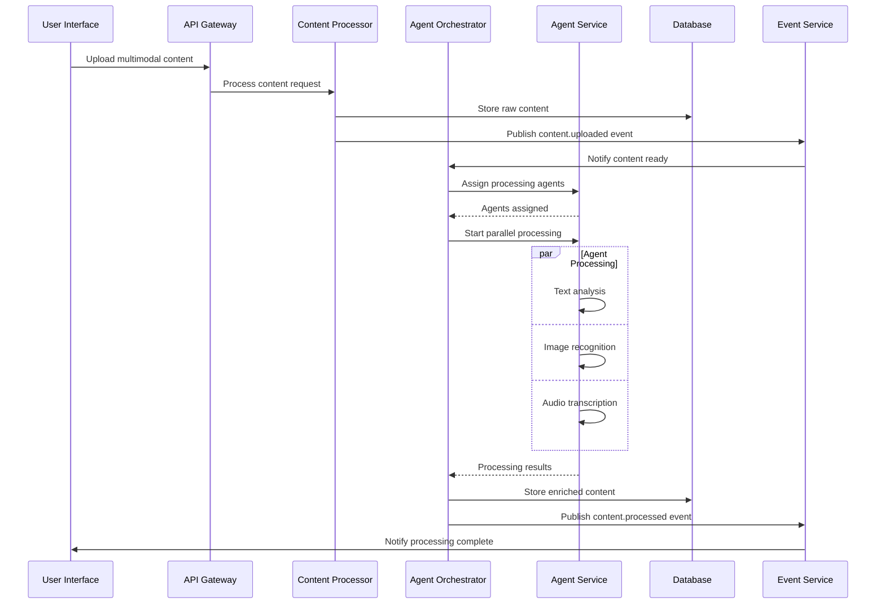

### Learning Session Flow

```mermaid
graph LR
    subgraph "Session Initiation"
        A[User Request] --> B[Session Service]
        B --> C[User Profile Lookup]
        C --> D[Learning Path Service]
    end
    
    subgraph "Content Delivery"
        D --> E[Content Recommendation]
        E --> F[Multimodal Content Service]
        F --> G[Adaptive Rendering]
    end
    
    subgraph "Interaction Processing"
        G --> H[User Interaction Capture]
        H --> I[Real-time Analysis]
        I --> J[Adaptive Response]
    end
    
    subgraph "Learning Analytics"
        J --> K[Progress Tracking]
        K --> L[Performance Analytics]
        L --> M[Recommendation Updates]
        M --> D
    end
```

## Data Consistency Patterns

### 1. Strong Consistency (ACID Transactions)
```yaml
Use Cases:
  - Financial transactions
  - User account operations
  - Critical system state changes

Implementation:
  - PostgreSQL transactions
  - Two-phase commit for distributed transactions
  - Saga pattern for long-running processes
```

### 2. Eventually Consistency (BASE)
```yaml
Use Cases:
  - Content analytics
  - Search index updates
  - Recommendation system updates

Implementation:
  - Event sourcing
  - CQRS (Command Query Responsibility Segregation)
  - Eventual consistency with compensation
```

### 3. Session Consistency
```yaml
Use Cases:
  - User session data
  - Shopping cart state
  - Temporary calculations

Implementation:
  - Redis-based session storage
  - Sticky sessions with load balancer
  - Session replication across nodes
```

## Error Handling and Recovery Patterns

### Circuit Breaker Pattern
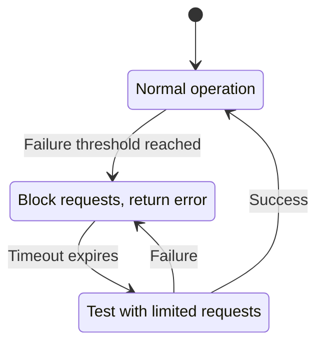

### Retry and Timeout Strategies
```yaml
Exponential Backoff:
  - Initial delay: 100ms
  - Max delay: 30s
  - Max retries: 5
  - Jitter: ±20%

Timeout Configuration:
  - API calls: 5s
  - Database queries: 10s
  - AI service calls: 30s
  - File uploads: 300s

Dead Letter Queue:
  - Failed message storage
  - Manual intervention required
  - Retry after fix
```

## Performance Optimization Strategies

### Caching Layers
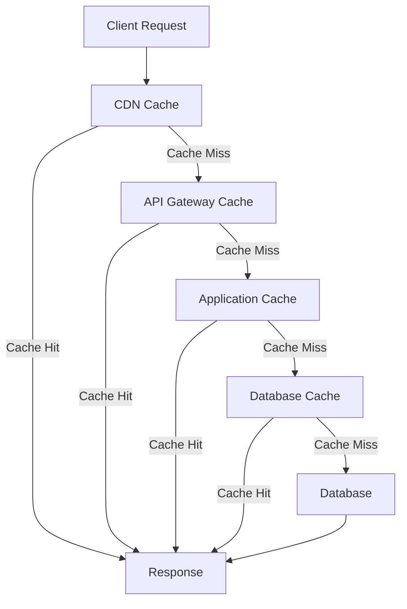

### Data Partitioning Strategy
```yaml
Horizontal Partitioning (Sharding):
  - User data by user_id hash
  - Content data by content_type
  - Analytics data by timestamp

Vertical Partitioning:
  - Separate read/write databases
  - Archive old data to cold storage
  - Optimize tables for specific queries

Geographic Partitioning:
  - Data locality by region
  - Compliance with data residency
  - Reduced latency
```

## Monitoring and Observability Data Flows

### Metrics Collection Pipeline
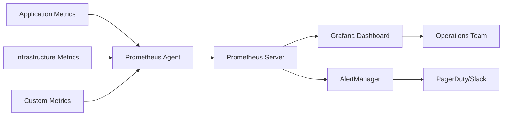

### Distributed Tracing Flow
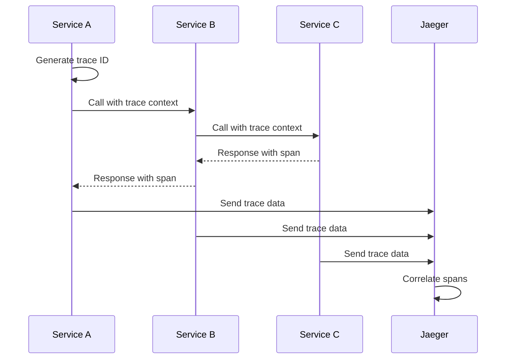

## Security Data Flows

### Authentication Token Flow
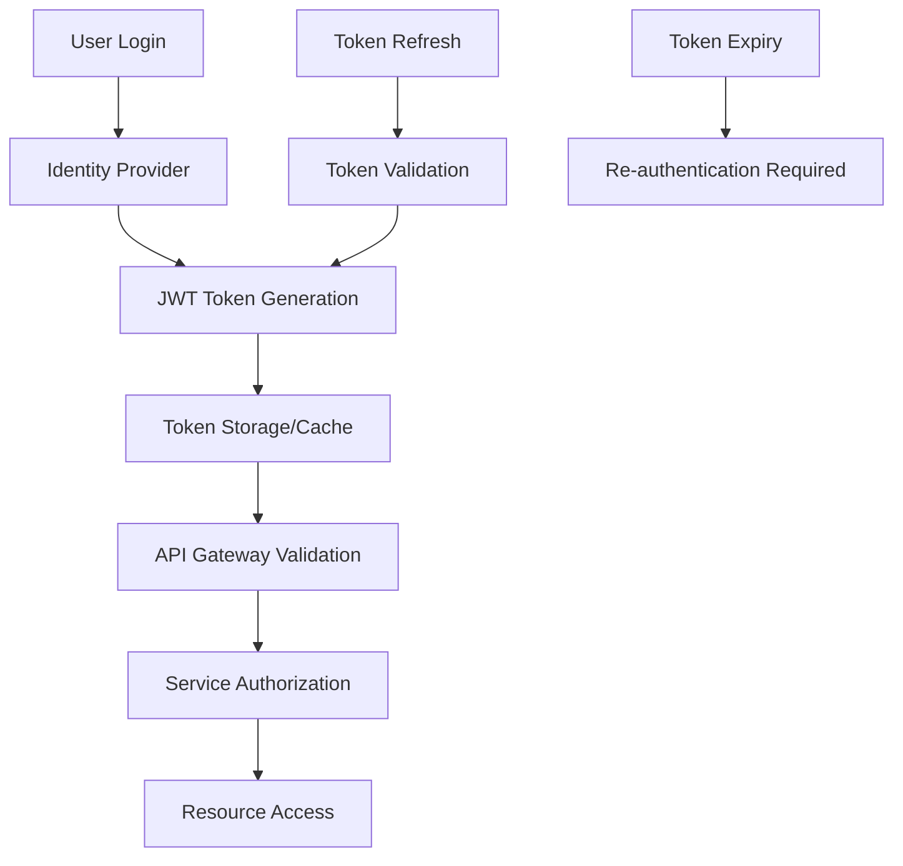

### Data Encryption Flow
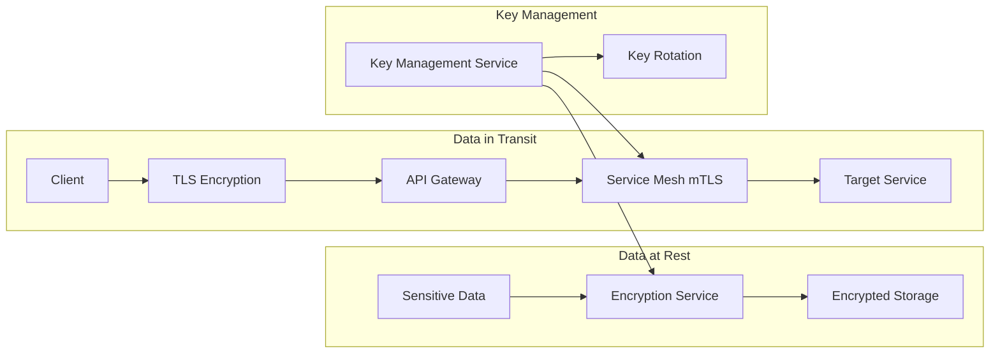

This comprehensive data flow documentation provides the foundation for understanding how data moves through the multimodal education system and how services interact to provide seamless functionality while maintaining performance, security, and reliability.